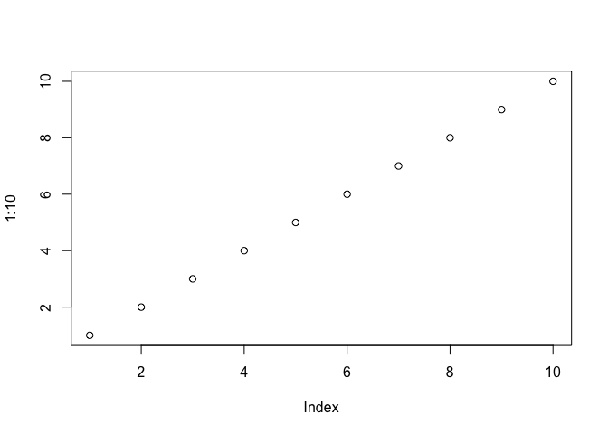
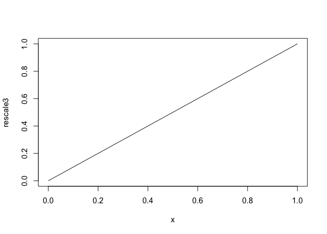
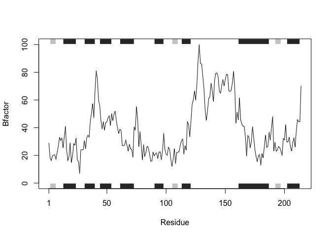
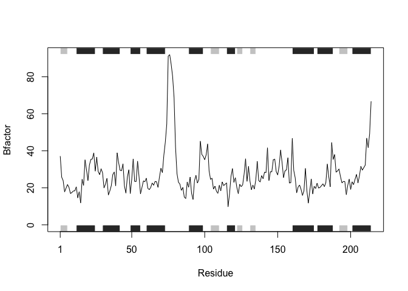
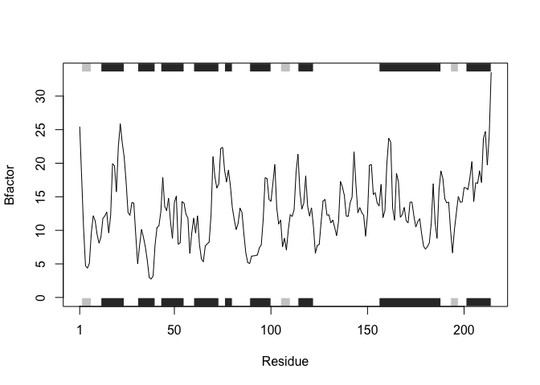

Class 6 R Functions
================
Duy Tong
10/17/2019

# This is H1 (Heading 1)

This is my work form class06 in **BIMMM 143**.

``` r
# this is to demo a code chunk
plot(1:10)
```

<!-- -->

## Practice raeding files (again…)

\#Practice reading 3 different files

``` r
read.table("test1.txt", sep=",", header=TRUE)
```

    ##   Col1 Col2 Col3
    ## 1    1    2    3
    ## 2    4    5    6
    ## 3    7    8    9
    ## 4    a    b    c

``` r
read.table("test2.txt", sep="$", header=TRUE)
```

    ##   Col1 Col2 Col3
    ## 1    1    2    3
    ## 2    4    5    6
    ## 3    7    8    9
    ## 4    a    b    c

``` r
read.table("test3.txt", sep="", header=FALSE)
```

    ##   V1 V2 V3
    ## 1  1  6  a
    ## 2  2  7  b
    ## 3  3  8  c
    ## 4  4  9  d
    ## 5  5 10  e

# Write Functions

``` r
add <- function(x, y=1) {
  #Sum the input x and y
  x+y
}
```

# Simplifying Functions Part 1

df\(a <- (df\)a - min(df\(a)) / (max(df\)a) - min(df\(a)) df\)b \<-
(df\(b - min(df\)a)) / (max(df\(b) - min(df\)b)) df\(c <- (df\)c -
min(df\(c)) / (max(df\)c) - min(df\(c)) df\)d \<- (df\(d - min(df\)d)) /
(max(df\(a) - min(df\)d))

\#Goal: Make the Function Simple df\(a <- rescale(df\)a)

\#Simplifying–Work With Generic Vector Named “x” x \<- (x-min(x)) /
(max(x)-min(x))

\#BUT… We’re Calling min(x) twice\! So… xmin \<- min(x) x \<- (x-xmin) /
(max(x) - xmin))

\#Further Optimization… use range() function rng \<- range(x) x \<- (x-
rng\[1\]) / (rng\[2\] - rng\[1\]) \[1\] -\> min(x) & \[2\] -\> max(x)

# A new function to re-scale data

``` r
rescale <- function(x) {
rng <-range(x)
(x - rng[1]) / (rng[2] - rng[1])
}
```

## Test the Function (NA = not available) Get it to Work..

``` r
x <- c(1,2,NA,3,10) 
rng <-range(x, na.rm = TRUE)
rng 
```

    ## [1]  1 10

\#Creating & Saving New Function

``` r
rescale2 <- function(x) {
  rng <- range(x, na.rm= TRUE)
  (x - rng[1]) / (rng[2] - rng[1])
  }
```

``` r
rescale2(c(1,2,NA,3,10))
```

    ## [1] 0.0000000 0.1111111        NA 0.2222222 1.0000000

\#More Functions

``` r
rescale3 <- function(x, na.rm=TRUE, plot=FALSE) {
  rng <-range(x, na.rm=na.rm)
  print("Hello")
  
  answer <- (x - rng[1]) / (rng[2] - rng[1])
  
  return(answer)
  
  print("is it me you are looking for?")
  if(plot) {
    plot(answer, typ="b", lwd=4)
  }
  print("I can see it in ...")
  #return(answer)--cuts the message
}
```

``` r
rescale <-plot(rescale3, )
```

    ## [1] "Hello"

<!-- -->

``` r
rescale3(1:10)
```

    ## [1] "Hello"

    ##  [1] 0.0000000 0.1111111 0.2222222 0.3333333 0.4444444 0.5555556 0.6666667
    ##  [8] 0.7777778 0.8888889 1.0000000

\#Section 2 of Hands-on Lab

Install the **bio3d** package for sequence and structure
analysis.

# Avoid this: install.packages(“bio3d”) in rmd file BUT INSTALL IN CONSOLE\!\!\!

**BIMM 143. Lecture 6 Lab–Section 1** \#Section 1A: Improve Analysis
Code By Writing Functions df \<-
data.frame(a=1:10,b=seq(200,400,length=10),c=11:20,d=NA) df\(a <- (df\)a
- min(df\(a)) / (max(df\)a) - min(df\(a)) df\)b \<- (df\(b - min(df\)a))
/ (max(df\(b) - min(df\)b)) df\(c <- (df\)c - min(df\(c)) / (max(df\)c)
- min(df\(c)) df\)d \<- (df\(d - min(df\)d)) / (max(df\(a) - min(df\)d))

\#Simplifying It… Part 1 df$a \<- function(x)

\#Simplifying It… Part 2 x \<- (x-min(x)) / (max(x)-min)

\#Simplifying It… Part 3 xmin \<- min(x) x \<- (x-xmin) / (max (x) -
xmin)

\#Further Optimizing It. Part 4 rng \<- range(x) x \<- (x -rng\[1\]) /
(rng\[2\] - rng\[1\])

\#Turn it Into a Function (Name, Arguments, Body) rescale \<-
function(x) { rng \<-range(x) (x - rng\[1\]) / (rng\[2\] - rng\[1\]) }

\#Section 1B: Analysis of Protein Drug Interactions

``` r
library(bio3d)
s1 <- read.pdb("4AKE") # kinase with drug
```

    ##   Note: Accessing on-line PDB file

``` r
s2 <- read.pdb("1AKE") # kinase no drug
```

    ##   Note: Accessing on-line PDB file
    ##    PDB has ALT records, taking A only, rm.alt=TRUE

``` r
s3 <- read.pdb("1E4Y") # kinase with drug
```

    ##   Note: Accessing on-line PDB file

``` r
s1.chainA <- trim.pdb(s1, chain="A", elety="CA")
s2.chainA <- trim.pdb(s2, chain="A", elety="CA")
s3.chainA <- trim.pdb(s1, chain="A", elety="CA")
s1.b <- s1.chainA$atom$b
s2.b <- s2.chainA$atom$b
s3.b <- s3.chainA$atom$b
plotb3(s1.b, sse=s1.chainA, typ="l", ylab="Bfactor")
```

<!-- -->

``` r
plotb3(s2.b, sse=s2.chainA, typ="l", ylab="Bfactor")
```

<!-- -->

``` r
plotb3(s3.b, sse=s3.chainA, typ="l", ylab="Bfactor")
```

<!-- -->

*Q1. What type of object is returned from the read.pdb () function?* s1
\<- read.pdb(“4AKE”) \# kinase with drug s2 \<- read.pdb(“1AKE”) \#
kinase no drug s3 \<- read.pdb(“1E4Y”) \# kinase with drug

*Q2. What does the trim.pdb () function do?* This function gives a new
smaller PDB object with subset of atoms and it is derived from a larger
PDB object.

*Q3. What input parameter would turn off the marginal black and grey
rectangles in the plots and what do they represent in this case?* Rug()

*Q4: What would be a better plot to compare across the different
proteins?* A significant way to compare different proteins is by
creating a bar plot.

*Q5: Which proteins are more similar to each other in their B-factor
trends? How would you quantify this?* From doing the dendrogram plot, s1
(“4AKE”) and s3 (“1E4Y”) are more similar proteins because they are
being treated with the same drug.A way to quantify this is by analysing
a dendrogram plot so see the level of differences of each protein.

\#Dendrogram Plot hc \<- hclust( dist( rbind(s1.b, s2.b, s3.b) ) )
plot(hc) \#This graph is showing that s1 & s3 are more related and also
related to expression levels because these proteins are treated with
drugs.

# **6: Homework \#4: Lecture 6 Improving Analysis Code**

``` r
#Create a function. The function(x) represents kinase.
kinase <-function(x) {
#Vectorize each different kinases to reduce duplication. In this case, optimized read.pdb() function recognizes all three kinase arguments and set them into a simplier object called s1.
  s1 <- read.pdb(x) 
#Optimize trim.pdb () function of all three kinases' arguments into a simplier object called s1.chainA, to avoid any duplications. The trim.pdb() provides a smaller PDB object from a larger PDB object. This code observes for chain "A" and the elety of "CA" in all three proteins)
  s1.chainA <- trim.pdb(s1, chain="A", elety="CA")
#s1. chainA$atom$b of diffrent kinases is further optimized into a simplier object known as s1.b that contains all three type of kinases.
  s1.b <- s1.chainA$atom$b
#Further optimize the function plotb3() in a way for it to contain all three kinases with the same graph-labeling arguments to avoid creating duplications.This code specifically looking at chain A at a specific atom in all three protein kinases. 
  plotb3(s1.b, sse=s1.chainA, typ="l", ylab="Bfactor")
}
#The output of kinase() function plots the coressponding PDB data for "4AKE" protein.
kinase("4AKE")
```

    ##   Note: Accessing on-line PDB file

    ## Warning in get.pdb(file, path = tempdir(), verbose = FALSE): /var/folders/
    ## 2h/5078l3ss4bsdkrnf7lc3ymfw0000gn/T//RtmpUFyZYv/4AKE.pdb exists. Skipping
    ## download

<!-- -->

``` r
#The output of kinase() function plots the coresspoding PDB data for "1AKE" protein 
kinase("1AKE")
```

    ##   Note: Accessing on-line PDB file

    ## Warning in get.pdb(file, path = tempdir(), verbose = FALSE): /var/folders/
    ## 2h/5078l3ss4bsdkrnf7lc3ymfw0000gn/T//RtmpUFyZYv/1AKE.pdb exists. Skipping
    ## download

    ##    PDB has ALT records, taking A only, rm.alt=TRUE

<!-- -->

``` r
#The output of kinase() function plots the corresponding PDB data for "1EAY" protein
kinase("1E4Y")
```

    ##   Note: Accessing on-line PDB file

    ## Warning in get.pdb(file, path = tempdir(), verbose = FALSE): /var/folders/
    ## 2h/5078l3ss4bsdkrnf7lc3ymfw0000gn/T//RtmpUFyZYv/1E4Y.pdb exists. Skipping
    ## download

<!-- -->

\#Section 2: Writing and Calling a Function \#Example: name.of.function
\<- function(argument1, argument2) { statements return(something) }

\#Square The Argument square.it \<- function(x) { square \<- x \* x
return(square) } \#Square a Number square.it (5) \#\# \[1\] 25 -\>
output

\#Square a Vector square.it(c(1,4,2)) \#\# \[1\] 1 16 4 -\> output

\#Cannot Square a Character (Has to Be Numeric) square.it(“hi”) -\>
non-numeric argument to binary operator

# Pass in an object that already have saved…

matrix1 \<-cbind (c(3,10), c(4,5)) \#R takes this matrix1 into the
function as x. square.it (matrix) \#\# \[,1\] \[,2\] \#\# \[1,\] 9 16
\#\# \[2,\] 100 25

\#Local Vs. Global Environment Example fun1 \<- function(x) { 3\*x-1 }
fun1(5) \#\# \[1\] 14

fun2 \<-function(x) { y \<-3 \* x -1 } fun2(5) -\> nothing happens…
because object y does not exist outside the function and have not used
return(y) to pass the value y outside the function.

print(y) -\> nothing happens… because it was created in local
environment of function.

\#Calling Other Functions & Passing Multiple Arguments

my.fun \<- function(X.matrix, y.vec, z.scalar) { \# use my previous
function square.it() and save result sq.scalar \<- square.it(z.scalar)
\# multiply the matrix by the vector using %*% operator mult \<-
X.matrix %*% y.vec \# multiply the resulting objects together to get a
final ans final \<- mult \* sq.scalar \# return the result return(final)
}
