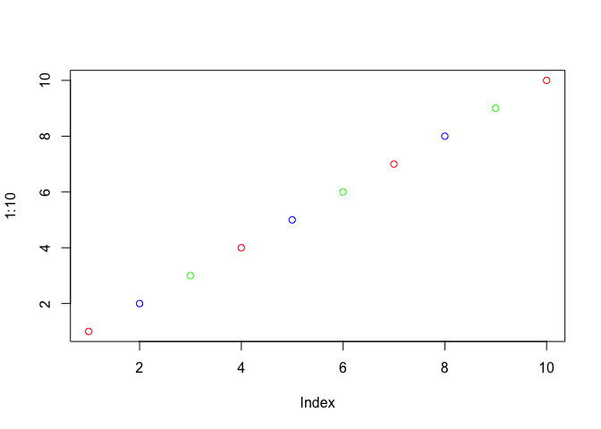

Class 7 R Functions and Packages
================
Duy Tong
10/22/2019

## R Functions Revisited

Source my functions from last
    day

``` r
source("http://tinyurl.com/rescale-R")
```

``` r
rescale(1:10)
```

    ##  [1] 0.0000000 0.1111111 0.2222222 0.3333333 0.4444444 0.5555556 0.6666667
    ##  [8] 0.7777778 0.8888889 1.0000000

``` r
rescale( c(1, 10, 5, NA, 6))
```

    ## [1] 0.0000000 1.0000000 0.4444444        NA 0.5555556

\#is.numeric & \!is.numeric functions \> ?is.numeric \> is.numeric(1:10)
\[1\] TRUE \> is.numeric(c(1,5,NA,10)) \[1\] TRUE \>
is.numeric(c(1,5,NA,10,“duy”)) \[1\] FALSE \>
\!is.numeric(c(1,5,NA,10,“duy”)) \[1\] TRUE \>
is.numeric(c(1,5,NA,10)) \[1\] TRUE \> \!is.numeric(c(1,5,NA,10)) \[1\]
FALSE \# \! added to is.numeric will flip false -\> true / vice versa.

\#`{r} rescale2(c(1:10, "duy"))`

\#`{r} rescale(c(1:10, "duy"))` Cannot run if there is a character

\#Write a function to find where there are NA elements in two input
vectors.

\#First make some simple input where I know the answer\!

``` r
x<- c( 1, 2, NA, 3, NA)
y<- c(NA, 3, NA, 3, 4)
```

\#Looked online and found the **is.na()** function

``` r
is.na(x)
```

    ## [1] FALSE FALSE  TRUE FALSE  TRUE

\#and the **which()** function tells me where the TRUE values are

``` r
which(is.na(x))
```

    ## [1] 3 5

``` r
which(is.na(y))
```

    ## [1] 1 3

``` r
is.na(x)
```

    ## [1] FALSE FALSE  TRUE FALSE  TRUE

``` r
is.na(y)
```

    ## [1]  TRUE FALSE  TRUE FALSE FALSE

\#The AND function requires two input TRUE to give a TRUE output

``` r
is.na(x) & is.na(y)
```

    ## [1] FALSE FALSE  TRUE FALSE FALSE

``` r
sum(c(TRUE,TRUE, FALSE,TRUE))
```

    ## [1] 3

\#Takine the **sum()** of TRUE FALSE vector will tell me how many TRUE
elements I have. (TRUE and FALSE vector cancels out). This is my working
snippet\!\! (CODE BELOW IS THE BODY)

``` r
sum(is.na(x) & is.na(y))
```

    ## [1] 1

\#Turn Into a Function

``` r
both_na <- function(x,y) {
  sum(is.na(x) & is.na(y))
}
```

\#Double Check Your Function

``` r
both_na(x,y)
```

    ## [1] 1

\#eejit proofing

``` r
x <-  c(NA, NA, NA)
y1 <- c( 1, NA, NA)
y2 <- c( 1, NA, NA, NA)
```

``` r
both_na(x,y1)
```

    ## [1] 2

\#What will this
    return?

``` r
both_na(x, y2)
```

    ## Warning in is.na(x) & is.na(y): longer object length is not a multiple of
    ## shorter object length

    ## [1] 3

\#Make input different length…

``` r
x2 <- c(NA,NA)
```

``` r
both_na(x2,y2)
```

    ## [1] 3

``` r
plot(1:10, col=c("red","blue", "green"))
```

<!-- -->

\#Recycle x/y3 -\> take the first NA of x add on to the next NA on y3
and keep add on to the NA on y3 -\> meaning of recycled vector.

``` r
x <-  c(NA, NA, NA)
y3 <- c( 1, NA, NA, NA, NA, NA, NA)
both_na(x, y3)
```

    ## Warning in is.na(x) & is.na(y): longer object length is not a multiple of
    ## shorter object length

    ## [1] 6

\#If like this…

``` r
x3 <- c(1, NA, NA)
y3 <- c(1, NA, NA, NA, NA, NA, NA)
both_na(x, y3)
```

    ## Warning in is.na(x) & is.na(y): longer object length is not a multiple of
    ## shorter object length

    ## [1] 6

\#If like this…

``` r
x <- c(1, NA, NA, 1, NA, NA, 1)
y3 <- c(1, NA, NA, NA, NA, NA, NA)
both_na(x3, y3)
```

    ## Warning in is.na(x) & is.na(y): longer object length is not a multiple of
    ## shorter object length

    ## [1] 4

\#Stop() Function & Add a check for when inputs x and y are not the same
length. Should do this early to catch the potential problems.

``` r
both_na2 <- function(x,y) {
  if(length(x) != length(y)) {
    stop("Inputs x and y should be the same length!")
  }
  sum(is.na(x) & is.na(y))
}
```

\#Test it \#`{r} both_na2 (x,y3)`

\#Length() Function

``` r
length(x)
```

    ## [1] 7

``` r
length(y3)
```

    ## [1] 7

\#Write a Function Practice\! \#Student 1 c(100, 100, 100, 100, 100,
100, 100, 90) \#Student 2 c(100, NA, 90, 90, 90, 90, 97, 80)

``` r
#Student 1
s1 <- c(100, 100, 100, 100, 100, 100, 100, 90)
#Student 2
s2 <- c(100, NA, 90, 90, 90, 90, 97, 80)

mean(s1[-which.min(s1)])
```

    ## [1] 100

``` r
mean(s2[-which.min(s2)])
```

    ## [1] NA

\#na.rm = TRUE means 0

``` r
which.min(s2)
```

    ## [1] 8

``` r
s2[-which.min(s2)]
```

    ## [1] 100  NA  90  90  90  90  97

``` r
mean(s2[-which.min(s2)], na.rm = TRUE)
```

    ## [1] 92.83333

``` r
any(is.na(s2))
```

    ## [1] TRUE

``` r
any(is.na(s1))
```

    ## [1] FALSE

\#We have our working code now turn it into a first function. \#If we
use warning

``` r
grade <- function(x) {
  if(any(is.na(x))) {
    warning("Stduent is missing homework")
  }
  mean(x[-which.min(x)], na.rm = TRUE)
}
```

``` r
grade(s1)
```

    ## [1] 100

``` r
grade(s2)
```

    ## Warning in grade(s2): Stduent is missing homework

    ## [1] 92.83333

\#If you only did one homework and rest are NA…

``` r
grade2 <- function(x) {
  if(any(is.na(x))) {
    warning("Stduent is missing homework")
  }
  sum(x[-which.min(x)], na.rm = TRUE /length(x)-1)
}
```

``` r
s3 <- c(100, NA, NA, NA, NA)
grade2(s3)
```

    ## Warning in grade2(s3): Stduent is missing homework

    ## [1] 0

``` r
url <- "https://tinyurl.com/gradeinput"
hw <-read.csv(url, row.names =1)
```

``` r
apply(hw,1, grade)
```

    ## Warning in FUN(newX[, i], ...): Stduent is missing homework
    
    ## Warning in FUN(newX[, i], ...): Stduent is missing homework
    
    ## Warning in FUN(newX[, i], ...): Stduent is missing homework
    
    ## Warning in FUN(newX[, i], ...): Stduent is missing homework

    ##  student-1  student-2  student-3  student-4  student-5  student-6 
    ##   91.75000   82.50000   84.25000   88.00000   88.25000   89.00000 
    ##  student-7  student-8  student-9 student-10 student-11 student-12 
    ##   94.00000   93.75000   87.75000   81.33333   86.00000   91.75000 
    ## student-13 student-14 student-15 student-16 student-17 student-18 
    ##   92.25000   87.75000   83.33333   89.50000   88.00000   97.00000 
    ## student-19 student-20 
    ##   82.75000   82.75000
