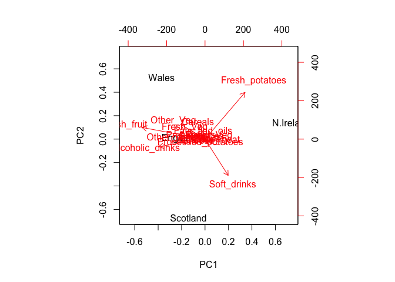

class08 Machine Learning 1
================
Duy Tong
10/24/2019

## K-means Clustering

``` r
tmp <- c(rnorm(30,-3), rnorm(30,3))
x <- cbind(x=tmp, y=rev(tmp))
plot(x)
```

<!-- --> Use the
kmeans() function setting k to 2 and nstart=20

\#Use kmean()

``` r
k <- kmeans(x, centers = 2, nstart = 20)
```

\#Inspect / Print the Result

``` r
k
```

    ## K-means clustering with 2 clusters of sizes 30, 30
    ## 
    ## Cluster means:
    ##           x         y
    ## 1 -3.450642  2.922017
    ## 2  2.922017 -3.450642
    ## 
    ## Clustering vector:
    ##  [1] 1 1 1 1 1 1 1 1 1 1 1 1 1 1 1 1 1 1 1 1 1 1 1 1 1 1 1 1 1 1 2 2 2 2 2
    ## [36] 2 2 2 2 2 2 2 2 2 2 2 2 2 2 2 2 2 2 2 2 2 2 2 2 2
    ## 
    ## Within cluster sum of squares by cluster:
    ## [1] 49.22868 49.22868
    ##  (between_SS / total_SS =  92.5 %)
    ## 
    ## Available components:
    ## 
    ## [1] "cluster"      "centers"      "totss"        "withinss"    
    ## [5] "tot.withinss" "betweenss"    "size"         "iter"        
    ## [9] "ifault"

# Cluster Means: the center -\> -3 & 3

# Cluster Vector:

\#Available Components:

\#Q. How many points are in each cluster? 30 points each.

\#Q. What ‘component’ of your result object details - cluster size? -
cluster assignment/membership? - cluster center? \#Cluster
    Size?

``` r
k$size
```

    ## [1] 30 30

# Membership / Assignment

``` r
k$cluster
```

    ##  [1] 1 1 1 1 1 1 1 1 1 1 1 1 1 1 1 1 1 1 1 1 1 1 1 1 1 1 1 1 1 1 2 2 2 2 2
    ## [36] 2 2 2 2 2 2 2 2 2 2 2 2 2 2 2 2 2 2 2 2 2 2 2 2 2

\#Cluster Center?

``` r
k$centers
```

    ##           x         y
    ## 1 -3.450642  2.922017
    ## 2  2.922017 -3.450642

\#Plot x colored by the kmeans cluster assignment and add cluster
centers as blue points

``` r
plot(x, col=k$cluster)
points(k$centers, col = "blue", pch = 15)
```

<!-- -->

## Hierarchinal Clustering in R

the `hclust()` function requires a distance matrix as input. You can get
this from the `dist()` function

``` r
# First we need to calculate point (dis)similarity
# as the Euclidean distance between observations
dist_matrix <- dist(x)
# The hclust() function returns a hierarchical
# clustering model
hc <- hclust(d = dist_matrix)
# the print method is not so useful here
hc
```

    ## 
    ## Call:
    ## hclust(d = dist_matrix)
    ## 
    ## Cluster method   : complete 
    ## Distance         : euclidean 
    ## Number of objects: 60

``` r
plot(hc)
```

<!-- --> \# the first
30 points in this branch & next 30 points in another branch.

\#Interpreting Results

``` r
# Draws a dendrogram
plot(hc)
abline (h=6, col= "red")
```

<!-- -->

# Cut Tree

``` r
# Draws a dendrogram
plot(hc)
abline (h=6, col= "red")
```

<!-- -->

``` r
cutree(hc, h = 6)
```

    ##  [1] 1 1 1 1 1 1 1 1 1 1 1 1 1 1 1 1 1 1 1 2 1 1 1 1 1 1 1 1 1 1 3 3 3 3 3
    ## [36] 3 3 3 3 3 2 3 3 3 3 3 3 3 3 3 3 3 3 3 3 3 3 3 3 3

``` r
# Draws a dendrogram
plot(hc)
abline (h=6, col= "red")
```

<!-- -->

``` r
grps <- cutree(hc, h = 6)
```

``` r
cutree(hc, k = 2)
```

    ##  [1] 1 1 1 1 1 1 1 1 1 1 1 1 1 1 1 1 1 1 1 1 1 1 1 1 1 1 1 1 1 1 2 2 2 2 2
    ## [36] 2 2 2 2 2 1 2 2 2 2 2 2 2 2 2 2 2 2 2 2 2 2 2 2 2

# Step 1. Generate Some Example Data for Clustering

``` r
x <- rbind(
matrix(rnorm(100, mean=0, sd = 0.3), ncol = 2), # c1
matrix(rnorm(100, mean = 1, sd = 0.3), ncol = 2), # c2
matrix(c(rnorm(50, mean = 1, sd = 0.3), # c3
rnorm(50, mean = 0, sd = 0.3)), ncol = 2))
colnames(x) <- c("x", "y")
```

# Step 2. Plot the Data Without Clustering

``` r
plot(x)
```

<!-- -->

# Step 3. Generate Colors for Known Clusters–to compare to hclust results

``` r
col <- as.factor( rep(c("c1","c2","c3"), each=50) )
plot(x, col=col)
```

<!-- --> \# Q. Use
the dist(), hclust(), plot() and cutree() functions to return 2 and 3
clusters

``` r
#clustering
hc <- hclust(dist(x))

#draw tree
plot (hc)
abline (h =2, col = "red")
```

<!-- -->

``` r
#Cut tree into clusters / groups
grps <- cutree(hc, k = 3)
grps
```

    ##   [1] 1 1 1 1 1 1 1 1 1 1 1 2 1 1 3 1 1 1 1 2 1 1 1 1 1 1 1 1 1 1 1 2 2 1 1
    ##  [36] 1 1 1 1 1 1 1 1 1 1 1 1 2 1 1 3 3 3 3 3 3 3 3 3 3 3 3 3 3 3 3 3 3 3 3
    ##  [71] 3 3 3 3 3 3 3 3 3 3 3 3 3 3 3 3 3 3 3 3 3 3 3 3 3 3 3 3 3 3 2 2 2 2 2
    ## [106] 2 2 1 2 1 2 2 1 2 2 2 2 2 2 2 2 2 2 2 2 2 2 2 2 1 2 2 2 2 2 2 2 2 2 3
    ## [141] 3 2 2 2 2 2 1 2 2 3

Plot the data colored by their hclust results

``` r
plot(x, col = grps)
```

<!-- -->

\#How many Points in Each Cluster

``` r
table(grps)
```

    ## grps
    ##  1  2  3 
    ## 49 47 54

\#Cross-Tabulate

``` r
table(grps, col)
```

    ##     col
    ## grps c1 c2 c3
    ##    1 44  0  5
    ##    2  5  0 42
    ##    3  1 50  3

``` r
mydata <- read.csv("https://tinyurl.com/expression-CSV",
row.names=1)
head(mydata)
```

    ##        wt1 wt2  wt3  wt4 wt5 ko1 ko2 ko3 ko4 ko5
    ## gene1  439 458  408  429 420  90  88  86  90  93
    ## gene2  219 200  204  210 187 427 423 434 433 426
    ## gene3 1006 989 1030 1017 973 252 237 238 226 210
    ## gene4  783 792  829  856 760 849 856 835 885 894
    ## gene5  181 249  204  244 225 277 305 272 270 279
    ## gene6  460 502  491  491 493 612 594 577 618 638

\#Number of row

``` r
#Dimension of Object
dim(mydata)
```

    ## [1] 100  10

``` r
#Number of Genes
nrow(mydata)
```

    ## [1] 100

\#R in PCA with the **prcomp()** function.

``` r
pca <- prcomp(t(mydata), scale=TRUE)
# See what is returned by the prcomp() function
attributes(pca)
```

    ## $names
    ## [1] "sdev"     "rotation" "center"   "scale"    "x"       
    ## 
    ## $class
    ## [1] "prcomp"

## A basic PC1 vs PC2 2-D Plot

``` r
plot(pca$x[ , 1], pca$x [, 2])
```

<!-- -->

# Variance Captured per PC

``` r
pca.var <- pca$sdev^2
```

## Precent variance is often more informative to look at

``` r
pca.var <- pca$sdev^2
pca.var.per <- round(pca.var/sum(pca.var)*100, 1)

pca.var.per
```

    ##  [1] 92.6  2.3  1.1  1.1  0.8  0.7  0.6  0.4  0.4  0.0

# Make Barplot of PCA

``` r
pca.var <- pca$sdev^2
pca.var.per <- round(pca.var/sum(pca.var)*100, 1)
barplot(pca.var.per, main="Scree Plot",
xlab="Principal Component", ylab="Percent Variation")
```

<!-- -->

``` r
pca.var.per
```

    ##  [1] 92.6  2.3  1.1  1.1  0.8  0.7  0.6  0.4  0.4  0.0

\#Color the
Points

``` r
plot(pca$x[ ,1], pca$x[ ,2], col = c("red", "red", "red", "red", "red", "blue", "blue", "blue", "blue", "blue"))
```

<!-- -->

``` r
colvec <- colnames(mydata)
colvec[grep("wt", colvec)] <- "red"
colvec[grep("ko", colvec)] <- "blue"
plot(pca$x[,1], pca$x[,2], col=colvec, pch=16,
xlab=paste0("PC1 (", pca.var.per[1], "%)"),
ylab=paste0("PC2 (", pca.var.per[2], "%)"))
#Add Labels
plot(pca$x[,1], pca$x[,2], col=colvec, pch=16,
xlab=paste0("PC1 (", pca.var.per[1], "%)"),
ylab=paste0("PC2 (", pca.var.per[2], "%)"))
## Click to identify which sample is which
identify(pca$x[,1], pca$x[,2], labels=colnames(mydata))
```

<!-- -->

    ## integer(0)

``` r
## Press ESC to exit…
```

# Lecture 8 Lab: PCA on Food

``` r
x <- read.csv("UK_foods (1).csv")
head(x)
```

    ##                X England Wales Scotland N.Ireland
    ## 1         Cheese     105   103      103        66
    ## 2  Carcass_meat      245   227      242       267
    ## 3    Other_meat      685   803      750       586
    ## 4           Fish     147   160      122        93
    ## 5 Fats_and_oils      193   235      184       209
    ## 6         Sugars     156   175      147       139

# Q1. How many rows and columns are in your new data frame named x? What R functions could you use to answer this question

``` r
dim(x)
```

    ## [1] 17  5

``` r
nrow(x)
```

    ## [1] 17

``` r
ncol(x)
```

    ## [1] 5

``` r
#There are 17 rows and 5 columns.
```

## Complete the following code to find out how many rows and columns are in x?

``` r
dim(x)
```

    ## [1] 17  5

# Checking Your Data

## Preview the First 6 Rows

``` r
#Could Also Specify **row.names()**
x <- read.csv("UK_foods (1).csv", row.names = 1)
head(x)
```

    ##                England Wales Scotland N.Ireland
    ## Cheese             105   103      103        66
    ## Carcass_meat       245   227      242       267
    ## Other_meat         685   803      750       586
    ## Fish               147   160      122        93
    ## Fats_and_oils      193   235      184       209
    ## Sugars             156   175      147       139

# Note How the Minus Indexing Works

``` r
rownames(x) <- x[,1]
x <- x[,-1]
head(x)
```

    ##     Wales Scotland N.Ireland
    ## 105   103      103        66
    ## 245   227      242       267
    ## 685   803      750       586
    ## 147   160      122        93
    ## 193   235      184       209
    ## 156   175      147       139

# Check the Dimensions Again

``` r
dim(x)
```

    ## [1] 17  3

\#Alternative Approach

``` r
x <- read.csv("UK_foods (1).csv", row.names = 1)
head(x)
```

    ##                England Wales Scotland N.Ireland
    ## Cheese             105   103      103        66
    ## Carcass_meat       245   227      242       267
    ## Other_meat         685   803      750       586
    ## Fish               147   160      122        93
    ## Fats_and_oils      193   235      184       209
    ## Sugars             156   175      147       139

\#Q2. Which approach to solving the ‘row-names problem’ mentioned above
do you prefer and why? Is one approach more robust than another under
certain circumstances? Giving an additional argument \*\*row.names()
gives a better image of the data because it shows most detailed.

\#Spotting Major Differences and Trends (Listen at 1 Hr 3 minutes Part
2) barplot(barplot(as.matrix(x), beside=T, col=rainbow(nrow(x))))

``` r
barplot(as.matrix(x), beside=T, col=rainbow(nrow(x)))
```

<!-- --> \#Q3:
Changing what optional argument in the above barplot() function results
in the following plot?

``` r
barplot(as.matrix(x), beside=FALSE, col=rainbow(nrow(x)))
```

<!-- -->

\#Q5: Generating all pairwise plots may help somewhat. Can you make
sense of the following code and resulting figure? What does it mean if a
given point lies on the diagonal for a given plot?

``` r
pairs(x, col=rainbow(10), pch=16)
```

<!-- -->

\#Q6. What is the main differences between N. Ireland and the other
countries of the UK in terms of this data-set? N. Ireland for PC 1 range
is further away from other countries; whereas, England, Scotland, Wales
are closely related to each other. This PCA graph is effective in a
sense that we’re comparing only 4 PCAs; if we happen to compare more set
of data then it would be complicated to find the signficant.

``` r
pca <-prcomp( t(x))
summary(pca)
```

    ## Importance of components:
    ##                             PC1      PC2      PC3       PC4
    ## Standard deviation     324.1502 212.7478 73.87622 4.189e-14
    ## Proportion of Variance   0.6744   0.2905  0.03503 0.000e+00
    ## Cumulative Proportion    0.6744   0.9650  1.00000 1.000e+00

# prooprtion of variance shows us true variance. How PC1 is the biggest\!

\#Q7. Complete the code below to generate a plot of PC1 vs PC2. The
second line adds text labels over the data points.

``` r
# Plot PC1 vs PC2
plot(pca$x[,1], pca$x[,2], xlab="PC1", ylab="PC2", xlim=c(-270,500))
text(pca$x[,1], pca$x[,2], colnames(x))
```

<!-- -->

# Q8. Customize your plot so that the colors of the country names match the colors in our UK and Ireland map and table at start of this document.

``` r
plot(pca$x[,1], pca$x[,2], xlab="PC1", ylab="PC2", xlim=c(-270,500))
text(pca$x[,1], pca$x[,2], colnames(x), col = c( "red", "yellow", "blue", "green"))
```

<!-- -->

# More PCA Information

``` r
v <- round( pca$sdev^2/sum(pca$sdev^2) * 100 )
v
```

    ## [1] 67 29  4  0

# or the second row here…

``` r
z <- summary(pca)
z$importance
```

    ##                              PC1       PC2      PC3          PC4
    ## Standard deviation     324.15019 212.74780 73.87622 4.188568e-14
    ## Proportion of Variance   0.67444   0.29052  0.03503 0.000000e+00
    ## Cumulative Proportion    0.67444   0.96497  1.00000 1.000000e+00

\#barplot

``` r
barplot(v, xlab = "Principal Component", ylab = "Percent Variation")
```

<!-- -->

# Digging Deeper (Variable Loadings)

## Lets focus on PC1 as it accounts for \> 90% of variance

``` r
par(mar=c(10, 3, 0.35, 0))
barplot( pca$rotation[,1], las=2 )
```

<!-- --> \#Q9:
Generate a similar ‘loadings plot’ for PC2. What two food groups feature
prominantely and what does PC2 maninly tell us about? The two food
groups that are feature prominantely are fresh potatoes in PC1 -\> which
pushes N. Ireland out toward the positive (this is shown beacause
fresh\_potatoes is most highest positive), wheraas, the negative valeus
(fresh\_fruit, Alcoholic drinks and other veg) fresh\_fruit = Wales,
Alcoholic drink = england, other veg = scotland. In PC2 -\> fresh
potatoes shows Wales, but whereas, solf\_drinks = shows for scottland.

``` r
par(mar=c(10, 3, 0.35, 0))
barplot( pca$rotation[,2], las=2)
```

<!-- -->

# Biplots

``` r
biplot(pca)
```

<!-- -->

# PCA of RNA-seq Data

``` r
rna.data <- read.csv("expression.csv", row.names=1)
head(rna.data)
```

    ##        wt1 wt2  wt3  wt4 wt5 ko1 ko2 ko3 ko4 ko5
    ## gene1  439 458  408  429 420  90  88  86  90  93
    ## gene2  219 200  204  210 187 427 423 434 433 426
    ## gene3 1006 989 1030 1017 973 252 237 238 226 210
    ## gene4  783 792  829  856 760 849 856 835 885 894
    ## gene5  181 249  204  244 225 277 305 272 270 279
    ## gene6  460 502  491  491 493 612 594 577 618 638

\#Q10: How many genes and samples are in this data set?

``` r
dim(rna.data)
```

    ## [1] 100  10

``` r
# 100 genes and 10 samples
```

\#Make barplot

``` r
## Again we have to take the transpose of our data 
pca <- prcomp(t(rna.data), scale=TRUE)
 
## Simple un ploished plot of pc1 and pc2
plot(pca$x[,1], pca$x[,2])
```

<!-- -->

``` r
## Variance captured per PC 
pca.var <- pca$sdev^2

## Precent variance is often more informative to look at 
pca.var.per <- round(pca.var/sum(pca.var)*100, 1)
pca.var.per
```

    ##  [1] 92.6  2.3  1.1  1.1  0.8  0.7  0.6  0.4  0.4  0.0

``` r
barplot(pca.var.per, main="Scree Plot", 
        xlab="Principal Component", ylab="Percent Variation")
```

<!-- -->

``` r
## A vector of colors for wt and ko samples
colvec <- colnames(rna.data)
colvec[grep("wt", colvec)] <- "red"
colvec[grep("ko", colvec)] <- "blue"

plot(pca$x[,1], pca$x[,2], col=colvec, pch=16,
     xlab=paste0("PC1 (", pca.var.per[1], "%)"),
     ylab=paste0("PC2 (", pca.var.per[2], "%)"))

text(pca$x[,1], pca$x[,2], labels = colnames(rna.data), pos=c(rep(4,5), rep(2,5)))
```

<!-- -->

``` r
## Another way to color by sample type
## Extract the first 2 characters of the sample name
sample.type <- substr(colnames(rna.data),1,2)
sample.type
```

    ##  [1] "wt" "wt" "wt" "wt" "wt" "ko" "ko" "ko" "ko" "ko"

``` r
## now use this as a factor input to color our plot
plot(pca$x[,1], pca$x[,2], col=as.factor(sample.type), pch=16)
```

<!-- -->
