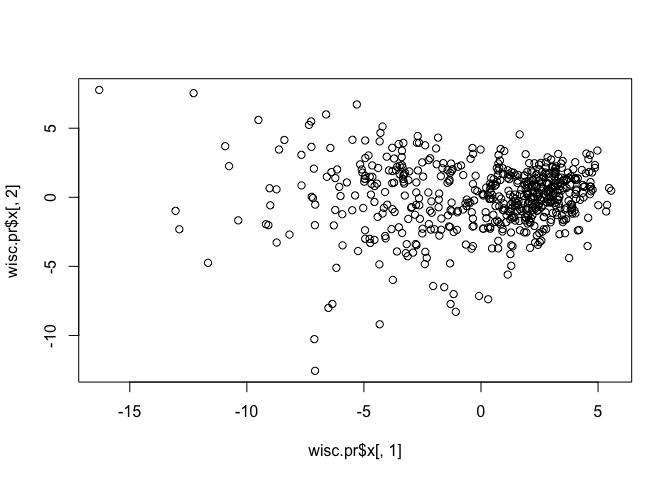
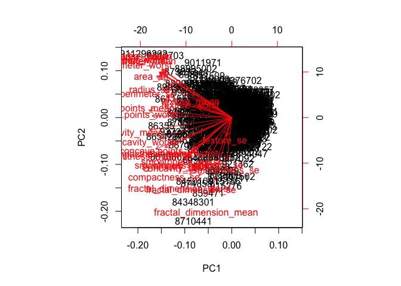
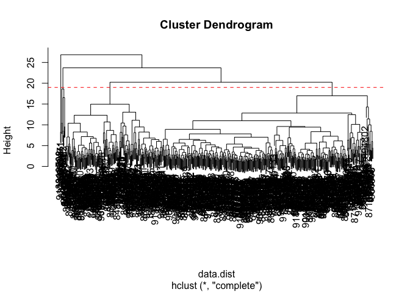
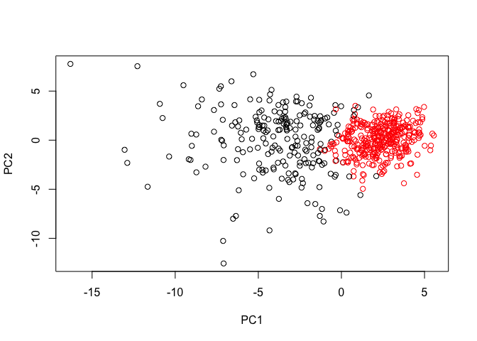
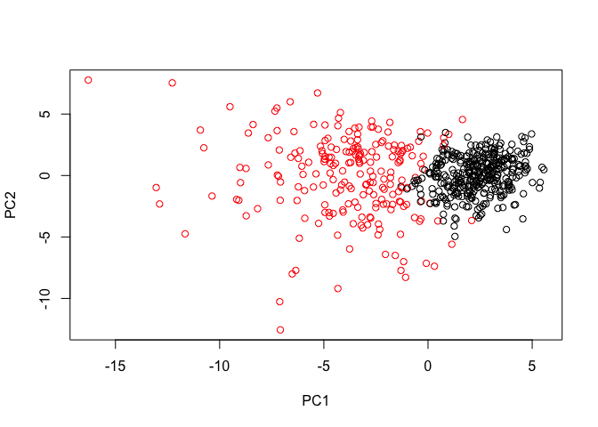
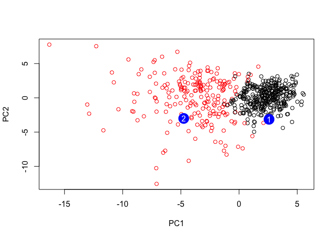

Class09 Unsupervised Learning Mini-Project
================
Duy Tong
10/29/2019

# Save your input data file to a new ‘data’ directory

``` r
wisc.df <- read.csv("WisconsinCancer.csv")
head(wisc.df)
```

    ##         id diagnosis radius_mean texture_mean perimeter_mean area_mean
    ## 1   842302         M       17.99        10.38         122.80    1001.0
    ## 2   842517         M       20.57        17.77         132.90    1326.0
    ## 3 84300903         M       19.69        21.25         130.00    1203.0
    ## 4 84348301         M       11.42        20.38          77.58     386.1
    ## 5 84358402         M       20.29        14.34         135.10    1297.0
    ## 6   843786         M       12.45        15.70          82.57     477.1
    ##   smoothness_mean compactness_mean concavity_mean concave.points_mean
    ## 1         0.11840          0.27760         0.3001             0.14710
    ## 2         0.08474          0.07864         0.0869             0.07017
    ## 3         0.10960          0.15990         0.1974             0.12790
    ## 4         0.14250          0.28390         0.2414             0.10520
    ## 5         0.10030          0.13280         0.1980             0.10430
    ## 6         0.12780          0.17000         0.1578             0.08089
    ##   symmetry_mean fractal_dimension_mean radius_se texture_se perimeter_se
    ## 1        0.2419                0.07871    1.0950     0.9053        8.589
    ## 2        0.1812                0.05667    0.5435     0.7339        3.398
    ## 3        0.2069                0.05999    0.7456     0.7869        4.585
    ## 4        0.2597                0.09744    0.4956     1.1560        3.445
    ## 5        0.1809                0.05883    0.7572     0.7813        5.438
    ## 6        0.2087                0.07613    0.3345     0.8902        2.217
    ##   area_se smoothness_se compactness_se concavity_se concave.points_se
    ## 1  153.40      0.006399        0.04904      0.05373           0.01587
    ## 2   74.08      0.005225        0.01308      0.01860           0.01340
    ## 3   94.03      0.006150        0.04006      0.03832           0.02058
    ## 4   27.23      0.009110        0.07458      0.05661           0.01867
    ## 5   94.44      0.011490        0.02461      0.05688           0.01885
    ## 6   27.19      0.007510        0.03345      0.03672           0.01137
    ##   symmetry_se fractal_dimension_se radius_worst texture_worst
    ## 1     0.03003             0.006193        25.38         17.33
    ## 2     0.01389             0.003532        24.99         23.41
    ## 3     0.02250             0.004571        23.57         25.53
    ## 4     0.05963             0.009208        14.91         26.50
    ## 5     0.01756             0.005115        22.54         16.67
    ## 6     0.02165             0.005082        15.47         23.75
    ##   perimeter_worst area_worst smoothness_worst compactness_worst
    ## 1          184.60     2019.0           0.1622            0.6656
    ## 2          158.80     1956.0           0.1238            0.1866
    ## 3          152.50     1709.0           0.1444            0.4245
    ## 4           98.87      567.7           0.2098            0.8663
    ## 5          152.20     1575.0           0.1374            0.2050
    ## 6          103.40      741.6           0.1791            0.5249
    ##   concavity_worst concave.points_worst symmetry_worst
    ## 1          0.7119               0.2654         0.4601
    ## 2          0.2416               0.1860         0.2750
    ## 3          0.4504               0.2430         0.3613
    ## 4          0.6869               0.2575         0.6638
    ## 5          0.4000               0.1625         0.2364
    ## 6          0.5355               0.1741         0.3985
    ##   fractal_dimension_worst  X
    ## 1                 0.11890 NA
    ## 2                 0.08902 NA
    ## 3                 0.08758 NA
    ## 4                 0.17300 NA
    ## 5                 0.07678 NA
    ## 6                 0.12440 NA

# **nrow()** tells us the number of rows for \# of patients Note that the `id` and `diagnosis` columns will not be used for most of the following steps.

``` r
nrow(wisc.df)
```

    ## [1] 569

# Beign & Maliganant

``` r
table(wisc.df$diagnosis)
```

    ## 
    ##   B   M 
    ## 357 212

# Complete the following code to input the data and store as wisc.df

``` r
wisc.data <- as.matrix(wisc.df[,3:32])
#[,3:32]) tells you only to consider from column 3 to column 32 and excluding other column 1,2
```

# Set the row names of wisc.data

``` r
row.names(wisc.data) <- wisc.df$id
head(wisc.data)
```

    ##          radius_mean texture_mean perimeter_mean area_mean smoothness_mean
    ## 842302         17.99        10.38         122.80    1001.0         0.11840
    ## 842517         20.57        17.77         132.90    1326.0         0.08474
    ## 84300903       19.69        21.25         130.00    1203.0         0.10960
    ## 84348301       11.42        20.38          77.58     386.1         0.14250
    ## 84358402       20.29        14.34         135.10    1297.0         0.10030
    ## 843786         12.45        15.70          82.57     477.1         0.12780
    ##          compactness_mean concavity_mean concave.points_mean symmetry_mean
    ## 842302            0.27760         0.3001             0.14710        0.2419
    ## 842517            0.07864         0.0869             0.07017        0.1812
    ## 84300903          0.15990         0.1974             0.12790        0.2069
    ## 84348301          0.28390         0.2414             0.10520        0.2597
    ## 84358402          0.13280         0.1980             0.10430        0.1809
    ## 843786            0.17000         0.1578             0.08089        0.2087
    ##          fractal_dimension_mean radius_se texture_se perimeter_se area_se
    ## 842302                  0.07871    1.0950     0.9053        8.589  153.40
    ## 842517                  0.05667    0.5435     0.7339        3.398   74.08
    ## 84300903                0.05999    0.7456     0.7869        4.585   94.03
    ## 84348301                0.09744    0.4956     1.1560        3.445   27.23
    ## 84358402                0.05883    0.7572     0.7813        5.438   94.44
    ## 843786                  0.07613    0.3345     0.8902        2.217   27.19
    ##          smoothness_se compactness_se concavity_se concave.points_se
    ## 842302        0.006399        0.04904      0.05373           0.01587
    ## 842517        0.005225        0.01308      0.01860           0.01340
    ## 84300903      0.006150        0.04006      0.03832           0.02058
    ## 84348301      0.009110        0.07458      0.05661           0.01867
    ## 84358402      0.011490        0.02461      0.05688           0.01885
    ## 843786        0.007510        0.03345      0.03672           0.01137
    ##          symmetry_se fractal_dimension_se radius_worst texture_worst
    ## 842302       0.03003             0.006193        25.38         17.33
    ## 842517       0.01389             0.003532        24.99         23.41
    ## 84300903     0.02250             0.004571        23.57         25.53
    ## 84348301     0.05963             0.009208        14.91         26.50
    ## 84358402     0.01756             0.005115        22.54         16.67
    ## 843786       0.02165             0.005082        15.47         23.75
    ##          perimeter_worst area_worst smoothness_worst compactness_worst
    ## 842302            184.60     2019.0           0.1622            0.6656
    ## 842517            158.80     1956.0           0.1238            0.1866
    ## 84300903          152.50     1709.0           0.1444            0.4245
    ## 84348301           98.87      567.7           0.2098            0.8663
    ## 84358402          152.20     1575.0           0.1374            0.2050
    ## 843786            103.40      741.6           0.1791            0.5249
    ##          concavity_worst concave.points_worst symmetry_worst
    ## 842302            0.7119               0.2654         0.4601
    ## 842517            0.2416               0.1860         0.2750
    ## 84300903          0.4504               0.2430         0.3613
    ## 84348301          0.6869               0.2575         0.6638
    ## 84358402          0.4000               0.1625         0.2364
    ## 843786            0.5355               0.1741         0.3985
    ##          fractal_dimension_worst
    ## 842302                   0.11890
    ## 842517                   0.08902
    ## 84300903                 0.08758
    ## 84348301                 0.17300
    ## 84358402                 0.07678
    ## 843786                   0.12440

# Create diagnosis vector for later

``` r
diagnosis <- wisc.df$diagnosis
```

## Question

Q1. How many observations are in this dataset?

``` r
nrow(wisc.data)
```

    ## [1] 569

Q2. How many of the observations have a malignant diagnosis?

``` r
table(wisc.data)
```

    ## wisc.data
    ##         0  0.000692 0.0007929 0.0008948 0.0009502 0.0009683 0.0009737 
    ##        78         2         1         1         1         1         2 
    ##  0.001002  0.001058  0.001087  0.001126  0.001128   0.00118  0.001184 
    ##         1         1         1         1         1         1         1 
    ##  0.001194  0.001217  0.001219  0.001286  0.001309  0.001343  0.001344 
    ##         1         1         1         1         1         1         1 
    ##  0.001345  0.001356   0.00136  0.001366  0.001381  0.001392  0.001432 
    ##         1         1         1         1         1         1         1 
    ##  0.001435  0.001444  0.001461  0.001463  0.001465  0.001487  0.001514 
    ##         1         1         2         1         1         2         1 
    ##  0.001519   0.00152  0.001524  0.001532  0.001533  0.001541  0.001546 
    ##         1         1         1         1         1         1         1 
    ##  0.001566  0.001575  0.001578  0.001588  0.001589  0.001593  0.001595 
    ##         1         1         1         1         1         1         2 
    ##  0.001597  0.001619  0.001621  0.001627  0.001629  0.001638  0.001656 
    ##         2         1         1         1         1         1         1 
    ##  0.001659  0.001661  0.001671  0.001672  0.001676  0.001684  0.001688 
    ##         1         1         1         1         1         1         1 
    ##  0.001697  0.001698    0.0017  0.001706  0.001708  0.001711  0.001713 
    ##         1         1         1         1         1         1         1 
    ##  0.001718   0.00172  0.001725  0.001726   0.00175  0.001754  0.001755 
    ##         1         1         1         1         1         1         1 
    ##  0.001767  0.001769  0.001773  0.001777  0.001779  0.001784  0.001787 
    ##         1         1         1         1         1         2         1 
    ##  0.001794  0.001798  0.001802  0.001803  0.001807  0.001812  0.001817 
    ##         1         1         1         1         1         1         1 
    ##  0.001828  0.001835  0.001845  0.001852  0.001857  0.001858   0.00186 
    ##         1         1         1         2         1         1         2 
    ##  0.001868  0.001887  0.001892  0.001902  0.001906  0.001941  0.001948 
    ##         1         1         2         1         2         1         1 
    ##  0.001952  0.001956  0.001957   0.00196  0.001963  0.001965   0.00197 
    ##         1         2         1         1         1         1         1 
    ##  0.001971  0.001972  0.001976  0.001982  0.001987  0.001988  0.001997 
    ##         2         1         2         1         1         1         1 
    ##  0.002001  0.002005  0.002015   0.00203  0.002052   0.00206  0.002065 
    ##         1         1         1         2         1         1         1 
    ##  0.002074  0.002081  0.002085  0.002087  0.002095  0.002104   0.00212 
    ##         2         1         1         1         1         1         1 
    ##  0.002128  0.002133  0.002142  0.002146  0.002152  0.002153  0.002157 
    ##         1         1         1         1         1         1         1 
    ##  0.002168  0.002177  0.002179  0.002198  0.002205  0.002206  0.002211 
    ##         1         1         1         1         2         1         1 
    ##  0.002217  0.002222  0.002228  0.002234  0.002248   0.00225  0.002252 
    ##         1         1         1         1         1         1         1 
    ##  0.002256  0.002267  0.002268  0.002272  0.002273  0.002278  0.002281 
    ##         2         1         1         1         1         1         1 
    ##  0.002289  0.002295  0.002299    0.0023  0.002304  0.002318  0.002326 
    ##         1         1         1         1         1         1         1 
    ##  0.002327   0.00233  0.002336  0.002355   0.00236  0.002362  0.002365 
    ##         1         1         1         1         1         1         1 
    ##  0.002371  0.002373  0.002377  0.002378  0.002379  0.002386  0.002399 
    ##         1         1         1         1         1         2         1 
    ##  0.002404  0.002411  0.002422  0.002425   0.00243  0.002436  0.002451 
    ##         2         1         1         1         1         1         1 
    ##  0.002461  0.002464   0.00247  0.002472  0.002476  0.002477   0.00248 
    ##         1         1         1         1         1         1         1 
    ##  0.002484  0.002496  0.002498  0.002528   0.00253  0.002534   0.00255 
    ##         1         1         1         1         1         1         1 
    ##  0.002551  0.002556  0.002564  0.002569  0.002575  0.002581  0.002582 
    ##         2         1         1         1         1         1         1 
    ##  0.002583  0.002585  0.002606  0.002607  0.002608  0.002613  0.002619 
    ##         1         1         1         1         1         1         1 
    ##   0.00262  0.002626  0.002629  0.002635  0.002658  0.002665  0.002667 
    ##         1         1         1         1         1         2         1 
    ##  0.002668  0.002671  0.002686  0.002689   0.00269  0.002695  0.002701 
    ##         1         1         1         1         1         1         2 
    ##  0.002713  0.002719  0.002725  0.002735  0.002744  0.002747  0.002751 
    ##         1         1         1         1         1         1         1 
    ##  0.002754  0.002758  0.002759  0.002768  0.002778  0.002783  0.002784 
    ##         1         2         1         1         1         2         1 
    ##  0.002787  0.002788  0.002789  0.002801  0.002808  0.002815  0.002817 
    ##         1         1         1         2         1         1         2 
    ##  0.002821  0.002826   0.00283  0.002831  0.002838  0.002846  0.002848 
    ##         1         1         1         1         1         1         1 
    ##  0.002866  0.002871  0.002881  0.002887  0.002893  0.002897  0.002917 
    ##         1         1         1         3         1         1         1 
    ##  0.002918  0.002922  0.002924  0.002925  0.002928  0.002941  0.002961 
    ##         1         1         2         1         1         2         1 
    ##  0.002967  0.002968  0.002977  0.002979  0.002985   0.00299  0.003002 
    ##         1         1         1         1         1         1         2 
    ##  0.003009  0.003012   0.00304  0.003042  0.003048  0.003053  0.003071 
    ##         2         1         1         1         1         1         1 
    ##  0.003087   0.00309    0.0031  0.003107  0.003114  0.003118  0.003121 
    ##         1         1         1         1         1         1         1 
    ##  0.003125   0.00313  0.003131  0.003136  0.003139  0.003169  0.003187 
    ##         2         1         1         1         1         1         1 
    ##  0.003204  0.003211  0.003213   0.00322  0.003223  0.003224   0.00323 
    ##         1         1         1         1         1         2         1 
    ##  0.003237  0.003242  0.003245  0.003249  0.003261  0.003265  0.003271 
    ##         1         1         1         1         1         1         1 
    ##   0.00328  0.003288   0.00329  0.003297  0.003299  0.003308  0.003317 
    ##         1         1         1         1         1         1         2 
    ##  0.003318  0.003324  0.003333  0.003336  0.003337  0.003338  0.003339 
    ##         2         1         2         1         1         2         1 
    ##  0.003345   0.00335  0.003351  0.003359  0.003362  0.003373  0.003385 
    ##         1         1         1         1         1         1         1 
    ##   0.00339  0.003391  0.003397  0.003399  0.003407  0.003408  0.003411 
    ##         1         1         1         1         1         1         1 
    ##  0.003418  0.003419  0.003428  0.003434  0.003442  0.003443  0.003446 
    ##         1         1         1         1         1         1         1 
    ##  0.003451  0.003457   0.00347  0.003472  0.003478  0.003479  0.003492 
    ##         1         1         1         2         1         1         1 
    ##  0.003493  0.003494  0.003495   0.00352  0.003526  0.003527  0.003532 
    ##         1         1         1         1         1         1         1 
    ##  0.003534  0.003535  0.003537   0.00354   0.00356  0.003563   0.00357 
    ##         1         2         1         1         1         2         1 
    ##  0.003576  0.003581  0.003586  0.003589  0.003599  0.003601  0.003608 
    ##         1         1         1         1         1         1         1 
    ##  0.003614  0.003617  0.003629  0.003632  0.003634  0.003643  0.003653 
    ##         1         1         2         1         1         1         1 
    ##  0.003659  0.003674  0.003681  0.003696  0.003704  0.003705  0.003707 
    ##         1         1         3         2         1         1         1 
    ##   0.00371  0.003711  0.003721  0.003727  0.003728  0.003733  0.003739 
    ##         1         1         1         1         1         1         1 
    ##   0.00374  0.003741  0.003742  0.003746  0.003747  0.003749  0.003755 
    ##         1         1         1         1         1         1         1 
    ##  0.003756  0.003761  0.003762  0.003796  0.003806  0.003813  0.003817 
    ##         1         1         1         2         1         1         1 
    ##  0.003818  0.003828   0.00384  0.003846  0.003854  0.003856  0.003872 
    ##         1         1         1         1         1         1         1 
    ##  0.003883  0.003884  0.003888  0.003892  0.003896  0.003899  0.003901 
    ##         1         1         1         1         1         1         1 
    ##  0.003913  0.003925  0.003933  0.003934  0.003949  0.003951  0.003956 
    ##         1         1         1         1         1         1         1 
    ##  0.003958  0.003976  0.003978   0.00398  0.003996  0.004005  0.004015 
    ##         1         1         1         1         1         2         1 
    ##  0.004022  0.004024  0.004028  0.004029  0.004031  0.004044  0.004045 
    ##         1         1         1         1         1         1         1 
    ##  0.004057  0.004065  0.004067  0.004076  0.004081  0.004085  0.004088 
    ##         1         1         1         1         1         1         1 
    ##  0.004097    0.0041  0.004107  0.004108  0.004117  0.004119  0.004123 
    ##         1         1         1         1         1         1         1 
    ##  0.004124  0.004133  0.004142  0.004143  0.004144  0.004147  0.004148 
    ##         1         1         1         1         1         1         1 
    ##  0.004154  0.004167  0.004168  0.004174  0.004185  0.004198    0.0042 
    ##         1         2         2         2         1         1         1 
    ##  0.004205  0.004217  0.004225   0.00423  0.004232  0.004235  0.004237 
    ##         1         1         1         1         1         1         1 
    ##  0.004239  0.004242  0.004253  0.004259  0.004261  0.004271  0.004272 
    ##         1         1         1         1         1         1         1 
    ##  0.004286  0.004291  0.004302  0.004306  0.004312  0.004314  0.004348 
    ##         1         1         1         1         1         1         1 
    ##  0.004351  0.004352  0.004359  0.004367  0.004369  0.004392  0.004394 
    ##         1         1         1         1         1         1         2 
    ##  0.004405  0.004406  0.004411  0.004413  0.004414  0.004417  0.004419 
    ##         1         1         1         1         1         1         1 
    ##  0.004426  0.004428  0.004435  0.004444  0.004445  0.004449   0.00445 
    ##         1         1         1         1         1         1         1 
    ##  0.004452  0.004455  0.004463  0.004473  0.004474  0.004476  0.004477 
    ##         2         1         1         1         1         1         1 
    ##  0.004481  0.004492  0.004493  0.004506   0.00451  0.004515  0.004536 
    ##         1         1         1         1         1         1         1 
    ##  0.004551  0.004558  0.004559   0.00456  0.004563   0.00457  0.004571 
    ##         2         1         1         2         1         1         2 
    ##  0.004572  0.004577  0.004578  0.004583  0.004584   0.00459  0.004599 
    ##         1         1         1         1         1         1         1 
    ##  0.004603  0.004613  0.004614  0.004622  0.004623  0.004625  0.004626 
    ##         1         1         1         1         1         1         1 
    ##  0.004631  0.004635  0.004638  0.004649  0.004651   0.00466  0.004667 
    ##         1         1         1         1         1         1         1 
    ##  0.004672  0.004675   0.00468  0.004693  0.004711  0.004714  0.004717 
    ##         1         1         1         1         1         1         1 
    ##  0.004723  0.004726  0.004728  0.004729  0.004731  0.004732  0.004738 
    ##         1         1         1         1         1         1         1 
    ##  0.004756  0.004757   0.00476  0.004766  0.004768  0.004775  0.004784 
    ##         1         1         1         1         1         2         1 
    ##  0.004785  0.004787  0.004796  0.004814  0.004821  0.004826   0.00483 
    ##         1         1         1         1         3         1         1 
    ##  0.004831  0.004832  0.004837  0.004841  0.004854   0.00486  0.004867 
    ##         1         1         1         1         1         1         1 
    ##  0.004868  0.004873  0.004877  0.004883  0.004899   0.00491  0.004911 
    ##         2         1         1         1         1         1         1 
    ##  0.004928  0.004929   0.00493  0.004938  0.004942  0.004952  0.004953 
    ##         1         1         1         2         1         1         1 
    ##  0.004955  0.004957  0.004967  0.004968  0.004972  0.004973  0.004976 
    ##         1         1         2         1         1         1         1 
    ##  0.004984  0.004989  0.005002  0.005006  0.005012  0.005015   0.00502 
    ##         1         1         1         1         1         1         1 
    ##  0.005025  0.005031  0.005033  0.005036  0.005037  0.005038  0.005042 
    ##         1         1         1         1         1         1         1 
    ##  0.005043  0.005044  0.005051  0.005061  0.005067  0.005072  0.005077 
    ##         1         1         2         1         1         1         1 
    ##   0.00508  0.005082  0.005089  0.005096  0.005099  0.005115   0.00512 
    ##         2         1         1         1         1         1         1 
    ##  0.005126  0.005128  0.005133  0.005142  0.005158  0.005159  0.005161 
    ##         1         2         1         1         1         1         1 
    ##  0.005169  0.005174  0.005179  0.005195  0.005212  0.005215  0.005217 
    ##         1         1         1         1         1         1         2 
    ##  0.005225  0.005231  0.005233  0.005243   0.00525  0.005251  0.005252 
    ##         1         1         1         1         1         2         1 
    ##  0.005254  0.005255  0.005273  0.005274  0.005283  0.005288  0.005293 
    ##         1         1         1         1         1         1         1 
    ##  0.005295  0.005296  0.005297  0.005298  0.005304  0.005308  0.005314 
    ##         1         1         1         3         1         1         1 
    ##  0.005324  0.005325  0.005332  0.005343  0.005344  0.005345  0.005348 
    ##         1         1         1         1         1         1         1 
    ##  0.005356  0.005367  0.005371  0.005383  0.005391  0.005393  0.005398 
    ##         1         1         1         2         1         1         1 
    ##  0.005403  0.005412  0.005414  0.005415  0.005421  0.005427  0.005433 
    ##         1         1         1         1         1         1         1 
    ##  0.005436  0.005442  0.005444  0.005449  0.005463  0.005466  0.005467 
    ##         1         1         2         1         1         1         1 
    ##  0.005472  0.005484  0.005485  0.005488  0.005495  0.005498  0.005501 
    ##         1         1         1         1         3         1         1 
    ##  0.005508  0.005512  0.005515  0.005517  0.005518  0.005524  0.005528 
    ##         1         1         1         1         3         1         2 
    ##   0.00553  0.005532  0.005539  0.005541  0.005551  0.005558  0.005564 
    ##         1         1         1         1         1         1         1 
    ##  0.005568  0.005579  0.005592  0.005596  0.005601  0.005607  0.005608 
    ##         1         1         1         1         1         1         1 
    ##  0.005612  0.005617  0.005623  0.005627  0.005635  0.005638  0.005654 
    ##         2         2         1         1         1         1         1 
    ##  0.005656  0.005657   0.00566  0.005664  0.005667  0.005672  0.005681 
    ##         1         1         1         1         2         1         1 
    ##  0.005682  0.005687  0.005697  0.005701  0.005704  0.005706  0.005715 
    ##         1         1         1         1         1         1         1 
    ##  0.005717  0.005718  0.005724  0.005726  0.005727  0.005731   0.00574 
    ##         1         1         1         1         1         1         1 
    ##  0.005742  0.005753  0.005756  0.005767  0.005768  0.005769  0.005771 
    ##         1         1         1         1         1         2         1 
    ##  0.005776  0.005783  0.005784   0.00579    0.0058  0.005812  0.005815 
    ##         1         1         1         1         1         1         1 
    ##   0.00582  0.005822  0.005824  0.005828  0.005832  0.005833  0.005836 
    ##         1         1         1         1         2         1         1 
    ##  0.005838  0.005839  0.005841  0.005851  0.005857  0.005868  0.005872 
    ##         1         1         1         1         1         1         2 
    ##  0.005875  0.005878  0.005883  0.005884  0.005888   0.00589  0.005891 
    ##         1         1         1         2         1         1         1 
    ##  0.005893    0.0059  0.005903  0.005905   0.00591  0.005917  0.005919 
    ##         1         1         1         1         2         3         1 
    ##  0.005928  0.005949  0.005953  0.005954   0.00596  0.005969  0.005984 
    ##         1         1         1         1         1         2         1 
    ##  0.005987  0.005996     0.006  0.006001  0.006003  0.006005  0.006009 
    ##         1         1         1         1         1         1         1 
    ##  0.006011  0.006016  0.006021  0.006032  0.006034   0.00604  0.006042 
    ##         1         1         2         1         1         2         2 
    ##  0.006048  0.006054  0.006056  0.006064   0.00609  0.006098  0.006104 
    ##         1         1         1         2         1         1         1 
    ##  0.006111  0.006113  0.006122  0.006123  0.006131  0.006133  0.006134 
    ##         1         2         1         1         1         1         1 
    ##  0.006142  0.006144   0.00615  0.006153  0.006159  0.006164  0.006174 
    ##         2         1         1         1         1         1         1 
    ##  0.006175  0.006176   0.00618  0.006185  0.006187  0.006189  0.006193 
    ##         1         1         1         1         1         1         1 
    ##  0.006208  0.006211  0.006213   0.00624  0.006245  0.006248   0.00625 
    ##         1         1         1         3         1         1         1 
    ##  0.006261  0.006263  0.006272  0.006273  0.006275  0.006292  0.006294 
    ##         1         1         1         1         1         1         1 
    ##  0.006296  0.006298  0.006299  0.006307  0.006315  0.006324   0.00633 
    ##         1         1         1         1         1         1         1 
    ##  0.006335  0.006336  0.006351  0.006355  0.006356  0.006364  0.006369 
    ##         1         1         1         1         1         1         1 
    ##   0.00637   0.00638  0.006383  0.006399  0.006416  0.006418  0.006423 
    ##         1         1         1         3         1         1         1 
    ##  0.006428  0.006429  0.006432  0.006433  0.006434  0.006435  0.006451 
    ##         1         1         2         1         1         1         1 
    ##  0.006455  0.006458   0.00646   0.00647  0.006471  0.006472  0.006474 
    ##         1         1         1         1         1         1         1 
    ##   0.00649  0.006493  0.006494  0.006502  0.006513  0.006515  0.006517 
    ##         1         1         2         1         1         1         1 
    ##  0.006522   0.00653  0.006532  0.006538  0.006543  0.006547  0.006548 
    ##         2         1         1         1         1         1         1 
    ##  0.006564  0.006565  0.006578  0.006583  0.006587  0.006588  0.006627 
    ##         1         1         1         1         1         2         2 
    ##  0.006635  0.006643  0.006652  0.006659  0.006662  0.006663  0.006664 
    ##         1         1         1         1         1         1         1 
    ##  0.006666  0.006691  0.006692  0.006697  0.006703  0.006708  0.006709 
    ##         1         1         1         1         1         1         1 
    ##  0.006715  0.006717  0.006719  0.006736  0.006739  0.006747  0.006758 
    ##         1         1         2         2         1         1         1 
    ##  0.006766   0.00677  0.006773  0.006789  0.006792  0.006794  0.006797 
    ##         1         1         1         1         1         1         1 
    ##  0.006801  0.006804  0.006809  0.006813   0.00682  0.006822  0.006829 
    ##         1         1         1         1         1         1         2 
    ##  0.006831  0.006836  0.006853  0.006854  0.006872   0.00688  0.006881 
    ##         1         1         1         1         1         1         1 
    ##  0.006883  0.006884  0.006887  0.006888  0.006897  0.006905  0.006908 
    ##         1         2         1         1         1         1         1 
    ##   0.00692  0.006929  0.006953   0.00696  0.006965  0.006972  0.006982 
    ##         1         1         1         1         1         1         1 
    ##  0.006983  0.006985  0.006991  0.006995  0.006998  0.007004  0.007016 
    ##         1         1         1         1         1         1         1 
    ##  0.007017  0.007026  0.007027  0.007039  0.007054  0.007066  0.007078 
    ##         1         1         1         1         1         1         1 
    ##  0.007082  0.007086  0.007087  0.007089  0.007096  0.007098  0.007112 
    ##         1         1         1         1         1         1         1 
    ##  0.007124  0.007138  0.007149  0.007159  0.007162  0.007173   0.00718 
    ##         1         1         1         1         1         1         1 
    ##  0.007189   0.00721  0.007228  0.007231  0.007234  0.007246  0.007247 
    ##         2         1         1         1         1         1         1 
    ##   0.00725  0.007256  0.007257  0.007259  0.007269  0.007276  0.007278 
    ##         1         1         1         1         1         1         1 
    ##  0.007295  0.007302  0.007303  0.007308  0.007315   0.00732  0.007327 
    ##         1         1         1         1         1         1         1 
    ##   0.00733  0.007334  0.007337  0.007339  0.007356  0.007357  0.007358 
    ##         1         1         1         1         1         1         1 
    ##  0.007364  0.007369  0.007373  0.007389  0.007392  0.007394  0.007405 
    ##         1         1         1         2         1         1         1 
    ##  0.007408  0.007416  0.007437   0.00744  0.007444  0.007445   0.00747 
    ##         1         1         1         1         1         1         1 
    ##  0.007483  0.007491  0.007497  0.007499  0.007501  0.007506  0.007508 
    ##         1         1         1         1         1         1         1 
    ##  0.007509   0.00751  0.007513  0.007514  0.007517  0.007527  0.007545 
    ##         1         2         1         2         1         1         1 
    ##  0.007548  0.007551  0.007555  0.007571  0.007583  0.007584  0.007591 
    ##         1         1         1         1         1         1         1 
    ##  0.007594  0.007595  0.007596   0.00761   0.00762  0.007624  0.007638 
    ##         1         2         1         1         1         1         1 
    ##  0.007646   0.00765  0.007665  0.007671  0.007702  0.007711  0.007731 
    ##         1         1         1         1         1         1         1 
    ##  0.007732  0.007741  0.007756  0.007762  0.007781  0.007799  0.007802 
    ##         1         1         1         1         1         1         1 
    ##  0.007803  0.007807  0.007809  0.007816  0.007831  0.007861  0.007875 
    ##         2         2         1         1         1         1         1 
    ##  0.007877  0.007881  0.007882  0.007895  0.007897  0.007899  0.007924 
    ##         1         1         1         1         1         1         1 
    ##  0.007936  0.007937  0.007939   0.00794  0.007956  0.007959  0.007962 
    ##         1         1         1         1         1         1         1 
    ##  0.007964  0.007965   0.00797  0.007974  0.007975  0.007976  0.007977 
    ##         1         1         1         1         1         1         1 
    ##  0.007978  0.007983  0.007986  0.007997     0.008  0.008005  0.008007 
    ##         1         1         1         1         1         1         1 
    ##  0.008008  0.008015  0.008029  0.008034  0.008038  0.008043  0.008045 
    ##         1         1         1         1         1         1         1 
    ##  0.008061  0.008064  0.008074  0.008081  0.008082  0.008093  0.008094 
    ##         1         1         1         1         1         1         1 
    ##  0.008102  0.008109  0.008124  0.008133  0.008146  0.008153   0.00816 
    ##         1         1         1         1         1         1         1 
    ##  0.008166  0.008179  0.008185  0.008186  0.008193  0.008198    0.0082 
    ##         1         1         1         1         1         1         1 
    ##  0.008231  0.008232  0.008239  0.008243   0.00826  0.008261  0.008263 
    ##         1         1         1         1         1         1         1 
    ##  0.008268  0.008274  0.008281  0.008304  0.008306  0.008312  0.008313 
    ##         2         1         1         1         1         1         1 
    ##   0.00832  0.008328  0.008342  0.008347  0.008356   0.00836   0.00838 
    ##         1         1         1         1         1         2         1 
    ##  0.008399  0.008412   0.00842  0.008422  0.008426  0.008432  0.008439 
    ##         1         1         1         1         1         1         1 
    ##  0.008462  0.008463  0.008468  0.008482  0.008488  0.008491  0.008496 
    ##         1         1         1         1         1         1         1 
    ##  0.008499  0.008507   0.00851  0.008522  0.008534  0.008535  0.008539 
    ##         1         1         1         1         2         1         1 
    ##   0.00854  0.008548  0.008565  0.008577  0.008578  0.008584  0.008593 
    ##         1         1         1         1         1         1         1 
    ##  0.008602  0.008606  0.008614  0.008637  0.008648   0.00866  0.008662 
    ##         1         1         1         1         1         1         1 
    ##   0.00867  0.008674  0.008675  0.008691  0.008699  0.008704  0.008713 
    ##         1         1         1         1         1         1         1 
    ##  0.008722  0.008725  0.008732  0.008738   0.00874  0.008747  0.008772 
    ##         1         1         2         1         1         1         1 
    ##  0.008776  0.008791  0.008799  0.008805  0.008824  0.008829  0.008835 
    ##         1         1         1         1         1         1         1 
    ##  0.008848  0.008849  0.008872  0.008875  0.008878  0.008902  0.008907 
    ##         1         1         1         1         1         1         1 
    ##   0.00892  0.008925  0.008934  0.008955  0.008965  0.008968  0.008974 
    ##         1         1         1         1         1         1         1 
    ##  0.008982  0.008985  0.008998  0.009006  0.009019  0.009037  0.009046 
    ##         1         1         2         1         1         1         1 
    ##  0.009057  0.009058  0.009061  0.009064  0.009067  0.009073  0.009075 
    ##         1         1         1         1         1         1         1 
    ##  0.009087  0.009098  0.009105   0.00911  0.009113  0.009117  0.009127 
    ##         2         1         1         2         1         1         1 
    ##  0.009128  0.009148  0.009155  0.009166  0.009169  0.009172  0.009175 
    ##         1         1         2         1         2         1         1 
    ##  0.009181  0.009191  0.009193  0.009197  0.009199  0.009206  0.009208 
    ##         1         1         1         1         2         1         1 
    ##  0.009213  0.009215  0.009216  0.009222  0.009231  0.009233  0.009238 
    ##         1         1         1         2         1         1         1 
    ##   0.00925  0.009259  0.009269  0.009276   0.00928  0.009282  0.009305 
    ##         1         3         1         1         1         1         1 
    ##  0.009327  0.009329  0.009333  0.009355  0.009362  0.009366  0.009368 
    ##         1         1         1         1         1         1         1 
    ##  0.009369  0.009393  0.009398    0.0094  0.009406  0.009407   0.00941 
    ##         1         1         1         1         1         1         1 
    ##  0.009423  0.009433  0.009442  0.009443  0.009472  0.009501  0.009514 
    ##         2         1         1         1         1         1         1 
    ##  0.009519   0.00952  0.009536  0.009538  0.009539  0.009549  0.009559 
    ##         1         1         2         1         1         1         1 
    ##   0.00956  0.009567  0.009579  0.009606  0.009615  0.009623  0.009627 
    ##         1         1         1         1         2         1         1 
    ##  0.009643   0.00968  0.009692  0.009702  0.009719  0.009753  0.009758 
    ##         1         1         1         1         1         1         1 
    ##  0.009767  0.009769  0.009783  0.009789  0.009811  0.009816  0.009845 
    ##         1         1         1         1         1         1         1 
    ##  0.009853  0.009861  0.009863  0.009875  0.009882  0.009883  0.009894 
    ##         1         1         1         2         1         1         1 
    ##  0.009895  0.009904  0.009919  0.009921  0.009924  0.009937  0.009947 
    ##         1         1         1         1         1         1         2 
    ##  0.009959  0.009976  0.009997      0.01   0.01003   0.01004   0.01005 
    ##         1         1         1         2         2         3         2 
    ##   0.01006   0.01007   0.01008    0.0101   0.01011   0.01012   0.01013 
    ##         1         1         1         1         3         2         1 
    ##   0.01015   0.01017   0.01018   0.01019   0.01022   0.01023   0.01024 
    ##         1         3         1         1         2         1         1 
    ##   0.01027   0.01029    0.0103   0.01031   0.01032   0.01033   0.01035 
    ##         1         1         3         1         1         1         1 
    ##   0.01037   0.01038   0.01039    0.0104   0.01042   0.01043   0.01044 
    ##         3         5         3         2         2         3         1 
    ##   0.01045   0.01046   0.01047   0.01049   0.01051   0.01052   0.01053 
    ##         2         1         1         1         3         4         1 
    ##   0.01054   0.01055   0.01056   0.01057   0.01061   0.01062   0.01063 
    ##         1         3         3         1         1         2         2 
    ##   0.01065   0.01067   0.01069   0.01071   0.01072   0.01075   0.01076 
    ##         5         3         4         2         2         2         2 
    ##   0.01078   0.01079   0.01081   0.01082   0.01083   0.01084   0.01087 
    ##         1         3         1         3         2         2         1 
    ##   0.01088    0.0109   0.01091   0.01093   0.01094   0.01095   0.01096 
    ##         1         1         1         3         2         2         2 
    ##   0.01097   0.01098   0.01099   0.01101   0.01102   0.01103   0.01104 
    ##         3         1         2         1         1         3         3 
    ##   0.01105   0.01106   0.01107   0.01108   0.01109    0.0111   0.01111 
    ##         1         1         1         1         1         3         4 
    ##   0.01112   0.01113   0.01114   0.01115   0.01116   0.01117    0.0112 
    ##         3         2         2         1         1         2         2 
    ##   0.01121   0.01122   0.01123   0.01124   0.01127   0.01129    0.0113 
    ##         2         1         4         2         2         1         2 
    ##   0.01131   0.01132   0.01133   0.01134   0.01135   0.01136   0.01137 
    ##         1         3         1         1         1         1         1 
    ##    0.0114   0.01141   0.01142   0.01143   0.01144   0.01145   0.01148 
    ##         1         1         1         1         1         1         3 
    ##   0.01149   0.01152   0.01153   0.01155   0.01156   0.01158   0.01159 
    ##         2         2         3         2         1         2         1 
    ##   0.01161   0.01162   0.01163   0.01164   0.01167   0.01168   0.01169 
    ##         2         4         1         3         4         1         2 
    ##   0.01171   0.01172   0.01174   0.01175   0.01176   0.01177   0.01178 
    ##         4         3         2         1         1         2         2 
    ##   0.01179    0.0118   0.01183   0.01184   0.01185   0.01186   0.01187 
    ##         1         2         2         2         2         2         1 
    ##   0.01188    0.0119   0.01191   0.01193   0.01195   0.01196   0.01197 
    ##         1         1         1         1         1         3         2 
    ##     0.012   0.01201   0.01202   0.01203   0.01204   0.01205   0.01206 
    ##         3         1         2         2         1         2         2 
    ##   0.01208   0.01209   0.01212   0.01215   0.01216   0.01219    0.0122 
    ##         1         1         1         3         1         1         2 
    ##   0.01221   0.01223   0.01226   0.01227   0.01228   0.01232   0.01233 
    ##         2         1         2         1         1         1         2 
    ##   0.01235   0.01236   0.01237   0.01238   0.01241   0.01243   0.01244 
    ##         1         3         1         1         2         2         1 
    ##   0.01245   0.01246   0.01247   0.01248   0.01249    0.0125   0.01251 
    ##         1         3         2         1         1         2         2 
    ##   0.01254   0.01256   0.01257   0.01259   0.01261   0.01262   0.01263 
    ##         3         3         2         1         1         3         3 
    ##   0.01264   0.01266   0.01267   0.01268   0.01269    0.0127   0.01271 
    ##         1         2         3         1         2         1         2 
    ##   0.01272   0.01273   0.01274   0.01275   0.01276   0.01277   0.01278 
    ##         2         1         1         1         3         1         1 
    ##   0.01282   0.01284   0.01285   0.01286   0.01288   0.01289    0.0129 
    ##         5         1         3         2         3         1         2 
    ##   0.01291   0.01292   0.01293   0.01295   0.01296   0.01297   0.01298 
    ##         4         1         2         2         1         1         2 
    ##   0.01301   0.01302   0.01303   0.01304   0.01307   0.01308   0.01311 
    ##         1         1         1         1         3         1         2 
    ##   0.01313   0.01314   0.01315   0.01316   0.01318    0.0132   0.01321 
    ##         1         1         3         2         1         2         1 
    ##   0.01322   0.01323   0.01325   0.01328   0.01329    0.0133   0.01331 
    ##         1         1         1         1         3         2         1 
    ##   0.01332   0.01333   0.01334   0.01335   0.01339    0.0134   0.01341 
    ##         1         1         2         1         2         3         4 
    ##   0.01342   0.01343   0.01344   0.01345   0.01346   0.01347   0.01349 
    ##         3         2         4         3         2         1         2 
    ##    0.0135   0.01352   0.01354   0.01356   0.01357   0.01358   0.01359 
    ##         2         2         2         1         1         1         1 
    ##   0.01361   0.01362   0.01364   0.01365   0.01367   0.01368   0.01369 
    ##         1         1         2         4         4         1         4 
    ##    0.0137   0.01371   0.01372   0.01374   0.01376   0.01377   0.01379 
    ##         4         3         1         3         3         2         1 
    ##    0.0138   0.01382   0.01383   0.01384   0.01385   0.01386   0.01388 
    ##         4         2         2         3         1         3         3 
    ##   0.01389    0.0139   0.01391   0.01392   0.01393   0.01394   0.01395 
    ##         2         2         1         1         3         2         2 
    ##   0.01397   0.01398     0.014   0.01401   0.01402   0.01403   0.01404 
    ##         2         1         1         1         1         2         1 
    ##   0.01405   0.01406   0.01407    0.0141   0.01411   0.01412   0.01414 
    ##         1         1         2         1         1         2         2 
    ##   0.01415   0.01416   0.01418   0.01419    0.0142   0.01421   0.01422 
    ##         2         1         2         1         2         2         2 
    ##   0.01423   0.01424   0.01427   0.01428   0.01431   0.01432   0.01434 
    ##         1         1         2         3         1         3         1 
    ##   0.01435   0.01439   0.01442   0.01443   0.01444   0.01445   0.01446 
    ##         2         1         2         2         1         2         1 
    ##   0.01447   0.01448   0.01449    0.0145   0.01451   0.01452   0.01453 
    ##         2         1         2         2         2         2         1 
    ##   0.01454   0.01457   0.01458   0.01459    0.0146   0.01461   0.01462 
    ##         3         1         1         2         2         3         2 
    ##   0.01463   0.01465   0.01466   0.01467   0.01468   0.01469   0.01471 
    ##         2         3         2         2         1         1         3 
    ##   0.01472   0.01473   0.01474   0.01477   0.01478   0.01479    0.0148 
    ##         1         1         1         1         1         3         2 
    ##   0.01482   0.01484   0.01485   0.01486   0.01487   0.01488   0.01489 
    ##         2         1         1         1         1         2         1 
    ##    0.0149   0.01491   0.01492   0.01493   0.01494   0.01495   0.01496 
    ##         1         1         1         2         2         1         1 
    ##   0.01498   0.01499     0.015   0.01501   0.01502   0.01503   0.01504 
    ##         2         5         2         1         3         3         1 
    ##   0.01506   0.01508   0.01509    0.0151   0.01514   0.01515   0.01516 
    ##         2         1         1         3         3         1         1 
    ##   0.01518   0.01519    0.0152   0.01521   0.01522   0.01523   0.01526 
    ##         1         2         2         2         2         1         1 
    ##   0.01527   0.01528   0.01529    0.0153   0.01535   0.01536   0.01537 
    ##         3         2         2         1         1         4         1 
    ##   0.01538   0.01539   0.01541   0.01543   0.01544   0.01546   0.01547 
    ##         1         1         2         1         3         1         3 
    ##   0.01548    0.0155   0.01551   0.01553   0.01555   0.01556   0.01557 
    ##         1         1         2         2         1         1         2 
    ##   0.01559    0.0156   0.01561   0.01562   0.01563   0.01564   0.01565 
    ##         2         4         3         1         1         2         1 
    ##   0.01567   0.01568   0.01569   0.01571   0.01573   0.01574   0.01575 
    ##         2         1         2         1         1         2         2 
    ##   0.01576   0.01578    0.0158   0.01581   0.01582   0.01583   0.01585 
    ##         1         2         4         1         1         2         1 
    ##   0.01587   0.01588    0.0159   0.01591   0.01592   0.01594   0.01596 
    ##         3         2         1         1         2         2         1 
    ##   0.01597   0.01601   0.01602   0.01603   0.01604   0.01606   0.01608 
    ##         2         2         1         1         2         1         4 
    ##   0.01609    0.0161   0.01613   0.01615   0.01616   0.01617   0.01619 
    ##         1         1         2         3         2         2         1 
    ##   0.01622   0.01623   0.01626   0.01627   0.01628    0.0163   0.01631 
    ##         1         3         1         1         1         2         1 
    ##   0.01633   0.01635   0.01637   0.01638   0.01639   0.01641   0.01646 
    ##         3         2         1         2         2         3         2 
    ##   0.01647   0.01648   0.01649   0.01651   0.01652   0.01654   0.01656 
    ##         4         1         1         2         4         1         1 
    ##   0.01657   0.01659   0.01661   0.01664   0.01665   0.01666   0.01667 
    ##         1         1         1         1         2         2         3 
    ##   0.01669   0.01671   0.01673   0.01674   0.01675   0.01677   0.01678 
    ##         1         2         1         2         1         1         3 
    ##   0.01679    0.0168   0.01682   0.01683   0.01686   0.01689    0.0169 
    ##         1         1         1         1         1         1         1 
    ##   0.01692   0.01693   0.01694   0.01695   0.01697   0.01698   0.01699 
    ##         2         1         1         3         1         4         2 
    ##     0.017   0.01701   0.01703   0.01705   0.01706   0.01708   0.01712 
    ##         2         1         1         1         1         1         2 
    ##   0.01713   0.01714   0.01715   0.01716   0.01717   0.01718   0.01719 
    ##         1         2         2         1         2         1         2 
    ##    0.0172   0.01721   0.01723   0.01724   0.01727   0.01731   0.01733 
    ##         1         2         2         1         2         1         1 
    ##   0.01735   0.01736   0.01737   0.01738    0.0174   0.01742   0.01743 
    ##         1         1         2         1         1         2         1 
    ##   0.01744   0.01745   0.01746   0.01748    0.0175   0.01752   0.01755 
    ##         1         2         1         1         1         1         2 
    ##   0.01756   0.01757   0.01758   0.01759   0.01761   0.01762   0.01763 
    ##         2         1         1         2         1         2         1 
    ##   0.01764   0.01765   0.01766   0.01768    0.0177   0.01772   0.01774 
    ##         1         1         2         3         2         1         2 
    ##   0.01775   0.01777   0.01778   0.01779    0.0178   0.01781   0.01782 
    ##         1         2         2         1         2         2         1 
    ##   0.01785   0.01786   0.01787   0.01789    0.0179   0.01791   0.01792 
    ##         1         1         1         1         1         2         3 
    ##   0.01795   0.01796   0.01797   0.01798   0.01799     0.018   0.01801 
    ##         1         3         2         3         1         4         2 
    ##   0.01805   0.01806   0.01807   0.01808   0.01809    0.0181   0.01812 
    ##         2         1         1         1         1         1         3 
    ##   0.01813   0.01815   0.01816   0.01817   0.01818   0.01819    0.0182 
    ##         1         1         3         1         3         2         1 
    ##   0.01822   0.01824   0.01826   0.01829   0.01831   0.01832   0.01834 
    ##         1         2         1         2         1         1         2 
    ##   0.01835   0.01838    0.0184   0.01841   0.01842   0.01843   0.01844 
    ##         4         1         2         3         2         5         1 
    ##   0.01846   0.01848   0.01851   0.01852   0.01853   0.01854   0.01855 
    ##         1         2         2         3         1         1         1 
    ##   0.01857    0.0186   0.01861   0.01863   0.01864   0.01865   0.01867 
    ##         2         1         2         1         1         3         2 
    ##   0.01868   0.01869    0.0187   0.01872   0.01873   0.01875   0.01876 
    ##         1         1         4         2         1         2         1 
    ##   0.01877   0.01878   0.01879    0.0188   0.01882   0.01883   0.01884 
    ##         3         2         2         2         1         2         3 
    ##   0.01885   0.01893   0.01894   0.01895   0.01896   0.01897   0.01898 
    ##         2         1         1         1         1         3         3 
    ##   0.01899     0.019   0.01902   0.01903   0.01906   0.01909    0.0191 
    ##         1         1         1         1         2         1         3 
    ##   0.01911   0.01915   0.01916   0.01917   0.01919   0.01921   0.01923 
    ##         2         1         1         2         1         2         1 
    ##   0.01924   0.01925   0.01929    0.0193   0.01934   0.01936   0.01938 
    ##         5         1         1         1         1         2         5 
    ##   0.01939    0.0194   0.01942   0.01943   0.01945   0.01946   0.01947 
    ##         3         2         1         1         1         1         2 
    ##   0.01948   0.01949   0.01951   0.01952   0.01953   0.01954   0.01956 
    ##         1         1         2         2         1         1         1 
    ##   0.01957   0.01958   0.01959    0.0196   0.01961   0.01962   0.01963 
    ##         1         1         1         1         2         2         1 
    ##   0.01964   0.01965   0.01966   0.01967   0.01968   0.01969   0.01971 
    ##         2         1         2         1         1         1         3 
    ##   0.01972   0.01974   0.01977   0.01978    0.0198   0.01981   0.01982 
    ##         3         1         2         1         1         1         2 
    ##   0.01985   0.01988   0.01989    0.0199   0.01992   0.01993   0.01994 
    ##         1         1         2         1         1         2         2 
    ##   0.01995   0.01996   0.01997   0.01998      0.02   0.02003   0.02005 
    ##         1         2         2         2         2         1         2 
    ##   0.02007   0.02008   0.02009   0.02014   0.02015   0.02016   0.02017 
    ##         2         3         1         1         2         1         2 
    ##   0.02018   0.02021   0.02022   0.02025   0.02027   0.02028    0.0203 
    ##         2         1         1         2         2         1         3 
    ##   0.02031   0.02032   0.02036   0.02037   0.02039   0.02041   0.02042 
    ##         3         1         1         1         1         1         1 
    ##   0.02043   0.02045   0.02047   0.02048   0.02049   0.02052   0.02054 
    ##         1         6         4         2         1         1         1 
    ##   0.02057   0.02058   0.02059    0.0206   0.02061   0.02062   0.02063 
    ##         2         1         1         1         1         2         1 
    ##   0.02065   0.02068   0.02069    0.0207   0.02071   0.02073   0.02074 
    ##         1         2         1         2         2         1         1 
    ##   0.02075   0.02076   0.02079    0.0208   0.02083   0.02085   0.02086 
    ##         2         1         2         2         2         2         2 
    ##   0.02087   0.02088    0.0209   0.02091   0.02094   0.02095   0.02096 
    ##         2         1         2         1         1         1         1 
    ##   0.02098   0.02099     0.021   0.02101   0.02102   0.02104   0.02105 
    ##         1         2         2         2         1         1         3 
    ##   0.02107   0.02108   0.02109   0.02114   0.02115   0.02117    0.0212 
    ##         1         1         1         1         1         2         1 
    ##   0.02121   0.02124   0.02127   0.02134   0.02137   0.02139    0.0214 
    ##         1         1         1         3         1         1         1 
    ##   0.02142   0.02143   0.02144   0.02147   0.02148   0.02149   0.02151 
    ##         1         2         1         1         1         1         1 
    ##   0.02152   0.02153   0.02154   0.02156   0.02157   0.02158   0.02161 
    ##         1         2         1         1         1         1         1 
    ##   0.02163   0.02165   0.02166   0.02168   0.02172   0.02173   0.02175 
    ##         1         2         1         3         2         1         2 
    ##   0.02176   0.02177   0.02178   0.02179    0.0218   0.02181   0.02183 
    ##         1         1         1         1         1         1         1 
    ##   0.02185   0.02186   0.02187   0.02188    0.0219   0.02193   0.02196 
    ##         2         1         2         1         1         2         1 
    ##   0.02197   0.02198   0.02199   0.02201   0.02203   0.02207    0.0221 
    ##         1         1         1         1         2         1         2 
    ##   0.02212   0.02213   0.02215   0.02216   0.02218   0.02219    0.0222 
    ##         1         1         1         1         1         3         2 
    ##   0.02221   0.02222   0.02223   0.02224    0.0223   0.02232   0.02233 
    ##         1         2         1         1         1         1         1 
    ##   0.02234   0.02237   0.02239   0.02245    0.0225   0.02251   0.02252 
    ##         1         1         1         1         1         2         1 
    ##   0.02254   0.02257   0.02258   0.02259    0.0226   0.02263   0.02265 
    ##         3         1         2         1         3         1         1 
    ##   0.02266   0.02269   0.02272   0.02273   0.02277   0.02278   0.02279 
    ##         1         1         2         1         3         1         1 
    ##    0.0228   0.02282   0.02283   0.02286   0.02287   0.02291   0.02292 
    ##         1         1         1         1         1         1         3 
    ##   0.02293   0.02294   0.02295   0.02297   0.02303   0.02305   0.02306 
    ##         2         2         1         2         1         1         1 
    ##   0.02307   0.02308   0.02309    0.0231   0.02311   0.02314   0.02315 
    ##         1         3         1         4         1         1         2 
    ##   0.02318   0.02321   0.02322   0.02324   0.02329    0.0233   0.02331 
    ##         1         2         2         1         1         1         1 
    ##   0.02332   0.02333   0.02334   0.02335   0.02336   0.02337   0.02343 
    ##         2         1         1         2         1         4         1 
    ##   0.02344   0.02348   0.02349   0.02353   0.02354   0.02358    0.0236 
    ##         2         3         1         2         1         1         2 
    ##   0.02361   0.02363   0.02367   0.02369    0.0237   0.02374   0.02375 
    ##         1         1         1         2         1         1         1 
    ##   0.02377   0.02379   0.02381   0.02383   0.02384   0.02386   0.02387 
    ##         2         1         3         3         2         1         1 
    ##   0.02388    0.0239   0.02397   0.02398   0.02399   0.02401   0.02402 
    ##         1         1         1         2         1         1         1 
    ##   0.02405   0.02406   0.02408   0.02416   0.02417   0.02418   0.02421 
    ##         1         2         1         1         1         2         1 
    ##   0.02423   0.02424   0.02427   0.02428   0.02431   0.02434   0.02438 
    ##         1         1         1         1         2         2         1 
    ##   0.02443   0.02444   0.02449   0.02451   0.02454   0.02456    0.0246 
    ##         3         1         1         1         1         2         1 
    ##   0.02461   0.02465   0.02466    0.0247   0.02471   0.02475    0.0248 
    ##         1         1         1         3         2         2         2 
    ##   0.02488   0.02489    0.0249   0.02493   0.02495   0.02499     0.025 
    ##         1         1         1         1         1         1         2 
    ##   0.02501   0.02502   0.02507   0.02509   0.02511   0.02514   0.02526 
    ##         1         1         1         1         1         1         1 
    ##   0.02527   0.02531   0.02533   0.02534   0.02536   0.02537   0.02538 
    ##         1         1         1         1         1         1         1 
    ##    0.0254   0.02541   0.02542   0.02544   0.02545   0.02548   0.02555 
    ##         1         2         1         2         1         1         1 
    ##   0.02556    0.0256   0.02562   0.02563   0.02564   0.02565   0.02566 
    ##         2         1         1         2         3         1         1 
    ##   0.02569   0.02571   0.02572   0.02574   0.02575   0.02578   0.02579 
    ##         1         1         3         1         1         1         2 
    ##   0.02583   0.02586   0.02587   0.02589   0.02591   0.02593   0.02594 
    ##         2         1         1         2         1         2         2 
    ##   0.02595   0.02598     0.026   0.02602   0.02606   0.02611   0.02613 
    ##         1         2         1         2         1         1         1 
    ##   0.02615   0.02616   0.02623   0.02624   0.02625   0.02626   0.02631 
    ##         1         1         2         1         1         1         1 
    ##   0.02632   0.02636   0.02637   0.02638   0.02639   0.02642   0.02643 
    ##         2         1         1         2         3         1         1 
    ##   0.02644   0.02645   0.02647   0.02648    0.0265   0.02652   0.02653 
    ##         1         2         2         2         1         2         2 
    ##   0.02657   0.02659   0.02661   0.02662   0.02664   0.02667   0.02669 
    ##         2         1         1         2         2         1         2 
    ##   0.02671   0.02674   0.02675   0.02676   0.02678   0.02679    0.0268 
    ##         1         2         2         1         2         1         1 
    ##   0.02681   0.02685   0.02688   0.02689   0.02693   0.02694     0.027 
    ##         3         1         2         1         1         1         1 
    ##   0.02701   0.02703   0.02704   0.02706    0.0271   0.02711   0.02712 
    ##         2         1         1         1         2         1         1 
    ##   0.02713   0.02714   0.02715   0.02719   0.02721   0.02722   0.02728 
    ##         1         1         1         1         2         2         1 
    ##   0.02729   0.02731   0.02733   0.02734   0.02736   0.02738   0.02739 
    ##         1         1         1         1         2         1         1 
    ##    0.0274   0.02741   0.02747   0.02749   0.02751   0.02755   0.02757 
    ##         1         1         1         2         1         1         2 
    ##   0.02758   0.02763   0.02765   0.02768   0.02769   0.02771   0.02772 
    ##         2         1         1         3         1         2         3 
    ##   0.02773   0.02778    0.0278   0.02783   0.02784   0.02785   0.02788 
    ##         1         1         1         1         1         1         1 
    ##   0.02789   0.02791   0.02793   0.02794   0.02796   0.02798   0.02799 
    ##         2         3         1         1         1         1         1 
    ##     0.028   0.02801   0.02806   0.02808   0.02809   0.02813   0.02816 
    ##         1         2         1         1         1         1         1 
    ##   0.02817   0.02819   0.02821   0.02822   0.02828   0.02832   0.02833 
    ##         1         1         2         2         1         2         2 
    ##   0.02837   0.02839   0.02845   0.02847   0.02853   0.02854   0.02855 
    ##         2         1         1         1         2         1         3 
    ##    0.0286   0.02863   0.02864   0.02867   0.02868   0.02869    0.0287 
    ##         1         1         3         1         1         1         1 
    ##   0.02872   0.02875   0.02877    0.0288   0.02881   0.02882   0.02884 
    ##         1         1         1         2         1         3         1 
    ##   0.02889   0.02891   0.02895   0.02897   0.02899   0.02905   0.02912 
    ##         1         2         1         1         3         1         2 
    ##   0.02913   0.02916   0.02919   0.02921   0.02923   0.02925   0.02928 
    ##         1         1         1         1         1         1         1 
    ##   0.02929   0.02932   0.02941   0.02944   0.02945   0.02948    0.0295 
    ##         1         2         3         1         2         1         1 
    ##   0.02951   0.02956   0.02957   0.02958   0.02961   0.02966   0.02967 
    ##         1         1         1         1         1         1         1 
    ##    0.0297   0.02973   0.02974   0.02975   0.02978   0.02981   0.02982 
    ##         1         1         1         1         1         1         1 
    ##   0.02983   0.02984   0.02987   0.02991   0.02995      0.03   0.03002 
    ##         1         2         1         1         4         2         1 
    ##   0.03003   0.03004   0.03011   0.03016   0.03024   0.03026   0.03027 
    ##         2         2         1         1         1         1         1 
    ##   0.03029   0.03033   0.03035   0.03036   0.03041   0.03044   0.03046 
    ##         3         1         1         1         1         1         2 
    ##   0.03047   0.03049   0.03051   0.03052   0.03053   0.03055   0.03056 
    ##         1         1         1         1         2         3         2 
    ##   0.03057   0.03058   0.03059   0.03067   0.03068    0.0307   0.03078 
    ##         1         1         1         1         1         1         1 
    ##   0.03079   0.03082   0.03084   0.03085   0.03088   0.03089   0.03093 
    ##         1         2         1         1         1         1         1 
    ##   0.03099     0.031   0.03102   0.03108   0.03109    0.0311   0.03112 
    ##         2         1         2         1         1         2         3 
    ##   0.03113   0.03114   0.03116   0.03119    0.0312   0.03122   0.03125 
    ##         2         1         1         1         1         1         2 
    ##   0.03126   0.03127   0.03132   0.03133   0.03136   0.03137   0.03139 
    ##         1         1         1         1         1         1         1 
    ##   0.03141   0.03142   0.03151   0.03152   0.03156   0.03157    0.0316 
    ##         1         1         1         1         1         1         1 
    ##   0.03162   0.03169   0.03175   0.03176   0.03179   0.03185   0.03188 
    ##         1         1         1         1         2         1         1 
    ##    0.0319   0.03193   0.03194   0.03197   0.03203   0.03204   0.03206 
    ##         1         1         2         1         2         1         1 
    ##   0.03207   0.03211   0.03212   0.03214   0.03218   0.03221   0.03232 
    ##         1         1         2         2         1         1         1 
    ##   0.03239   0.03245   0.03247   0.03248    0.0325   0.03251   0.03252 
    ##         1         1         1         1         1         1         1 
    ##   0.03255   0.03259   0.03261   0.03263   0.03264   0.03265    0.0327 
    ##         1         1         1         1         2         2         1 
    ##   0.03275   0.03279   0.03281   0.03288   0.03295   0.03296   0.03299 
    ##         1         1         1         1         1         1         1 
    ##   0.03304   0.03312   0.03318   0.03321   0.03322   0.03323   0.03326 
    ##         1         2         2         1         1         1         1 
    ##   0.03328   0.03332   0.03333   0.03334   0.03336   0.03341   0.03342 
    ##         1         1         1         1         1         1         1 
    ##   0.03344   0.03345   0.03346   0.03348    0.0335   0.03354   0.03356 
    ##         2         1         1         1         1         1         2 
    ##   0.03357   0.03367   0.03368   0.03369    0.0337   0.03371   0.03372 
    ##         1         1         1         1         1         1         1 
    ##   0.03373   0.03374   0.03378   0.03379   0.03384   0.03387   0.03389 
    ##         1         1         1         1         1         1         1 
    ##    0.0339   0.03391   0.03393   0.03397   0.03398     0.034   0.03407 
    ##         1         1         2         1         1         1         1 
    ##   0.03413   0.03414   0.03416   0.03418   0.03432   0.03433   0.03437 
    ##         1         1         2         1         1         1         1 
    ##   0.03438   0.03441   0.03445   0.03446   0.03452   0.03454   0.03457 
    ##         2         1         1         1         2         1         1 
    ##   0.03464   0.03469   0.03471   0.03476   0.03477    0.0348   0.03481 
    ##         1         1         1         3         1         1         1 
    ##   0.03482   0.03483   0.03485   0.03487   0.03491   0.03495   0.03497 
    ##         1         2         1         1         1         1         1 
    ##   0.03498     0.035   0.03502   0.03503   0.03504    0.0351   0.03512 
    ##         1         1         1         1         1         1         1 
    ##   0.03515   0.03517   0.03528   0.03532   0.03534   0.03546   0.03553 
    ##         2         1         1         1         1         2         1 
    ##   0.03554   0.03558   0.03562   0.03571   0.03574   0.03575   0.03576 
    ##         1         1         1         2         1         1         2 
    ##   0.03581   0.03582   0.03592   0.03609   0.03611   0.03612   0.03613 
    ##         2         2         1         1         1         1         1 
    ##   0.03614   0.03619    0.0363   0.03633   0.03634   0.03644   0.03649 
    ##         2         1         1         1         1         1         1 
    ##   0.03653   0.03669   0.03672   0.03675   0.03688   0.03695   0.03697 
    ##         1         1         2         1         2         1         1 
    ##   0.03698     0.037   0.03705   0.03709    0.0371   0.03711   0.03713 
    ##         1         1         1         1         4         1         1 
    ##   0.03715   0.03716   0.03718   0.03726   0.03728   0.03729   0.03731 
    ##         3         1         2         1         1         1         2 
    ##   0.03732   0.03735   0.03736   0.03737   0.03738   0.03745   0.03747 
    ##         2         3         1         1         2         1         1 
    ##   0.03756   0.03759   0.03763   0.03766    0.0377   0.03774    0.0378 
    ##         2         1         1         1         1         1         1 
    ##   0.03781   0.03783   0.03789   0.03791   0.03799     0.038   0.03809 
    ##         2         1         1         1         2         1         1 
    ##   0.03813   0.03821   0.03829   0.03832   0.03834    0.0384   0.03844 
    ##         1         1         1         1         2         1         1 
    ##   0.03845   0.03846    0.0385   0.03856   0.03858   0.03863   0.03866 
    ##         1         2         1         1         1         1         1 
    ##   0.03867   0.03872   0.03873   0.03876    0.0388   0.03885   0.03888 
    ##         1         3         1         1         2         1         1 
    ##   0.03889    0.0389   0.03892   0.03897   0.03898     0.039   0.03908 
    ##         2         1         1         1         1         1         1 
    ##   0.03909   0.03912   0.03914   0.03915   0.03916   0.03917   0.03922 
    ##         1         1         1         1         1         1         1 
    ##   0.03927   0.03932   0.03938    0.0395   0.03953   0.03961   0.03965 
    ##         1         1         2         1         1         1         1 
    ##   0.03966   0.03974   0.03976    0.0398   0.03983   0.03986   0.03987 
    ##         1         1         2         2         1         1         1 
    ##   0.03988    0.0399   0.03994   0.03996   0.03997   0.04004   0.04005 
    ##         1         1         1         2         1         1         1 
    ##   0.04006   0.04017   0.04022   0.04029   0.04038    0.0404   0.04042 
    ##         2         1         1         1         1         1         1 
    ##   0.04043   0.04044   0.04052   0.04055   0.04057   0.04061   0.04062 
    ##         2         1         3         1         1         1         1 
    ##   0.04063   0.04069   0.04072   0.04074   0.04077   0.04079   0.04083 
    ##         1         1         1         1         1         1         1 
    ##   0.04087   0.04088    0.0409   0.04093   0.04094   0.04097   0.04102 
    ##         1         1         1         1         1         1         1 
    ##   0.04105   0.04107   0.04112   0.04116   0.04132   0.04151   0.04156 
    ##         2         1         1         1         1         1         1 
    ##   0.04158   0.04167   0.04178   0.04183   0.04185   0.04187   0.04192 
    ##         1         1         1         1         1         1         2 
    ##   0.04195   0.04196   0.04197     0.042   0.04201   0.04202   0.04205 
    ##         1         1         1         1         1         1         1 
    ##   0.04209   0.04216   0.04223   0.04227   0.04232   0.04234   0.04235 
    ##         1         1         1         1         1         1         1 
    ##    0.0424   0.04243   0.04249   0.04252   0.04256   0.04257   0.04262 
    ##         1         2         1         1         1         1         1 
    ##   0.04265   0.04266   0.04268   0.04274   0.04275   0.04276   0.04279 
    ##         1         1         1         1         1         1         1 
    ##   0.04302   0.04303   0.04304   0.04305   0.04306   0.04308    0.0431 
    ##         2         1         1         1         3         1         1 
    ##   0.04312   0.04327   0.04328   0.04334   0.04335   0.04336    0.0434 
    ##         1         1         1         1         1         1         1 
    ##   0.04344   0.04345   0.04349   0.04358   0.04362   0.04375   0.04384 
    ##         2         1         1         1         1         1         1 
    ##   0.04387   0.04391   0.04392   0.04393   0.04401   0.04408   0.04412 
    ##         1         1         1         1         1         1         1 
    ##   0.04413   0.04419   0.04435   0.04436    0.0444   0.04445   0.04447 
    ##         1         1         1         1         1         1         1 
    ##   0.04451   0.04458   0.04462   0.04464   0.04479    0.0448   0.04484 
    ##         1         1         3         1         1         1         1 
    ##   0.04489   0.04493   0.04497   0.04499   0.04502   0.04505   0.04506 
    ##         1         1         2         1         1         2         1 
    ##   0.04515   0.04522   0.04524   0.04528   0.04531   0.04537   0.04542 
    ##         1         1         1         1         2         1         1 
    ##   0.04545   0.04547   0.04548   0.04549    0.0456   0.04562   0.04563 
    ##         1         1         1         1         1         1         1 
    ##   0.04568   0.04571    0.0458   0.04588   0.04589   0.04591   0.04603 
    ##         1         1         1         2         1         2         2 
    ##   0.04605   0.04608   0.04615   0.04619   0.04626   0.04635   0.04638 
    ##         1         1         1         1         1         1         2 
    ##   0.04639   0.04644   0.04645   0.04649   0.04653   0.04658   0.04665 
    ##         1         1         1         1         1         1         1 
    ##   0.04671   0.04674   0.04683   0.04686   0.04689   0.04695   0.04697 
    ##         1         1         1         1         1         1         1 
    ##   0.04701   0.04705   0.04711   0.04712   0.04715   0.04718   0.04721 
    ##         1         1         1         2         1         1         2 
    ##   0.04726    0.0473   0.04732   0.04741   0.04744   0.04746   0.04751 
    ##         1         1         1         2         1         1         2 
    ##   0.04753   0.04755   0.04757   0.04759   0.04762   0.04763   0.04765 
    ##         1         1         1         1         1         1         1 
    ##   0.04766   0.04768   0.04773   0.04781   0.04783   0.04785   0.04786 
    ##         1         1         1         1         2         1         1 
    ##   0.04793   0.04796   0.04804   0.04812   0.04815   0.04819   0.04824 
    ##         1         1         1         1         3         1         1 
    ##   0.04825   0.04831   0.04833   0.04835   0.04844   0.04846   0.04859 
    ##         1         2         1         1         1         1         1 
    ##   0.04861   0.04866   0.04867   0.04877   0.04878   0.04888   0.04894 
    ##         1         1         1         1         1         1         1 
    ##   0.04904   0.04907   0.04908   0.04912   0.04921   0.04938    0.0494 
    ##         1         1         1         1         1         1         1 
    ##   0.04942   0.04944   0.04951   0.04953   0.04954   0.04957    0.0496 
    ##         1         1         1         1         1         1         1 
    ##   0.04961   0.04966    0.0497   0.04971   0.04972    0.0498   0.04983 
    ##         1         1         1         1         1         1         1 
    ##   0.04994   0.04996      0.05   0.05008   0.05013   0.05014   0.05016 
    ##         2         1         1         1         1         1         1 
    ##   0.05024   0.05025   0.05028    0.0503   0.05036   0.05042   0.05044 
    ##         1         1         1         1         1         1         1 
    ##   0.05051   0.05052   0.05054   0.05055   0.05057   0.05063   0.05069 
    ##         1         1         1         1         1         1         1 
    ##   0.05073   0.05074   0.05077   0.05081   0.05087   0.05093   0.05096 
    ##         1         1         1         1         1         1         1 
    ##   0.05101   0.05102   0.05104   0.05112   0.05113   0.05115   0.05121 
    ##         1         1         1         1         2         1         1 
    ##   0.05122   0.05131   0.05133   0.05139    0.0515   0.05156   0.05159 
    ##         1         2         1         1         1         1         1 
    ##   0.05168   0.05175   0.05176   0.05177   0.05182   0.05185   0.05186 
    ##         1         1         1         1         1         2         1 
    ##   0.05189   0.05192   0.05196   0.05198     0.052   0.05205   0.05206 
    ##         2         1         1         1         1         1         1 
    ##   0.05213    0.0522   0.05223   0.05232   0.05233   0.05234   0.05241 
    ##         1         1         2         1         1         2         1 
    ##   0.05242   0.05243   0.05244   0.05246   0.05251   0.05252   0.05253 
    ##         1         1         1         1         1         2         2 
    ##   0.05255   0.05259   0.05263   0.05266   0.05268   0.05271   0.05272 
    ##         1         1         3         2         1         1         1 
    ##   0.05275   0.05278   0.05279   0.05282   0.05285   0.05294   0.05296 
    ##         1         2         1         1         2         1         1 
    ##   0.05301   0.05302   0.05303   0.05306   0.05307   0.05308   0.05313 
    ##         1         1         2         1         2         1         2 
    ##   0.05318   0.05319   0.05321   0.05325   0.05326   0.05328   0.05332 
    ##         1         1         1         1         1         1         1 
    ##   0.05333   0.05334   0.05335   0.05338    0.0534   0.05348   0.05352 
    ##         1         1         1         1         1         1         1 
    ##   0.05355   0.05356   0.05361   0.05364   0.05366    0.0537   0.05371 
    ##         1         1         1         1         2         1         2 
    ##   0.05373   0.05374   0.05375   0.05376   0.05381   0.05385    0.0539 
    ##         1         1         1         1         1         1         1 
    ##   0.05391   0.05395   0.05397   0.05407   0.05416   0.05419   0.05425 
    ##         2         1         2         1         2         1         1 
    ##   0.05428   0.05429    0.0543   0.05433   0.05438   0.05439   0.05441 
    ##         1         1         1         1         1         1         1 
    ##   0.05443   0.05445   0.05448   0.05449   0.05461   0.05464    0.0547 
    ##         1         1         1         1         1         1         1 
    ##   0.05473   0.05474   0.05478   0.05484   0.05485   0.05489   0.05491 
    ##         2         2         1         1         1         1         1 
    ##   0.05492   0.05494     0.055   0.05501   0.05502   0.05504   0.05506 
    ##         1         1         1         2         1         2         2 
    ##   0.05509    0.0551   0.05518    0.0552   0.05521   0.05523   0.05524 
    ##         1         1         1         1         1         1         1 
    ##   0.05525   0.05526   0.05529   0.05532   0.05533   0.05534   0.05536 
    ##         2         2         1         1         1         1         1 
    ##   0.05539   0.05541   0.05543   0.05544   0.05546   0.05547   0.05549 
    ##         1         1         1         2         1         1         2 
    ##    0.0555   0.05551   0.05553   0.05554   0.05556   0.05557   0.05561 
    ##         1         1         2         1         3         1         1 
    ##   0.05562   0.05563   0.05564   0.05572   0.05575    0.0558   0.05581 
    ##         1         1         1         1         1         2         3 
    ##   0.05584   0.05586   0.05587   0.05588   0.05592   0.05593   0.05594 
    ##         1         2         1         2         2         1         2 
    ##   0.05596   0.05597   0.05598   0.05601   0.05602   0.05603   0.05605 
    ##         1         1         1         1         2         1         1 
    ##   0.05613   0.05614   0.05616   0.05623   0.05627   0.05628   0.05629 
    ##         2         1         2         2         1         2         1 
    ##   0.05635   0.05636   0.05637   0.05638    0.0564   0.05642   0.05647 
    ##         1         1         1         1         1         1         1 
    ##   0.05648   0.05649    0.0565   0.05653   0.05656   0.05657    0.0566 
    ##         1         2         1         1         1         1         1 
    ##   0.05661   0.05664   0.05667   0.05669   0.05671   0.05673   0.05674 
    ##         2         1         3         3         2         2         2 
    ##   0.05677    0.0568   0.05684   0.05688    0.0569   0.05693   0.05695 
    ##         1         1         1         3         1         1         1 
    ##   0.05696   0.05697   0.05698   0.05699     0.057   0.05701   0.05703 
    ##         2         1         1         2         1         1         1 
    ##   0.05708    0.0571   0.05715   0.05718   0.05723   0.05724   0.05727 
    ##         2         1         2         1         1         1         1 
    ##    0.0573   0.05731   0.05736   0.05737   0.05738   0.05741   0.05742 
    ##         1         1         2         1         1         1         1 
    ##   0.05743   0.05746   0.05748    0.0575   0.05754   0.05761   0.05763 
    ##         3         1         1         1         2         1         1 
    ##   0.05764   0.05766   0.05768   0.05769    0.0577   0.05774   0.05778 
    ##         1         1         1         1         1         2         2 
    ##    0.0578   0.05781   0.05786   0.05794   0.05796   0.05801   0.05802 
    ##         3         2         1         2         1         1         1 
    ##   0.05808   0.05813   0.05814   0.05821   0.05823   0.05824   0.05826 
    ##         1         1         1         1         1         1         1 
    ##   0.05828   0.05835   0.05836   0.05839   0.05843   0.05847   0.05848 
    ##         1         2         1         3         2         2         1 
    ##    0.0585   0.05852   0.05853   0.05855   0.05858   0.05859   0.05862 
    ##         1         1         1         2         1         2         1 
    ##   0.05863   0.05865   0.05866   0.05871   0.05875   0.05878   0.05882 
    ##         1         2         2         2         2         1         2 
    ##   0.05883   0.05884   0.05886   0.05888    0.0589   0.05891   0.05892 
    ##         2         3         2         2         3         1         3 
    ##   0.05894   0.05895   0.05897   0.05898   0.05899   0.05904   0.05905 
    ##         1         1         1         2         1         1         1 
    ##   0.05907   0.05912   0.05913   0.05914   0.05915   0.05916   0.05921 
    ##         4         2         3         3         2         2         1 
    ##   0.05922   0.05928   0.05929   0.05932   0.05933   0.05934   0.05935 
    ##         1         1         1         1         2         1         1 
    ##   0.05936    0.0594   0.05941   0.05943   0.05945   0.05946   0.05948 
    ##         1         1         2         2         2         1         1 
    ##    0.0595   0.05952   0.05953   0.05955   0.05956    0.0596   0.05961 
    ##         1         1         1         2         1         1         1 
    ##   0.05963   0.05966   0.05968   0.05969   0.05971   0.05972   0.05974 
    ##         1         1         1         1         1         1         1 
    ##   0.05975   0.05976   0.05977   0.05978    0.0598   0.05981   0.05982 
    ##         1         2         1         1         1         1         1 
    ##   0.05984   0.05985   0.05986   0.05988   0.05991   0.05994   0.05995 
    ##         1         1         1         1         1         1         1 
    ##   0.05997   0.05999      0.06   0.06005   0.06009   0.06013   0.06015 
    ##         1         2         2         1         1         2         1 
    ##   0.06016   0.06018   0.06019    0.0602   0.06021   0.06022   0.06025 
    ##         1         1         4         2         1         2         1 
    ##   0.06028   0.06031   0.06033   0.06037   0.06042   0.06043   0.06046 
    ##         1         2         1         1         1         1         1 
    ##   0.06048   0.06049    0.0605   0.06053   0.06057   0.06059   0.06063 
    ##         2         1         1         2         1         2         1 
    ##   0.06064   0.06065   0.06066   0.06069    0.0607   0.06071   0.06072 
    ##         1         1         1         1         1         1         3 
    ##   0.06077   0.06079   0.06081   0.06082   0.06083   0.06085   0.06087 
    ##         1         1         2         2         2         1         1 
    ##   0.06088    0.0609   0.06091   0.06095   0.06097     0.061   0.06104 
    ##         1         1         1         2         1         2         1 
    ##   0.06105   0.06106    0.0611   0.06111   0.06113   0.06114   0.06115 
    ##         1         1         2         1         3         1         1 
    ##    0.0612   0.06121   0.06125   0.06126   0.06127   0.06128   0.06129 
    ##         2         2         1         1         2         1         2 
    ##    0.0613   0.06132   0.06133   0.06136   0.06139    0.0614   0.06141 
    ##         2         1         1         3         1         2         2 
    ##   0.06142   0.06144   0.06146   0.06147   0.06148   0.06149   0.06154 
    ##         2         1         1         1         1         1         2 
    ##   0.06155   0.06158   0.06159   0.06161   0.06164   0.06165   0.06166 
    ##         2         2         1         1         1         2         2 
    ##   0.06168   0.06169   0.06171   0.06174   0.06177   0.06181   0.06183 
    ##         1         1         1         1         1         2         2 
    ##   0.06184   0.06188   0.06189   0.06191   0.06192   0.06194   0.06195 
    ##         1         1         1         1         1         3         1 
    ##   0.06197     0.062   0.06201   0.06203   0.06206   0.06207   0.06211 
    ##         1         1         1         1         1         1         2 
    ##   0.06213   0.06214   0.06216   0.06217   0.06218   0.06219    0.0622 
    ##         3         1         1         2         1         2         1 
    ##   0.06221   0.06222   0.06227   0.06228   0.06229    0.0623   0.06231 
    ##         1         2         1         1         1         1         1 
    ##   0.06232   0.06233   0.06235   0.06243   0.06246   0.06248   0.06249 
    ##         2         1         2         2         1         1         1 
    ##   0.06251   0.06254   0.06258   0.06259    0.0626   0.06261   0.06263 
    ##         3         1         1         1         1         1         1 
    ##   0.06266   0.06267    0.0627   0.06271   0.06275   0.06277   0.06281 
    ##         1         1         1         1         1         1         1 
    ##   0.06284   0.06285   0.06287   0.06288   0.06289    0.0629   0.06291 
    ##         2         1         3         1         1         2         1 
    ##   0.06296     0.063   0.06303   0.06306   0.06307   0.06309    0.0631 
    ##         3         1         2         1         1         1         1 
    ##   0.06312   0.06314   0.06315   0.06316   0.06317    0.0632   0.06321 
    ##         1         1         1         1         2         1         1 
    ##   0.06322   0.06323   0.06325   0.06328   0.06329    0.0633   0.06331 
    ##         1         1         1         1         2         2         2 
    ##   0.06335    0.0634   0.06341   0.06343   0.06344   0.06346   0.06347 
    ##         2         1         1         3         1         1         1 
    ##   0.06365   0.06367   0.06372   0.06373   0.06374   0.06376   0.06382 
    ##         1         1         1         2         1         1         1 
    ##   0.06384   0.06386   0.06387   0.06389    0.0639     0.064   0.06401 
    ##         1         2         2         1         1         1         1 
    ##   0.06402   0.06403   0.06404   0.06408   0.06409    0.0641   0.06412 
    ##         2         1         1         1         2         1         2 
    ##   0.06413   0.06419   0.06422   0.06428   0.06429    0.0643   0.06431 
    ##         2         1         1         1         1         1         2 
    ##   0.06432   0.06433   0.06435   0.06439    0.0644   0.06443   0.06444 
    ##         1         1         1         1         1         1         1 
    ##   0.06446   0.06447    0.0645   0.06453   0.06457   0.06461   0.06462 
    ##         1         1         2         1         2         1         2 
    ##   0.06463   0.06464   0.06466   0.06467   0.06469    0.0647   0.06471 
    ##         1         2         1         1         2         1         1 
    ##   0.06476   0.06477   0.06481   0.06484   0.06487   0.06491   0.06492 
    ##         3         1         1         1         2         1         1 
    ##   0.06493   0.06494   0.06495   0.06498   0.06499   0.06501   0.06503 
    ##         2         1         1         1         1         1         1 
    ##   0.06505   0.06506    0.0651   0.06515   0.06517    0.0652   0.06522 
    ##         1         1         1         2         1         1         1 
    ##   0.06526   0.06527   0.06528   0.06529   0.06532    0.0654   0.06541 
    ##         2         1         2         1         1         2         1 
    ##   0.06542   0.06544   0.06545   0.06548   0.06552   0.06553   0.06556 
    ##         1         2         1         2         2         1         2 
    ##   0.06558   0.06559    0.0656   0.06562   0.06563   0.06566   0.06569 
    ##         1         2         1         1         1         1         1 
    ##    0.0657   0.06572   0.06574   0.06575   0.06576   0.06577   0.06578 
    ##         1         2         2         2         4         1         2 
    ##    0.0658   0.06581   0.06582   0.06588   0.06589    0.0659   0.06591 
    ##         1         1         1         1         1         2         1 
    ##   0.06592   0.06593   0.06596   0.06597   0.06599     0.066   0.06601 
    ##         2         1         1         1         1         1         2 
    ##   0.06602   0.06603   0.06606   0.06608   0.06609   0.06612   0.06613 
    ##         2         1         2         2         1         2         1 
    ##   0.06615   0.06618   0.06621   0.06623   0.06624    0.0663   0.06635 
    ##         2         1         1         2         1         1         1 
    ##   0.06636   0.06637   0.06638   0.06639    0.0664   0.06641   0.06643 
    ##         2         2         1         2         1         2         1 
    ##   0.06648    0.0665   0.06651   0.06654   0.06657   0.06658   0.06659 
    ##         1         1         1         1         1         1         1 
    ##   0.06663   0.06664   0.06669    0.0667   0.06672   0.06673   0.06677 
    ##         1         2         3         1         1         1         1 
    ##   0.06678   0.06679   0.06684   0.06685   0.06688   0.06696   0.06697 
    ##         1         1         1         1         2         1         2 
    ##   0.06698    0.0671   0.06712   0.06714   0.06718   0.06722   0.06724 
    ##         1         1         1         1         1         1         2 
    ##   0.06726   0.06735   0.06736   0.06737   0.06739   0.06742   0.06743 
    ##         2         2         2         1         1         1         1 
    ##   0.06744   0.06745   0.06747   0.06754   0.06757   0.06758   0.06759 
    ##         2         1         1         1         1         2         1 
    ##    0.0676   0.06761   0.06765   0.06766   0.06768   0.06769   0.06771 
    ##         1         1         1         2         1         1         1 
    ##   0.06772   0.06777   0.06779   0.06782   0.06783   0.06784   0.06788 
    ##         2         2         1         3         2         1         1 
    ##   0.06791   0.06794   0.06797     0.068   0.06807    0.0681   0.06811 
    ##         1         1         1         1         1         1         1 
    ##   0.06815   0.06818   0.06824   0.06825   0.06827   0.06828   0.06829 
    ##         1         1         1         1         1         2         2 
    ##    0.0683   0.06833   0.06835   0.06836   0.06837   0.06839   0.06843 
    ##         1         1         2         1         1         1         2 
    ##   0.06845   0.06846   0.06847    0.0685   0.06854   0.06859   0.06861 
    ##         1         1         1         1         1         1         1 
    ##   0.06862   0.06864   0.06869    0.0687   0.06871   0.06873   0.06876 
    ##         1         1         1         1         1         1         1 
    ##   0.06877   0.06878   0.06879    0.0688   0.06883   0.06885   0.06888 
    ##         4         1         1         1         1         1         1 
    ##   0.06889    0.0689   0.06891   0.06894   0.06895   0.06896   0.06898 
    ##         1         1         1         1         1         1         1 
    ##   0.06899     0.069   0.06902   0.06905   0.06907   0.06908   0.06911 
    ##         2         1         1         1         1         1         1 
    ##   0.06912   0.06913   0.06914   0.06915   0.06916   0.06917   0.06918 
    ##         1         1         1         3         1         1         1 
    ##   0.06922   0.06924   0.06925   0.06934   0.06935   0.06937   0.06938 
    ##         1         1         1         1         1         1         1 
    ##   0.06945   0.06946   0.06949    0.0695   0.06953   0.06954   0.06955 
    ##         1         1         1         2         1         1         1 
    ##   0.06956   0.06958   0.06959    0.0696   0.06961   0.06963   0.06968 
    ##         1         1         1         2         1         1         1 
    ##   0.06969   0.06981   0.06987   0.06994   0.06995   0.07003   0.07005 
    ##         1         1         3         1         1         1         3 
    ##   0.07007   0.07009   0.07012   0.07014   0.07016   0.07017   0.07018 
    ##         1         1         1         1         1         1         1 
    ##   0.07024   0.07025   0.07026   0.07027   0.07028   0.07029   0.07032 
    ##         1         2         1         1         1         1         1 
    ##   0.07036   0.07037   0.07038   0.07039   0.07041   0.07048   0.07053 
    ##         1         1         1         2         1         1         1 
    ##   0.07055   0.07056   0.07057   0.07061   0.07062   0.07064   0.07065 
    ##         1         1         2         2         1         1         1 
    ##   0.07069    0.0707   0.07071   0.07074   0.07077   0.07079   0.07081 
    ##         1         2         1         1         1         1         2 
    ##   0.07083   0.07087   0.07094   0.07097   0.07098   0.07102   0.07107 
    ##         3         2         1         2         1         1         1 
    ##   0.07112   0.07113   0.07115   0.07116   0.07117   0.07123   0.07125 
    ##         1         1         3         2         2         1         1 
    ##   0.07126   0.07127   0.07135   0.07146   0.07147   0.07152   0.07153 
    ##         1         3         1         1         1         1         1 
    ##   0.07158    0.0716   0.07161   0.07162   0.07163   0.07165   0.07174 
    ##         1         2         1         1         1         1         1 
    ##   0.07175   0.07182   0.07185   0.07187   0.07188    0.0719   0.07191 
    ##         1         1         1         1         1         1         1 
    ##   0.07192   0.07198     0.072   0.07204   0.07207    0.0721   0.07211 
    ##         1         1         1         1         1         1         1 
    ##   0.07214   0.07215   0.07217    0.0722   0.07222   0.07223   0.07224 
    ##         1         1         1         1         1         1         1 
    ##   0.07228    0.0723   0.07232   0.07234   0.07237   0.07238   0.07239 
    ##         1         1         1         2         1         2         1 
    ##   0.07242   0.07246   0.07247   0.07252   0.07253   0.07254   0.07255 
    ##         1         1         2         1         3         1         2 
    ##   0.07259   0.07262   0.07274   0.07277   0.07279   0.07281   0.07283 
    ##         1         2         1         1         1         1         1 
    ##   0.07285   0.07287   0.07292   0.07293   0.07304   0.07307    0.0731 
    ##         2         1         1         1         1         1         1 
    ##   0.07313   0.07319    0.0732   0.07325   0.07326    0.0733   0.07331 
    ##         1         1         1         3         1         1         1 
    ##   0.07335   0.07339    0.0734   0.07343   0.07348   0.07351   0.07355 
    ##         1         1         1         1         2         2         1 
    ##   0.07356   0.07359   0.07364   0.07369    0.0737   0.07371   0.07372 
    ##         1         2         1         1         1         3         1 
    ##   0.07376    0.0738   0.07389    0.0739   0.07393   0.07395   0.07397 
    ##         2         1         1         2         2         1         1 
    ##   0.07398   0.07399     0.074   0.07404   0.07405   0.07406   0.07407 
    ##         1         1         1         1         1         1         1 
    ##   0.07408   0.07409   0.07413   0.07415   0.07418   0.07421   0.07425 
    ##         1         1         1         1         1         2         1 
    ##   0.07426   0.07427   0.07428   0.07429   0.07431   0.07434   0.07436 
    ##         1         3         1         1         5         1         1 
    ##   0.07445   0.07446   0.07449   0.07451   0.07453   0.07458    0.0746 
    ##         1         1         1         1         1         1         1 
    ##   0.07463   0.07466   0.07469    0.0747   0.07471   0.07474   0.07483 
    ##         1         1         2         1         1         2         1 
    ##   0.07484   0.07485   0.07486   0.07488   0.07497   0.07504   0.07506 
    ##         1         1         1         1         1         1         1 
    ##   0.07507   0.07515   0.07517   0.07525   0.07526   0.07529    0.0753 
    ##         1         1         1         1         1         2         1 
    ##   0.07538   0.07542   0.07548    0.0755   0.07551   0.07552   0.07557 
    ##         1         2         1         1         1         1         1 
    ##   0.07561   0.07568   0.07569    0.0757   0.07582   0.07587   0.07589 
    ##         1         2         1         1         1         1         1 
    ##    0.0759   0.07592   0.07593   0.07596   0.07599   0.07602   0.07603 
    ##         1         1         1         1         1         1         2 
    ##   0.07608   0.07609    0.0761   0.07613   0.07614   0.07615   0.07617 
    ##         1         1         1         2         1         1         1 
    ##   0.07618   0.07619   0.07622   0.07623   0.07624   0.07625   0.07626 
    ##         1         1         1         2         1         2         1 
    ##   0.07628    0.0763   0.07632   0.07633   0.07638   0.07643   0.07649 
    ##         1         1         3         1         1         1         1 
    ##   0.07658   0.07661   0.07662   0.07664   0.07669   0.07675   0.07676 
    ##         1         1         1         2         1         1         1 
    ##   0.07678   0.07682   0.07683   0.07685   0.07686   0.07688   0.07692 
    ##         1         1         3         2         1         1         1 
    ##   0.07694   0.07696   0.07697   0.07698   0.07699   0.07701   0.07708 
    ##         1         1         1         4         2         1         1 
    ##   0.07712   0.07721   0.07722   0.07723   0.07726   0.07729   0.07731 
    ##         1         2         4         1         1         1         1 
    ##   0.07732   0.07734   0.07735   0.07738   0.07741   0.07743   0.07745 
    ##         1         1         1         2         2         1         1 
    ##   0.07748    0.0775   0.07751   0.07752   0.07753   0.07757   0.07762 
    ##         1         1         1         1         1         1         1 
    ##   0.07763   0.07764   0.07767   0.07769   0.07773   0.07776   0.07779 
    ##         1         1         1         1         2         1         1 
    ##    0.0778   0.07782   0.07785   0.07787   0.07789   0.07793   0.07796 
    ##         2         2         1         1         1         1         1 
    ##   0.07798   0.07799     0.078   0.07802   0.07804   0.07806   0.07808 
    ##         1         1         2         1         2         1         1 
    ##   0.07809    0.0781   0.07813   0.07818    0.0782   0.07823   0.07828 
    ##         2         1         1         2         1         1         1 
    ##   0.07834   0.07837   0.07838   0.07839    0.0784   0.07842   0.07845 
    ##         1         1         2         1         1         1         1 
    ##   0.07848   0.07849   0.07857   0.07858    0.0786   0.07862   0.07863 
    ##         1         2         1         1         1         1         2 
    ##   0.07864   0.07867   0.07871   0.07873   0.07875   0.07879   0.07881 
    ##         2         1         1         1         1         1         1 
    ##   0.07883   0.07885   0.07887   0.07895   0.07896   0.07898   0.07899 
    ##         1         1         1         1         1         1         1 
    ##     0.079   0.07903   0.07909   0.07911   0.07915   0.07918   0.07919 
    ##         2         1         1         2         1         2         1 
    ##    0.0792   0.07924   0.07926   0.07927   0.07934   0.07937   0.07941 
    ##         1         1         4         1         1         1         1 
    ##   0.07943   0.07944   0.07948    0.0795   0.07951   0.07952   0.07953 
    ##         2         3         3         2         1         1         2 
    ##   0.07955   0.07956   0.07957   0.07958   0.07961   0.07963   0.07966 
    ##         1         1         2         1         1         2         2 
    ##   0.07969   0.07971   0.07974   0.07976   0.07981   0.07984   0.07987 
    ##         1         1         1         1         1         1         4 
    ##   0.07991   0.07993   0.07999   0.08004   0.08005   0.08006   0.08007 
    ##         1         2         1         1         1         1         1 
    ##   0.08009   0.08013   0.08017   0.08019    0.0802   0.08022   0.08024 
    ##         2         1         1         1         4         1         1 
    ##   0.08025   0.08028   0.08032   0.08043   0.08044   0.08045   0.08046 
    ##         2         1         1         1         1         2         1 
    ##   0.08052   0.08054   0.08055   0.08056    0.0806   0.08061   0.08066 
    ##         1         1         1         1         1         2         1 
    ##   0.08067   0.08075   0.08079    0.0808   0.08082   0.08083   0.08087 
    ##         1         1         1         1         1         1         2 
    ##   0.08088   0.08089   0.08092   0.08096   0.08098   0.08099   0.08104 
    ##         1         1         1         1         2         2         1 
    ##   0.08105   0.08108   0.08112   0.08113   0.08115   0.08116   0.08117 
    ##         1         1         1         1         1         2         1 
    ##   0.08118    0.0812   0.08121   0.08123   0.08125   0.08129   0.08132 
    ##         1         3         1         3         1         1         1 
    ##   0.08134   0.08136   0.08138   0.08139   0.08142   0.08147    0.0815 
    ##         1         1         1         1         2         1         1 
    ##   0.08151   0.08155   0.08158   0.08162   0.08165   0.08169   0.08172 
    ##         3         1         2         1         1         1         1 
    ##   0.08174   0.08175   0.08177   0.08178   0.08181   0.08182   0.08183 
    ##         2         2         1         2         1         1         1 
    ##   0.08187   0.08192   0.08194   0.08198     0.082   0.08201   0.08203 
    ##         2         2         3         1         1         1         1 
    ##   0.08206   0.08211   0.08216   0.08217   0.08218   0.08219   0.08222 
    ##         1         1         2         1         1         1         1 
    ##   0.08223   0.08224   0.08225   0.08228   0.08232   0.08234   0.08235 
    ##         1         1         1         1         1         1         2 
    ##    0.0824   0.08243   0.08251   0.08253   0.08255   0.08259   0.08261 
    ##         1         1         1         1         1         2         2 
    ##   0.08262   0.08263   0.08268   0.08269   0.08271   0.08272   0.08273 
    ##         1         1         1         2         1         1         1 
    ##   0.08275   0.08276   0.08278   0.08283   0.08284   0.08288    0.0829 
    ##         1         1         2         1         2         1         1 
    ##   0.08293   0.08294   0.08296   0.08297   0.08298   0.08301   0.08302 
    ##         2         2         1         1         1         1         1 
    ##   0.08304   0.08306   0.08308   0.08311   0.08312   0.08313   0.08314 
    ##         1         1         1         1         1         1         1 
    ##   0.08316   0.08317    0.0832   0.08321   0.08324   0.08328   0.08331 
    ##         1         1         1         1         1         1         1 
    ##   0.08333    0.0834   0.08341   0.08345   0.08348   0.08351   0.08352 
    ##         2         2         1         1         1         1         1 
    ##   0.08353   0.08355   0.08362   0.08363   0.08365   0.08368   0.08369 
    ##         1         1         1         1         2         3         1 
    ##   0.08371   0.08372   0.08385   0.08386   0.08388    0.0839   0.08393 
    ##         1         1         1         1         2         1         2 
    ##   0.08399   0.08401   0.08402   0.08404   0.08405   0.08409   0.08411 
    ##         1         1         1         1         1         1         2 
    ##   0.08419    0.0842   0.08421   0.08422   0.08423   0.08424   0.08434 
    ##         1         1         1         2         1         1         1 
    ##   0.08436   0.08437   0.08439   0.08442   0.08445   0.08448   0.08449 
    ##         1         1         1         1         1         1         1 
    ##    0.0845   0.08451   0.08452   0.08455   0.08456   0.08458    0.0846 
    ##         1         1         1         1         1         1         1 
    ##   0.08464   0.08465   0.08468   0.08472   0.08473   0.08474   0.08476 
    ##         1         2         3         2         2         1         1 
    ##   0.08477   0.08481   0.08482   0.08484   0.08485   0.08486   0.08487 
    ##         1         2         1         1         1         1         1 
    ##   0.08488    0.0849   0.08491   0.08492   0.08496   0.08498   0.08499 
    ##         2         2         1         1         1         1         1 
    ##     0.085   0.08501   0.08502   0.08503   0.08508   0.08511   0.08512 
    ##         1         1         1         1         1         4         1 
    ##   0.08515   0.08518    0.0852   0.08523   0.08524   0.08534   0.08539 
    ##         1         1         1         2         1         1         1 
    ##   0.08541   0.08542   0.08543   0.08546   0.08549   0.08553   0.08555 
    ##         1         1         1         1         2         1         1 
    ##   0.08557   0.08562   0.08564   0.08567   0.08568   0.08574   0.08575 
    ##         1         1         1         1         1         2         1 
    ##   0.08578   0.08579    0.0858   0.08582   0.08583   0.08586   0.08588 
    ##         1         1         1         1         1         1         1 
    ##   0.08591   0.08597     0.086   0.08605   0.08606   0.08611   0.08614 
    ##         1         2         2         1         3         1         1 
    ##   0.08615   0.08624   0.08625   0.08631   0.08632   0.08633   0.08636 
    ##         2         1         1         1         1         2         1 
    ##   0.08637   0.08641   0.08642   0.08646   0.08653   0.08654    0.0866 
    ##         1         1         1         1         2         1         1 
    ##   0.08662   0.08665   0.08666   0.08668   0.08669   0.08671   0.08673 
    ##         1         2         1         2         1         1         1 
    ##   0.08675   0.08677   0.08682   0.08683   0.08684   0.08685    0.0869 
    ##         1         2         2         1         1         1         1 
    ##   0.08691   0.08694   0.08698   0.08701   0.08704   0.08705   0.08711 
    ##         1         1         1         2         1         1         1 
    ##   0.08713   0.08718    0.0872   0.08732   0.08737   0.08739   0.08743 
    ##         1         1         1         1         1         1         2 
    ##   0.08744   0.08749    0.0875   0.08751   0.08752   0.08756   0.08757 
    ##         1         1         3         2         2         1         1 
    ##   0.08758   0.08759    0.0876   0.08762   0.08763   0.08764   0.08772 
    ##         1         1         2         1         1         1         2 
    ##   0.08773   0.08774   0.08777   0.08783   0.08785   0.08791   0.08792 
    ##         1         1         1         1         2         1         1 
    ##   0.08794   0.08795   0.08797   0.08799   0.08801   0.08803   0.08808 
    ##         1         1         1         3         1         1         1 
    ##   0.08811   0.08814   0.08815   0.08817   0.08822   0.08824   0.08829 
    ##         1         1         2         2         1         2         1 
    ##   0.08832   0.08834   0.08836   0.08837   0.08839   0.08842   0.08851 
    ##         1         1         1         1         2         2         1 
    ##   0.08853   0.08855   0.08858   0.08862   0.08864   0.08865   0.08866 
    ##         1         1         2         1         1         2         1 
    ##   0.08867   0.08871   0.08872   0.08875   0.08876   0.08877   0.08878 
    ##         1         1         1         1         1         1         1 
    ##    0.0888   0.08886    0.0889   0.08893   0.08895   0.08902   0.08906 
    ##         1         1         2         1         1         1         1 
    ##   0.08911   0.08915   0.08918   0.08923   0.08924   0.08928   0.08931 
    ##         1         1         1         2         1         1         1 
    ##   0.08941   0.08946   0.08947   0.08949    0.0895   0.08958    0.0896 
    ##         1         2         1         1         2         2         1 
    ##   0.08963   0.08968   0.08971   0.08974   0.08978    0.0898   0.08982 
    ##         1         1         1         1         2         1         1 
    ##   0.08983   0.08988   0.08992   0.08994   0.08995   0.08996   0.08999 
    ##         2         1         1         1         1         1         2 
    ##   0.09001   0.09003   0.09009   0.09023   0.09026   0.09029    0.0903 
    ##         1         1         3         1         2         2         1 
    ##   0.09031   0.09037    0.0904   0.09042   0.09048    0.0905   0.09052 
    ##         1         1         1         1         1         1         2 
    ##   0.09055   0.09056   0.09057   0.09059    0.0906   0.09061   0.09063 
    ##         1         1         2         1         1         2         1 
    ##    0.0907   0.09073   0.09075   0.09076   0.09077   0.09078    0.0908 
    ##         1         1         1         2         1         1         1 
    ##   0.09081   0.09082   0.09087    0.0909   0.09092   0.09097   0.09113 
    ##         1         1         2         2         1         2         1 
    ##   0.09116   0.09123   0.09124   0.09127   0.09136   0.09138    0.0914 
    ##         1         1         1         1         3         1         2 
    ##   0.09148    0.0915   0.09156   0.09158   0.09159   0.09166   0.09168 
    ##         1         1         1         1         2         1         1 
    ##    0.0917   0.09172   0.09173   0.09176   0.09179    0.0918   0.09181 
    ##         1         1         1         1         1         1         1 
    ##   0.09182   0.09183   0.09185   0.09186   0.09187   0.09189   0.09194 
    ##         1         1         1         1         1         1         1 
    ##   0.09198     0.092   0.09203   0.09206   0.09208   0.09209   0.09211 
    ##         1         1         3         1         1         1         1 
    ##   0.09215   0.09218   0.09221   0.09222   0.09223   0.09228   0.09231 
    ##         2         2         1         1         1         1         1 
    ##    0.0924   0.09241   0.09242   0.09245   0.09246    0.0925   0.09251 
    ##         1         1         1         1         1         1         2 
    ##   0.09252   0.09258    0.0926   0.09261   0.09263   0.09265   0.09267 
    ##         2         1         1         2         3         1         2 
    ##    0.0927   0.09271   0.09274   0.09277   0.09288   0.09289   0.09293 
    ##         1         1         1         1         1         1         2 
    ##   0.09296     0.093   0.09309    0.0931   0.09311   0.09312   0.09314 
    ##         1         1         1         1         1         1         1 
    ##   0.09326   0.09329   0.09331   0.09333   0.09342   0.09345   0.09349 
    ##         1         1         1         2         1         1         1 
    ##    0.0935   0.09353   0.09357   0.09358   0.09359   0.09362   0.09363 
    ##         1         2         1         1         1         1         1 
    ##   0.09366   0.09368    0.0937   0.09373   0.09379   0.09382   0.09383 
    ##         1         2         1         1         1         1         1 
    ##   0.09384   0.09385   0.09387   0.09388   0.09391   0.09401   0.09402 
    ##         3         1         2         2         1         2         1 
    ##   0.09405   0.09412    0.0942   0.09422   0.09423   0.09425   0.09427 
    ##         1         1         1         1         1         1         1 
    ##   0.09428   0.09429    0.0943   0.09431   0.09434   0.09438   0.09439 
    ##         1         1         1         1         1         1         1 
    ##    0.0944   0.09441   0.09444   0.09445   0.09446   0.09447   0.09451 
    ##         1         1         1         3         1         1         1 
    ##   0.09453   0.09457   0.09462   0.09463   0.09464   0.09469   0.09472 
    ##         1         2         4         2         2         2         1 
    ##   0.09473   0.09479   0.09486   0.09488   0.09491   0.09492   0.09495 
    ##         1         2         1         1         1         1         1 
    ##   0.09498   0.09502   0.09509   0.09514   0.09515   0.09516   0.09518 
    ##         1         1         3         2         1         1         1 
    ##   0.09519   0.09524   0.09527   0.09532   0.09534   0.09545   0.09546 
    ##         1         1         1         2         1         1         2 
    ##   0.09561   0.09564   0.09566   0.09575   0.09578   0.09579    0.0958 
    ##         1         1         1         1         1         1         1 
    ##   0.09584   0.09585   0.09586   0.09587   0.09588   0.09592   0.09594 
    ##         1         1         2         1         1         1         2 
    ##   0.09597   0.09601   0.09603   0.09605   0.09606   0.09608    0.0961 
    ##         1         1         1         1         1         1         1 
    ##   0.09614   0.09616   0.09618   0.09638   0.09639   0.09646   0.09653 
    ##         1         1         1         1         1         2         1 
    ##   0.09657   0.09661   0.09664   0.09667   0.09669   0.09671   0.09676 
    ##         2         1         1         2         1         1         1 
    ##   0.09678   0.09684   0.09686   0.09687   0.09688   0.09697   0.09699 
    ##         1         1         1         1         1         2         1 
    ##   0.09701   0.09702   0.09708   0.09709    0.0971   0.09711   0.09713 
    ##         1         2         1         1         1         2         1 
    ##   0.09714    0.0972   0.09721   0.09722   0.09723   0.09726    0.0973 
    ##         1         1         1         1         2         2         1 
    ##    0.0974   0.09742   0.09744   0.09746   0.09749   0.09751   0.09752 
    ##         3         1         2         1         1         1         3 
    ##   0.09754   0.09755   0.09756   0.09758   0.09768   0.09769   0.09772 
    ##         1         2         1         1         1         2         1 
    ##   0.09773   0.09774   0.09779    0.0978   0.09782   0.09783   0.09789 
    ##         1         1         1         1         1         2         2 
    ##   0.09791   0.09794   0.09797   0.09799   0.09804   0.09806   0.09812 
    ##         1         2         1         1         1         1         1 
    ##   0.09815   0.09816   0.09823   0.09825   0.09831   0.09832   0.09834 
    ##         1         1         3         1         3         1         1 
    ##   0.09836   0.09847   0.09851   0.09855   0.09858   0.09861   0.09862 
    ##         1         2         1         1         1         2         1 
    ##   0.09866   0.09867    0.0987   0.09871   0.09872   0.09873   0.09874 
    ##         2         1         1         1         1         1         1 
    ##   0.09875   0.09876   0.09879    0.0988   0.09882   0.09883   0.09898 
    ##         1         1         2         1         1         1         1 
    ##   0.09901   0.09905   0.09906    0.0991   0.09915   0.09916   0.09926 
    ##         1         1         1         1         1         1         1 
    ##   0.09929   0.09933   0.09934   0.09938   0.09946   0.09947    0.0995 
    ##         2         1         2         2         1         2         1 
    ##   0.09952   0.09953   0.09954   0.09958    0.0996   0.09961   0.09964 
    ##         1         1         1         1         1         1         1 
    ##   0.09965   0.09966   0.09968    0.0997   0.09975   0.09976   0.09981 
    ##         2         1         2         3         1         1         1 
    ##   0.09983   0.09984   0.09989   0.09993   0.09994   0.09995   0.09996 
    ##         1         1         1         1         1         1         2 
    ##   0.09997       0.1    0.1001    0.1002    0.1003    0.1004    0.1005 
    ##         1         2         5         3         3         1         4 
    ##    0.1006    0.1007    0.1008    0.1009     0.101    0.1011    0.1012 
    ##         4         8         3         5         5         3         3 
    ##    0.1013    0.1014    0.1015    0.1016    0.1017    0.1018    0.1019 
    ##         4         2         7         4         6         4         3 
    ##     0.102    0.1021    0.1022    0.1023    0.1024    0.1025    0.1026 
    ##         3         6         2         3         4         4         6 
    ##    0.1027    0.1028    0.1029     0.103    0.1031    0.1032    0.1033 
    ##         4         5         3         6         3         1         2 
    ##    0.1034    0.1035    0.1036    0.1037    0.1038    0.1039     0.104 
    ##         4         2         6         5         4         4         3 
    ##    0.1041    0.1042    0.1043    0.1044    0.1045    0.1046    0.1047 
    ##         3         1         5         5         3         3         4 
    ##    0.1048    0.1049     0.105    0.1051    0.1052    0.1053    0.1054 
    ##         6         7         5         3         2         4         7 
    ##    0.1055    0.1056    0.1058    0.1059     0.106    0.1061    0.1062 
    ##         3         3         1         3         6         2         3 
    ##    0.1063    0.1064    0.1065    0.1066    0.1067    0.1068    0.1069 
    ##         6         6         4         6         2         3         3 
    ##     0.107    0.1071    0.1072    0.1073    0.1074    0.1075    0.1076 
    ##         3         5         6         5         2         6         5 
    ##    0.1077    0.1078     0.108    0.1081    0.1082    0.1084    0.1085 
    ##         2         1         5         1         4         3         5 
    ##    0.1086    0.1087    0.1088    0.1089     0.109    0.1091    0.1092 
    ##         2         4         4         7         3         3         4 
    ##    0.1093    0.1094    0.1095    0.1096    0.1097    0.1098    0.1099 
    ##         1         3         2         8         4         1         6 
    ##      0.11    0.1101    0.1102    0.1103    0.1104    0.1105    0.1106 
    ##         2         3         2         4         1         5         1 
    ##    0.1108    0.1109     0.111    0.1111    0.1112    0.1113    0.1114 
    ##         6         6         3         3         2         1         3 
    ##    0.1115    0.1116    0.1117    0.1118    0.1119     0.112    0.1121 
    ##         6         1         3         5         2         6         3 
    ##    0.1122    0.1123    0.1124    0.1125    0.1126    0.1127    0.1128 
    ##         3         2         1         3         5         1         3 
    ##    0.1129     0.113    0.1131    0.1132    0.1133    0.1134    0.1135 
    ##         1         2         3         2         2         3         2 
    ##    0.1136    0.1137    0.1138    0.1139     0.114    0.1141    0.1142 
    ##         3         3         3         4         2         6         6 
    ##    0.1143    0.1144    0.1145    0.1146    0.1147    0.1148    0.1149 
    ##         3         5         4         1         7         3         2 
    ##     0.115    0.1151    0.1152    0.1153    0.1154    0.1155    0.1157 
    ##         4         1         2         5         2         7         2 
    ##    0.1158    0.1159     0.116    0.1162    0.1164    0.1165    0.1166 
    ##         3         1         3         6         2         1         5 
    ##    0.1167    0.1168    0.1169     0.117    0.1171    0.1172    0.1175 
    ##         5         5         2         5         1         3         4 
    ##    0.1176    0.1178    0.1179     0.118    0.1181    0.1183    0.1184 
    ##         1         3         2         2         4         3         3 
    ##    0.1185    0.1186    0.1188    0.1189     0.119    0.1191    0.1192 
    ##         3         4         2         2         2         2         2 
    ##    0.1193    0.1194    0.1195    0.1197    0.1198    0.1199      0.12 
    ##         3         4         1         2         3         5         3 
    ##    0.1201    0.1202    0.1203    0.1204    0.1205    0.1206    0.1207 
    ##         3         3         2         6         3         5         2 
    ##    0.1208    0.1209     0.121    0.1211    0.1212    0.1213    0.1214 
    ##         2         1         1         2         2         2         1 
    ##    0.1215    0.1216    0.1217    0.1218    0.1219     0.122    0.1221 
    ##         2         6         1         9         1         3         2 
    ##    0.1222    0.1223    0.1224    0.1225    0.1226    0.1227    0.1228 
    ##         2         7         1         4         4         3         2 
    ##     0.123    0.1231    0.1232    0.1233    0.1234    0.1235    0.1236 
    ##         3         2         2         3         4         2         1 
    ##    0.1237    0.1238    0.1239     0.124    0.1241    0.1242    0.1243 
    ##         2         2         1         3         1         3         6 
    ##    0.1244    0.1246    0.1247    0.1248    0.1249    0.1251    0.1252 
    ##         3         2         2         3         4         3         4 
    ##    0.1254    0.1255    0.1256    0.1257    0.1258    0.1259    0.1262 
    ##         1         6         6         3         1         3         1 
    ##    0.1263    0.1264    0.1265    0.1266    0.1267    0.1268     0.127 
    ##         1         2         3         2         4         1         1 
    ##    0.1271    0.1272    0.1273    0.1274    0.1275    0.1276    0.1277 
    ##         1         2         2         1         7         2         2 
    ##    0.1278    0.1279     0.128    0.1281    0.1282    0.1283    0.1284 
    ##         4         2         4         2         3         2         3 
    ##    0.1285    0.1286    0.1287    0.1288    0.1289     0.129    0.1291 
    ##         1         2         2         2         5         1         2 
    ##    0.1292    0.1293    0.1294    0.1295    0.1296    0.1297    0.1298 
    ##         3         2         4         1         2         6         4 
    ##    0.1299      0.13    0.1301    0.1302    0.1303    0.1304    0.1305 
    ##         1         2         2         1         2         3         3 
    ##    0.1306    0.1307    0.1308    0.1309     0.131    0.1311    0.1312 
    ##         3         1         3         1         3         3         6 
    ##    0.1313    0.1314    0.1315    0.1316    0.1317    0.1318    0.1319 
    ##         4         3         1         5         1         2         2 
    ##    0.1321    0.1322    0.1323    0.1324    0.1325    0.1326    0.1327 
    ##         1         2         3         2         2         3         2 
    ##    0.1328    0.1329     0.133    0.1332    0.1333    0.1334    0.1335 
    ##         1         1         1         1         1         1         4 
    ##    0.1336    0.1337    0.1338    0.1339     0.134    0.1341    0.1342 
    ##         1         1         2         6         1         3         4 
    ##    0.1343    0.1344    0.1345    0.1346    0.1347    0.1348    0.1349 
    ##         2         1         1         4         4         2         3 
    ##     0.135    0.1351    0.1352    0.1353    0.1354    0.1356    0.1357 
    ##         3         1         3         3         3         1         5 
    ##    0.1358    0.1359     0.136    0.1361    0.1362    0.1363    0.1364 
    ##         2         4         2         2         3         2         4 
    ##    0.1365    0.1366    0.1367    0.1368    0.1369    0.1371    0.1373 
    ##         4         1         2         3         2         2         2 
    ##    0.1374    0.1375    0.1376    0.1377    0.1379     0.138    0.1381 
    ##         5         1         3         6         4         1         4 
    ##    0.1382    0.1383    0.1384    0.1385    0.1386    0.1387    0.1388 
    ##         1         1         3         3         2         1         3 
    ##    0.1389     0.139    0.1391    0.1392    0.1393    0.1394    0.1395 
    ##         4         3         1         1         1         1         3 
    ##    0.1396    0.1397    0.1398    0.1399    0.1401    0.1402    0.1403 
    ##         1         3         4         2         5         7         1 
    ##    0.1405    0.1406    0.1407    0.1408    0.1409     0.141    0.1411 
    ##         3         2         3         2         2         2         4 
    ##    0.1412    0.1413    0.1414    0.1415    0.1416    0.1417    0.1418 
    ##         2         3         2         6         2         3         3 
    ##    0.1419    0.1421    0.1422    0.1423    0.1424    0.1425    0.1426 
    ##         3         2         1         3         4         4         3 
    ##    0.1427    0.1428    0.1429    0.1431    0.1432    0.1434    0.1435 
    ##         3         4         1         3         3         2         2 
    ##    0.1436    0.1438     0.144    0.1442    0.1444    0.1445    0.1446 
    ##         3         3         3         4         2         2         3 
    ##    0.1447    0.1448    0.1449     0.145    0.1451    0.1452    0.1453 
    ##         2         2         3         3         1         2         5 
    ##    0.1454    0.1456    0.1457    0.1458    0.1459     0.146    0.1461 
    ##         2         3         3         1         3         4         1 
    ##    0.1463    0.1464    0.1465    0.1466    0.1467    0.1468    0.1469 
    ##         2         3         3         3         5         1         2 
    ##    0.1471    0.1472    0.1473    0.1474    0.1475    0.1476    0.1477 
    ##         4         4         2         2         1         1         1 
    ##    0.1478    0.1479    0.1481    0.1482    0.1483    0.1485    0.1486 
    ##         4         3         1         5         4         2         5 
    ##    0.1487    0.1489     0.149    0.1491    0.1492    0.1494    0.1495 
    ##         3         4         3         4         2         1         3 
    ##    0.1496    0.1497    0.1498    0.1499      0.15    0.1501    0.1502 
    ##         3         2         1         3         2         1         1 
    ##    0.1503    0.1504    0.1505    0.1506    0.1507    0.1508    0.1509 
    ##         3         4         2         4         2         3         1 
    ##     0.151    0.1511    0.1512    0.1513    0.1514    0.1515    0.1516 
    ##         1         2         2         1         4         5         6 
    ##    0.1517    0.1518    0.1519     0.152    0.1521    0.1522    0.1523 
    ##         5         1         1         2         5         2         2 
    ##    0.1525    0.1526    0.1527    0.1528     0.153    0.1531    0.1532 
    ##         3         4         1         4         3         3         2 
    ##    0.1533    0.1535    0.1536    0.1537    0.1538    0.1539    0.1541 
    ##         5         4         2         2         2         3         2 
    ##    0.1542    0.1543    0.1544    0.1545    0.1546    0.1547    0.1548 
    ##         1         1         3         1         5         3         3 
    ##     0.155    0.1551    0.1552    0.1553    0.1554    0.1555    0.1556 
    ##         4         4         3         2         2         6         2 
    ##    0.1557    0.1558    0.1559    0.1561    0.1562    0.1563    0.1564 
    ##         1         3         5         2         4         3         5 
    ##    0.1565    0.1566    0.1569    0.1571    0.1572    0.1573    0.1574 
    ##         4         3         1         5         2         4         3 
    ##    0.1575    0.1578    0.1579     0.158    0.1581    0.1582    0.1583 
    ##         1         1         1         3         1         4         2 
    ##    0.1584    0.1585    0.1586    0.1587    0.1588    0.1589     0.159 
    ##         3         2         1         1         2         2         4 
    ##    0.1592    0.1593    0.1594    0.1595    0.1596    0.1598    0.1599 
    ##         2         1         2         3         2         2         3 
    ##      0.16    0.1601    0.1602    0.1603    0.1604    0.1606    0.1607 
    ##         1         6         1         3         2         1         3 
    ##    0.1609     0.161    0.1611    0.1613    0.1614    0.1615    0.1616 
    ##         3         3         1         4         2         2         1 
    ##    0.1617    0.1618    0.1619     0.162    0.1621    0.1622    0.1624 
    ##         1         2         3         5         2         3         3 
    ##    0.1625    0.1626    0.1627    0.1628     0.163    0.1631    0.1632 
    ##         2         2         1         3         4         1         4 
    ##    0.1633    0.1634    0.1635    0.1636    0.1637    0.1638    0.1639 
    ##         2         4         2         1         3         3         5 
    ##     0.164    0.1641    0.1642    0.1644    0.1645    0.1646    0.1647 
    ##         2         5         3         2         2         2         1 
    ##    0.1648    0.1649     0.165    0.1651    0.1652    0.1653    0.1654 
    ##         5         2         5         1         3         1         2 
    ##    0.1655    0.1657    0.1659     0.166    0.1661    0.1662    0.1663 
    ##         1         2         3         2         2         2         3 
    ##    0.1664    0.1665    0.1666    0.1667    0.1668    0.1669    0.1671 
    ##         2         3         1         5         2         4         1 
    ##    0.1673    0.1674    0.1675    0.1676    0.1678    0.1679     0.168 
    ##         3         1         1         4         3         2         1 
    ##    0.1681    0.1682    0.1683    0.1684    0.1685    0.1686    0.1687 
    ##         2         2         2         1         1         1         1 
    ##    0.1688    0.1689     0.169    0.1692    0.1694    0.1695    0.1696 
    ##         3         4         2         4         1         3         3 
    ##    0.1697    0.1698    0.1699      0.17    0.1701    0.1703    0.1704 
    ##         5         2         1         4         2         4         1 
    ##    0.1705    0.1707    0.1708    0.1709     0.171    0.1711    0.1712 
    ##         2         3         3         2         3         2         2 
    ##    0.1713    0.1714    0.1716    0.1717    0.1718    0.1719     0.172 
    ##         2         4         2         4         2         1         3 
    ##    0.1721    0.1722    0.1723    0.1724    0.1726    0.1727    0.1728 
    ##         3         3         1         4         2         3         1 
    ##     0.173    0.1731    0.1732    0.1733    0.1734    0.1735    0.1737 
    ##         3         2         4         2         1         3         4 
    ##    0.1739    0.1741    0.1742    0.1743    0.1744    0.1745    0.1746 
    ##         5         2         2         1         1         1         2 
    ##     0.175    0.1751    0.1752    0.1753    0.1754    0.1755    0.1758 
    ##         1         3         2         1         1         1         1 
    ##    0.1759    0.1761    0.1764    0.1765    0.1766    0.1767    0.1768 
    ##         3         2         1         5         1         3         2 
    ##    0.1769     0.177    0.1771    0.1772    0.1773    0.1775    0.1776 
    ##         5         1         1         3         4         1         3 
    ##    0.1777    0.1778    0.1779     0.178    0.1781    0.1782    0.1783 
    ##         2         1         4         2         2         3         4 
    ##    0.1784    0.1785    0.1786    0.1788    0.1789    0.1791    0.1792 
    ##         3         3         2         4         3         5         3 
    ##    0.1793    0.1794    0.1795    0.1797    0.1798    0.1799      0.18 
    ##         3         3         1         2         1         4         2 
    ##    0.1801    0.1802    0.1803    0.1804    0.1805    0.1806    0.1807 
    ##         2         2         1         3         1         2         5 
    ##    0.1808    0.1809     0.181    0.1811    0.1812    0.1813    0.1814 
    ##         2         3         3         6         2         3         2 
    ##    0.1815    0.1816    0.1818    0.1819     0.182    0.1822    0.1823 
    ##         2         2         2         1         3         4         2 
    ##    0.1824    0.1825    0.1827    0.1828    0.1829     0.183    0.1832 
    ##         2         1         3         1         2         2         1 
    ##    0.1833    0.1834    0.1836    0.1838    0.1839     0.184    0.1841 
    ##         2         3         1         3         2         3         2 
    ##    0.1842    0.1843    0.1844    0.1845    0.1846    0.1847    0.1848 
    ##         2         2         2         3         1         3         4 
    ##    0.1849     0.185    0.1851    0.1852    0.1853    0.1854    0.1855 
    ##         1         2         3         2         3         2         4 
    ##    0.1856    0.1857    0.1859     0.186    0.1861    0.1862    0.1863 
    ##         4         1         4         3         3         1         1 
    ##    0.1864    0.1865    0.1866    0.1867    0.1868    0.1869     0.187 
    ##         1         1         1         1         3         2         2 
    ##    0.1871    0.1872    0.1873    0.1874    0.1875    0.1876    0.1878 
    ##         1         4         1         1         3         2         2 
    ##    0.1879     0.188    0.1881    0.1882    0.1883    0.1885    0.1886 
    ##         4         2         2         1         2         4         1 
    ##    0.1887    0.1889     0.189    0.1891    0.1892    0.1893    0.1895 
    ##         3         1         3         1         1         5         1 
    ##    0.1896    0.1897    0.1898    0.1899      0.19    0.1901    0.1902 
    ##         1         1         1         1         1         2         4 
    ##    0.1903    0.1904    0.1905    0.1907    0.1908    0.1909     0.191 
    ##         2         2         1         1         1         3         2 
    ##    0.1911    0.1912    0.1913    0.1914    0.1916    0.1917     0.192 
    ##         1         2         2         1         2         2         2 
    ##    0.1921    0.1922    0.1923    0.1924    0.1925    0.1926    0.1927 
    ##         1         4         1         3         4         2         3 
    ##    0.1928    0.1929     0.193    0.1931    0.1932    0.1934    0.1935 
    ##         4         1         3         2         4         2         4 
    ##    0.1936    0.1937    0.1938    0.1939     0.194    0.1941    0.1942 
    ##         2         4         1         1         1         1         2 
    ##    0.1943    0.1944    0.1945    0.1946    0.1947    0.1948    0.1949 
    ##         5         1         1         1         1         2         2 
    ##     0.195    0.1953    0.1954    0.1956    0.1957    0.1958    0.1959 
    ##         2         3         3         3         2         1         1 
    ##     0.196    0.1961    0.1962    0.1963    0.1964    0.1965    0.1966 
    ##         1         1         1         2         2         1         4 
    ##    0.1967     0.197    0.1971    0.1972    0.1973    0.1974    0.1975 
    ##         3         2         1         1         1         4         2 
    ##    0.1976    0.1977    0.1978    0.1979     0.198    0.1981    0.1982 
    ##         3         1         2         2         3         2         1 
    ##    0.1984    0.1985    0.1986    0.1987    0.1988    0.1989     0.199 
    ##         1         1         1         1         3         1         1 
    ##    0.1991    0.1992    0.1993    0.1995    0.1996    0.1997    0.1998 
    ##         1         2         1         2         1         1         2 
    ##    0.1999       0.2    0.2001    0.2002    0.2003    0.2004    0.2005 
    ##         2         1         1         1         2         1         1 
    ##    0.2006    0.2008    0.2009     0.201    0.2012    0.2013    0.2014 
    ##         2         1         3         2         1         2         1 
    ##    0.2015    0.2016    0.2018    0.2019    0.2022    0.2023    0.2024 
    ##         1         2         1         1         1         1         1 
    ##    0.2025    0.2026    0.2027    0.2028     0.203    0.2031    0.2032 
    ##         2         1         5         1         3         3         1 
    ##    0.2034    0.2035    0.2036    0.2037    0.2041    0.2042    0.2043 
    ##         2         2         1         2         1         1         1 
    ##    0.2045    0.2047    0.2048    0.2049     0.205    0.2051    0.2053 
    ##         1         1         2         2         1         1         1 
    ##    0.2054    0.2057     0.206    0.2061    0.2063    0.2065    0.2066 
    ##         2         2         4         1         1         1         1 
    ##    0.2067    0.2068    0.2069     0.207    0.2071    0.2073    0.2074 
    ##         2         1         2         2         1         2         1 
    ##    0.2075    0.2077    0.2079     0.208    0.2081    0.2082    0.2084 
    ##         3         1         2         1         1         2         2 
    ##    0.2085    0.2086    0.2087    0.2088    0.2089     0.209    0.2091 
    ##         3         1         3         1         2         2         2 
    ##    0.2092    0.2094    0.2095    0.2096    0.2097    0.2098    0.2099 
    ##         2         2         2         2         1         1         1 
    ##      0.21    0.2101    0.2102    0.2104    0.2105    0.2106    0.2107 
    ##         2         2         4         1         1         2         2 
    ##    0.2108     0.211    0.2111    0.2112    0.2113    0.2114    0.2115 
    ##         1         1         1         2         4         2         1 
    ##    0.2116    0.2117    0.2118    0.2119     0.212    0.2121    0.2123 
    ##         5         1         1         1         1         3         2 
    ##    0.2124    0.2127    0.2128    0.2129     0.213    0.2131    0.2132 
    ##         1         1         3         1         1         2         1 
    ##    0.2133    0.2134    0.2135    0.2136    0.2137    0.2141    0.2142 
    ##         2         2         3         3         1         1         1 
    ##    0.2143    0.2144    0.2146    0.2148    0.2149    0.2151    0.2152 
    ##         2         1         1         1         1         2         3 
    ##    0.2154    0.2156    0.2157    0.2158    0.2159     0.216    0.2162 
    ##         1         1         2         1         1         3         1 
    ##    0.2163    0.2164    0.2165    0.2166    0.2167     0.217    0.2171 
    ##         2         2         1         1         1         2         1 
    ##    0.2173    0.2175    0.2176    0.2177    0.2179    0.2182    0.2183 
    ##         1         1         1         2         1         1         1 
    ##    0.2184    0.2185    0.2186    0.2187    0.2188     0.219    0.2191 
    ##         1         1         1         1         2         1         2 
    ##    0.2194    0.2195    0.2196    0.2197    0.2199      0.22    0.2202 
    ##         1         1         5         2         1         2         1 
    ##    0.2204    0.2205    0.2208     0.221    0.2212    0.2213    0.2216 
    ##         4         1         4         3         1         2         2 
    ##    0.2217    0.2218     0.222    0.2222    0.2225    0.2226    0.2227 
    ##         1         1         2         2         1         4         2 
    ##    0.2229    0.2231    0.2233    0.2235    0.2236    0.2238    0.2239 
    ##         2         1         2         3         3         2         3 
    ##    0.2241    0.2243    0.2244    0.2246    0.2247    0.2248    0.2249 
    ##         2         1         2         1         2         3         3 
    ##     0.225    0.2251    0.2252    0.2253    0.2254    0.2255    0.2256 
    ##         2         3         2         1         2         1         2 
    ##    0.2258     0.226    0.2262    0.2264    0.2267    0.2268    0.2271 
    ##         2         1         1         4         2         2         1 
    ##    0.2272    0.2273    0.2275    0.2276    0.2279     0.228    0.2282 
    ##         1         2         2         1         1         3         2 
    ##    0.2283    0.2284    0.2289    0.2291    0.2293    0.2295    0.2297 
    ##         1         1         1         1         3         1         1 
    ##    0.2298    0.2299      0.23    0.2301    0.2302    0.2303    0.2305 
    ##         4         1         3         2         2         1         1 
    ##    0.2306    0.2308    0.2309     0.231    0.2311    0.2315    0.2317 
    ##         1         1         1         4         2         3         1 
    ##    0.2318    0.2319     0.232    0.2321    0.2322    0.2323    0.2324 
    ##         3         1         1         1         1         1         1 
    ##    0.2327    0.2329     0.233    0.2334    0.2335    0.2336    0.2338 
    ##         1         1         1         1         2         1         2 
    ##    0.2341    0.2344    0.2345    0.2346    0.2349     0.235    0.2351 
    ##         2         1         2         2         1         2         2 
    ##    0.2355    0.2356    0.2357     0.236    0.2362    0.2363    0.2364 
    ##         1         3         1         2         1         1         4 
    ##    0.2365    0.2366    0.2367    0.2368    0.2369    0.2372    0.2375 
    ##         1         1         1         1         3         2         2 
    ##    0.2376    0.2378     0.238    0.2382    0.2383    0.2384    0.2385 
    ##         2         3         1         2         3         1         1 
    ##    0.2387    0.2388     0.239    0.2393    0.2394    0.2395    0.2396 
    ##         1         3         2         1         2         1         1 
    ##    0.2397    0.2398    0.2399      0.24    0.2403    0.2404    0.2405 
    ##         2         2         1         1         2         2         1 
    ##    0.2406    0.2407    0.2409    0.2413    0.2414    0.2416    0.2417 
    ##         2         1         2         2         2         1         2 
    ##    0.2419    0.2422    0.2426    0.2428    0.2429     0.243    0.2431 
    ##         2         1         1         1         1         3         2 
    ##    0.2432    0.2433    0.2434    0.2435    0.2436    0.2437    0.2438 
    ##         3         1         3         1         1         2         1 
    ##    0.2439    0.2441    0.2443    0.2444    0.2445    0.2446    0.2447 
    ##         3         1         1         2         2         2         1 
    ##    0.2448    0.2449     0.245    0.2451    0.2452    0.2454    0.2455 
    ##         2         1         1         1         1         1         1 
    ##    0.2456    0.2458    0.2459     0.246    0.2462    0.2463    0.2465 
    ##         2         3         1         1         1         2         1 
    ##    0.2467    0.2471    0.2472    0.2473    0.2474    0.2475    0.2477 
    ##         1         1         1         2         1         3         2 
    ##    0.2478    0.2479     0.248    0.2482    0.2487    0.2488    0.2489 
    ##         1         1         1         1         2         1         1 
    ##    0.2492    0.2493    0.2495    0.2497    0.2498    0.2499      0.25 
    ##         1         1         1         1         1         1         3 
    ##    0.2502    0.2504    0.2505    0.2506    0.2507    0.2508     0.251 
    ##         1         1         2         2         1         2         3 
    ##    0.2512    0.2513    0.2514    0.2515    0.2517    0.2518    0.2521 
    ##         2         2         1         1         2         1         2 
    ##    0.2522    0.2523    0.2524    0.2525    0.2527     0.253    0.2531 
    ##         2         1         1         2         2         3         1 
    ##    0.2533    0.2534    0.2535    0.2536    0.2538     0.254    0.2541 
    ##         1         3         3         1         1         2         1 
    ##    0.2542    0.2543    0.2544    0.2545    0.2548    0.2549     0.255 
    ##         3         2         1         2         2         1         4 
    ##    0.2551    0.2552    0.2554    0.2556    0.2557     0.256    0.2562 
    ##         1         1         1         3         2         3         2 
    ##    0.2563    0.2564    0.2565    0.2566    0.2567    0.2569     0.257 
    ##         2         1         1         1         2         3         1 
    ##    0.2571    0.2572    0.2573    0.2574    0.2575    0.2576    0.2577 
    ##         1         2         1         1         2         4         3 
    ##     0.258    0.2581    0.2582    0.2584    0.2585    0.2589     0.259 
    ##         1         1         1         1         1         2         2 
    ##    0.2592    0.2593    0.2595    0.2596    0.2597    0.2599      0.26 
    ##         1         2         1         1         2         1         1 
    ##    0.2602    0.2604    0.2605    0.2606    0.2608    0.2609     0.261 
    ##         1         2         1         2         2         1         1 
    ##    0.2614    0.2615    0.2618    0.2619    0.2621    0.2622    0.2623 
    ##         1         1         1         1         2         1         3 
    ##    0.2625    0.2626    0.2629    0.2636    0.2637    0.2639    0.2641 
    ##         1         1         1         2         1         2         1 
    ##    0.2642    0.2644    0.2646    0.2649     0.265    0.2651    0.2654 
    ##         1         3         1         1         2         2         3 
    ##    0.2655    0.2656    0.2658     0.266    0.2661    0.2663    0.2664 
    ##         2         1         1         2         1         1         1 
    ##    0.2665    0.2666    0.2668    0.2671    0.2675    0.2676    0.2677 
    ##         1         3         1         1         2         1         1 
    ##    0.2678    0.2679    0.2681    0.2683    0.2684    0.2685    0.2687 
    ##         4         1         1         1         2         3         2 
    ##    0.2688    0.2689     0.269    0.2691    0.2694    0.2698    0.2699 
    ##         3         1         1         2         2         3         2 
    ##    0.2701    0.2702    0.2709     0.271    0.2711    0.2712    0.2713 
    ##         1         1         1         3         1         2         2 
    ##    0.2718    0.2719     0.272    0.2722    0.2723    0.2725    0.2727 
    ##         1         1         1         1         1         1         2 
    ##     0.273    0.2731    0.2733    0.2735    0.2736    0.2738     0.274 
    ##         1         1         4         1         2         1         1 
    ##    0.2741    0.2742    0.2743    0.2744    0.2747    0.2749     0.275 
    ##         2         1         1         3         2         1         1 
    ##    0.2756    0.2757    0.2758    0.2761    0.2762    0.2763    0.2765 
    ##         2         1         2         1         1         1         1 
    ##    0.2767    0.2768     0.277    0.2772    0.2773    0.2775    0.2776 
    ##         1         2         2         2         1         1         2 
    ##    0.2778    0.2779     0.278    0.2781    0.2784    0.2785    0.2787 
    ##         1         3         1         1         1         1         2 
    ##     0.279    0.2791    0.2792    0.2793    0.2796      0.28    0.2802 
    ##         1         1         1         1         1         1         1 
    ##    0.2803    0.2804    0.2806    0.2807    0.2809     0.281    0.2812 
    ##         2         1         3         1         2         3         2 
    ##    0.2813    0.2815    0.2817    0.2818    0.2819    0.2822    0.2823 
    ##         1         1         1         2         1         1         1 
    ##    0.2826    0.2827    0.2829    0.2832    0.2833    0.2834    0.2837 
    ##         2         2         3         1         1         1         1 
    ##    0.2839     0.284    0.2841    0.2842    0.2843    0.2844    0.2845 
    ##         1         1         3         1         1         1         1 
    ##    0.2846    0.2848    0.2849    0.2851    0.2852    0.2853    0.2856 
    ##         1         1         2         1         1         1         1 
    ##    0.2859     0.286    0.2861    0.2864    0.2865    0.2866    0.2867 
    ##         1         3         1         1         1         3         3 
    ##    0.2868    0.2871    0.2872    0.2873    0.2877    0.2878     0.288 
    ##         3         4         1         2         1         2         1 
    ##    0.2883    0.2884    0.2889    0.2894    0.2895    0.2901    0.2902 
    ##         2         3         2         2         1         1         1 
    ##    0.2903    0.2906    0.2908    0.2909     0.291    0.2911    0.2912 
    ##         1         1         1         1         1         1         1 
    ##    0.2913    0.2914     0.292    0.2923    0.2926    0.2927    0.2928 
    ##         2         2         3         1         1         1         1 
    ##    0.2929    0.2932    0.2933    0.2937    0.2939     0.294    0.2941 
    ##         2         1         1         1         1         1         1 
    ##    0.2942    0.2945    0.2947    0.2948    0.2949     0.295    0.2954 
    ##         1         1         1         1         1         2         2 
    ##    0.2955    0.2957    0.2959    0.2961    0.2962    0.2963    0.2964 
    ##         2         2         1         1         2         1         2 
    ##    0.2965    0.2968    0.2972    0.2973    0.2976    0.2977    0.2978 
    ##         1         2         3         1         3         1         1 
    ##    0.2979    0.2982    0.2983    0.2986    0.2989    0.2991    0.2992 
    ##         1         1         2         1         1         1         1 
    ##    0.2994    0.2996    0.2998       0.3    0.3001    0.3003    0.3006 
    ##         1         1         1         1         1         2         1 
    ##    0.3007    0.3009     0.301    0.3013    0.3014    0.3016    0.3019 
    ##         1         1         1         2         1         1         1 
    ##     0.302    0.3021    0.3024    0.3026    0.3028    0.3029     0.303 
    ##         2         2         2         1         1         1         1 
    ##    0.3031    0.3032    0.3035    0.3037    0.3038     0.304    0.3046 
    ##         1         1         2         1         2         1         1 
    ##    0.3049     0.305    0.3053    0.3054    0.3055    0.3057    0.3058 
    ##         1         1         1         1         4         1         1 
    ##    0.3059     0.306    0.3061    0.3062    0.3063    0.3064    0.3065 
    ##         1         4         1         1         2         2         1 
    ##    0.3067    0.3068     0.307    0.3071    0.3074    0.3075    0.3076 
    ##         1         1         1         1         1         1         1 
    ##    0.3077     0.308    0.3089    0.3092    0.3093    0.3094      0.31 
    ##         2         1         2         1         1         1         1 
    ##    0.3101    0.3103    0.3104    0.3105    0.3106    0.3108    0.3109 
    ##         3         3         1         3         1         1         3 
    ##     0.311    0.3113    0.3114    0.3117    0.3118     0.312    0.3122 
    ##         1         2         2         1         1         1         1 
    ##    0.3124    0.3126    0.3129     0.313    0.3132    0.3135    0.3138 
    ##         2         1         1         1         1         3         1 
    ##    0.3141    0.3142    0.3147     0.315    0.3151    0.3152    0.3153 
    ##         1         1         2         1         3         1         1 
    ##    0.3155    0.3157    0.3158     0.316    0.3161    0.3162    0.3163 
    ##         2         2         1         1         1         1         2 
    ##    0.3167    0.3168    0.3169    0.3171    0.3172    0.3174    0.3175 
    ##         1         1         2         1         1         2         1 
    ##    0.3176    0.3179    0.3184    0.3186    0.3187    0.3189    0.3191 
    ##         2         1         1         2         2         1         1 
    ##    0.3193    0.3194    0.3196    0.3197    0.3198      0.32    0.3201 
    ##         1         1         3         1         2         1         2 
    ##    0.3202    0.3206    0.3207    0.3209     0.321    0.3214    0.3215 
    ##         1         4         2         1         1         1         2 
    ##    0.3216    0.3218    0.3219     0.322    0.3222    0.3227     0.323 
    ##         2         2         1         2         1         1         1 
    ##    0.3231    0.3233    0.3235    0.3237    0.3241    0.3242    0.3244 
    ##         1         1         1         1         1         1         1 
    ##    0.3245    0.3249    0.3251    0.3253    0.3258    0.3262    0.3265 
    ##         1         1         3         1         2         1         1 
    ##    0.3266    0.3267     0.327    0.3271    0.3272    0.3274    0.3275 
    ##         1         1         1         1         1         2         1 
    ##    0.3276    0.3277    0.3278    0.3282    0.3283    0.3292    0.3294 
    ##         2         1         1         1         1         1         1 
    ##    0.3297    0.3299    0.3301    0.3305    0.3306    0.3308    0.3309 
    ##         1         1         2         2         1         2         2 
    ##    0.3313    0.3316    0.3318    0.3321    0.3322    0.3323    0.3327 
    ##         2         1         1         1         1         1         1 
    ##    0.3331    0.3336    0.3339     0.334    0.3342    0.3343    0.3344 
    ##         2         1         1         1         1         1         3 
    ##    0.3345    0.3349     0.335    0.3354    0.3355    0.3365    0.3368 
    ##         2         1         1         1         1         1         2 
    ##    0.3371    0.3378    0.3379     0.338    0.3381    0.3383    0.3384 
    ##         2         1         2         3         1         1         1 
    ##    0.3387    0.3389     0.339    0.3391    0.3393    0.3397    0.3399 
    ##         1         1         1         1         1         1         1 
    ##    0.3402    0.3403    0.3407    0.3408    0.3409    0.3414    0.3415 
    ##         1         1         1         1         1         2         1 
    ##    0.3416    0.3419     0.342    0.3424    0.3428    0.3429    0.3437 
    ##         4         1         1         1         1         1         1 
    ##    0.3438    0.3439    0.3441    0.3442    0.3444    0.3446    0.3454 
    ##         2         1         1         1         1         2         2 
    ##    0.3455    0.3458     0.346    0.3463    0.3469     0.347    0.3473 
    ##         1         2         1         1         1         1         1 
    ##    0.3476    0.3478     0.348    0.3486    0.3487    0.3491    0.3498 
    ##         1         1         1         1         1         1         1 
    ##    0.3508    0.3511    0.3512    0.3514    0.3518    0.3523    0.3527 
    ##         1         2         1         1         1         1         1 
    ##     0.353    0.3533    0.3534    0.3535    0.3537    0.3538    0.3539 
    ##         1         1         2         1         1         2         2 
    ##    0.3542    0.3547    0.3549     0.355    0.3557    0.3559    0.3563 
    ##         1         1         2         1         1         1         1 
    ##    0.3567    0.3568    0.3577    0.3578    0.3582    0.3583    0.3585 
    ##         1         1         1         1         2         3         2 
    ##    0.3587    0.3589     0.359    0.3591    0.3593    0.3596    0.3597 
    ##         1         1         1         1         1         2         2 
    ##      0.36    0.3602    0.3604     0.361    0.3613    0.3617    0.3619 
    ##         1         2         1         1         2         1         1 
    ##    0.3621    0.3625    0.3627    0.3628     0.363    0.3635    0.3639 
    ##         1         1         1         2         3         2         2 
    ##    0.3642    0.3643    0.3645    0.3651     0.366    0.3661    0.3662 
    ##         1         1         1         1         1         1         1 
    ##    0.3663    0.3664    0.3665    0.3672    0.3677    0.3679    0.3681 
    ##         1         1         1         1         1         1         1 
    ##    0.3682    0.3689     0.369    0.3693    0.3695    0.3698    0.3699 
    ##         1         1         1         1         1         1         1 
    ##      0.37    0.3703    0.3704    0.3706    0.3713    0.3719     0.372 
    ##         1         1         1         1         1         1         1 
    ##    0.3721    0.3724    0.3725    0.3728    0.3735    0.3739    0.3744 
    ##         1         1         1         1         2         1         1 
    ##    0.3748    0.3749    0.3751    0.3754    0.3755    0.3759    0.3762 
    ##         1         1         1         1         1         1         1 
    ##    0.3776    0.3777    0.3778    0.3779    0.3784    0.3786    0.3788 
    ##         1         1         1         1         1         1         1 
    ##    0.3791    0.3792    0.3794    0.3795    0.3796    0.3799    0.3809 
    ##         1         1         1         1         2         1         1 
    ##    0.3828    0.3829     0.383    0.3833    0.3834    0.3835    0.3841 
    ##         1         1         1         1         1         1         1 
    ##    0.3842    0.3846    0.3849    0.3853    0.3856    0.3857     0.386 
    ##         1         1         1         2         1         1         1 
    ##    0.3861    0.3865    0.3871    0.3879    0.3885    0.3889    0.3892 
    ##         2         1         1         1         1         1         1 
    ##    0.3897    0.3898      0.39    0.3903    0.3904    0.3906    0.3908 
    ##         1         1         1         1         1         1         1 
    ##    0.3911    0.3912    0.3913     0.392    0.3921    0.3927    0.3934 
    ##         1         1         1         1         1         1         1 
    ##    0.3948    0.3949    0.3956     0.396    0.3961    0.3962    0.3965 
    ##         1         1         1         1         1         1         2 
    ##    0.3966    0.3971    0.3975    0.3976    0.3977    0.3981    0.3985 
    ##         1         1         1         1         2         1         1 
    ##    0.3993    0.3995       0.4    0.4002    0.4004    0.4007    0.4023 
    ##         1         1         1         1         1         1         1 
    ##    0.4024    0.4027    0.4029     0.403    0.4033    0.4034     0.404 
    ##         2         1         1         2         1         1         2 
    ##    0.4041    0.4045    0.4053    0.4055    0.4056    0.4057    0.4059 
    ##         1         1         1         1         1         1         1 
    ##    0.4061    0.4062    0.4064    0.4066    0.4069    0.4076    0.4082 
    ##         2         1         1         1         1         1         1 
    ##    0.4087    0.4089    0.4092    0.4097    0.4098    0.4099    0.4101 
    ##         1         1         1         1         3         1         2 
    ##    0.4107    0.4108    0.4116    0.4122    0.4125    0.4126    0.4128 
    ##         1         1         1         1         1         1         1 
    ##    0.4146    0.4154    0.4157    0.4159    0.4165    0.4166    0.4167 
    ##         1         1         1         1         1         1         1 
    ##    0.4185    0.4186    0.4188    0.4193    0.4202    0.4203    0.4204 
    ##         1         1         1         1         2         2         1 
    ##    0.4207    0.4209    0.4211    0.4212    0.4218     0.422    0.4222 
    ##         1         1         1         1         1         1         1 
    ##    0.4225    0.4226    0.4228    0.4233    0.4234    0.4238    0.4244 
    ##         1         1         1         1         1         1         1 
    ##    0.4245     0.425    0.4251    0.4255    0.4256    0.4257    0.4264 
    ##         3         1         1         1         1         1         2 
    ##    0.4266    0.4268     0.427     0.429    0.4302    0.4309     0.431 
    ##         1         1         1         2         1         1         1 
    ##    0.4311    0.4312    0.4316    0.4317    0.4331    0.4332    0.4334 
    ##         1         1         1         1         1         1         1 
    ##    0.4336    0.4341    0.4347    0.4357    0.4365    0.4366     0.437 
    ##         1         1         1         1         1         1         1 
    ##    0.4375    0.4378    0.4384    0.4388     0.439    0.4399    0.4402 
    ##         1         1         1         1         1         1         2 
    ##    0.4425    0.4426    0.4429    0.4432    0.4433    0.4455    0.4462 
    ##         1         1         1         1         1         1         1 
    ##    0.4467    0.4478     0.448    0.4489    0.4492    0.4503    0.4504 
    ##         1         1         2         1         1         1         3 
    ##    0.4505    0.4537    0.4564    0.4565    0.4589    0.4601    0.4607 
    ##         1         1         1         1         1         1         1 
    ##    0.4609    0.4615    0.4634    0.4636    0.4646    0.4648    0.4653 
    ##         1         1         1         1         1         1         1 
    ##    0.4658    0.4665    0.4667     0.467    0.4674    0.4677    0.4681 
    ##         1         1         2         1         1         1         1 
    ##     0.469    0.4695    0.4697    0.4704    0.4706    0.4709    0.4724 
    ##         1         1         1         1         3         1         1 
    ##    0.4725    0.4727    0.4734    0.4743    0.4751    0.4753    0.4756 
    ##         1         1         1         1         1         1         1 
    ##    0.4757    0.4761    0.4768    0.4779    0.4784    0.4785    0.4789 
    ##         1         1         1         1         1         1         1 
    ##    0.4791    0.4801    0.4819    0.4824    0.4825    0.4827    0.4833 
    ##         1         1         1         1         1         1         1 
    ##    0.4834    0.4848    0.4858    0.4863    0.4866    0.4875    0.4882 
    ##         1         1         1         1         1         1         1 
    ##     0.489    0.4896    0.4925    0.4932    0.4953    0.4956    0.4957 
    ##         2         1         1         1         1         3         1 
    ##     0.496    0.4966    0.4967    0.4981    0.4993    0.5006    0.5018 
    ##         1         1         2         1         1         1         2 
    ##    0.5026     0.503    0.5036     0.504    0.5046    0.5058    0.5066 
    ##         1         1         1         1         1         1         1 
    ##    0.5079     0.509      0.51    0.5106    0.5115    0.5158    0.5165 
    ##         2         1         1         1         1         1         1 
    ##    0.5166    0.5169    0.5172    0.5179    0.5186     0.519    0.5196 
    ##         1         1         1         1         1         1         1 
    ##    0.5203    0.5204    0.5209     0.522     0.524    0.5243    0.5249 
    ##         1         1         1         1         1         1         1 
    ##    0.5262    0.5274    0.5293    0.5296    0.5308    0.5329     0.534 
    ##         1         1         1         1         2         1         1 
    ##    0.5343    0.5344    0.5355    0.5366    0.5372    0.5375     0.538 
    ##         1         1         1         1         1         1         1 
    ##    0.5381     0.539    0.5391    0.5401    0.5409    0.5417    0.5435 
    ##         2         1         1         1         1         1         1 
    ##     0.544    0.5449    0.5461    0.5462    0.5477    0.5495    0.5503 
    ##         1         1         1         1         1         1         1 
    ##    0.5505    0.5506     0.552    0.5539    0.5553    0.5558    0.5564 
    ##         1         1         1         2         1         2         1 
    ##    0.5588    0.5601    0.5609    0.5619    0.5634    0.5646    0.5648 
    ##         1         1         1         1         1         1         1 
    ##    0.5659    0.5664    0.5673    0.5679    0.5692    0.5702    0.5703 
    ##         1         1         1         1         1         1         1 
    ##    0.5706    0.5717    0.5733    0.5735    0.5754    0.5755    0.5762 
    ##         1         1         1         1         1         1         1 
    ##    0.5774    0.5775    0.5781    0.5796    0.5803    0.5804    0.5807 
    ##         1         1         1         1         1         1         1 
    ##     0.582     0.583    0.5835    0.5849    0.5858    0.5862    0.5864 
    ##         1         1         1         1         1         1         1 
    ##    0.5897    0.5904    0.5906    0.5907    0.5911    0.5914    0.5917 
    ##         1         1         1         1         1         1         1 
    ##    0.5925    0.5936    0.5937    0.5954    0.5955    0.5959     0.599 
    ##         1         1         1         1         1         2         1 
    ##    0.5996    0.6003    0.6009     0.603    0.6061    0.6062    0.6068 
    ##         1         1         1         1         1         1         1 
    ##    0.6076    0.6091    0.6107     0.611    0.6121    0.6123    0.6124 
    ##         1         1         1         1         1         1         1 
    ##    0.6133    0.6137    0.6164    0.6181    0.6191    0.6205    0.6218 
    ##         1         1         1         1         1         1         1 
    ##    0.6221    0.6226    0.6232    0.6237    0.6242    0.6247    0.6282 
    ##         1         1         1         1         1         1         1 
    ##    0.6289    0.6298    0.6305    0.6329    0.6332    0.6335    0.6336 
    ##         1         1         1         1         1         1         1 
    ##    0.6342    0.6361    0.6362    0.6372    0.6376    0.6399    0.6412 
    ##         1         1         1         1         1         1         2 
    ##    0.6417    0.6422     0.645    0.6451    0.6457     0.647    0.6476 
    ##         1         1         1         1         1         1         1 
    ##    0.6509    0.6534    0.6538    0.6549    0.6556    0.6566    0.6575 
    ##         1         1         1         1         1         1         1 
    ##    0.6577    0.6583     0.659    0.6592    0.6594    0.6599    0.6612 
    ##         1         1         1         1         1         1         1 
    ##    0.6633    0.6636    0.6638    0.6642    0.6643    0.6656    0.6674 
    ##         1         1         1         1         2         2         1 
    ##    0.6683     0.669    0.6724    0.6745     0.678    0.6783     0.679 
    ##         1         1         1         1         1         1         1 
    ##    0.6793     0.681    0.6833     0.685    0.6857    0.6863    0.6864 
    ##         1         1         1         1         1         1         1 
    ##    0.6869    0.6872    0.6874    0.6881    0.6896    0.6917    0.6922 
    ##         1         1         1         1         1         1         1 
    ##    0.6931    0.6943    0.6946    0.6956    0.6965    0.6986    0.6991 
    ##         1         1         1         1         1         1         1 
    ##    0.6997    0.6999    0.7026    0.7036    0.7049    0.7053    0.7087 
    ##         2         1         1         1         1         1         1 
    ##     0.709    0.7096    0.7119    0.7128    0.7151    0.7198    0.7213 
    ##         1         1         1         1         1         1         1 
    ##    0.7242     0.726    0.7275    0.7285    0.7294    0.7311    0.7339 
    ##         1         1         1         1         1         1         2 
    ##    0.7345    0.7356    0.7364    0.7372    0.7383    0.7392    0.7394 
    ##         1         1         1         1         1         1         2 
    ##    0.7395    0.7436    0.7444    0.7452    0.7456    0.7474    0.7476 
    ##         1         1         1         1         1         1         1 
    ##    0.7477    0.7548     0.757    0.7572    0.7574    0.7576    0.7582 
    ##         1         1         1         1         1         1         1 
    ##    0.7584    0.7614    0.7615    0.7629    0.7636    0.7655    0.7656 
    ##         1         1         1         1         1         2         1 
    ##    0.7661    0.7681    0.7693    0.7706    0.7712    0.7714    0.7725 
    ##         1         1         1         1         1         1         1 
    ##    0.7727    0.7732    0.7747    0.7786      0.78     0.781    0.7813 
    ##         1         1         1         1         1         1         1 
    ##    0.7815    0.7859    0.7869    0.7873    0.7884    0.7886    0.7888 
    ##         1         1         1         1         1         1         1 
    ##    0.7892    0.7917    0.7923    0.7927    0.7959    0.7975    0.8068 
    ##         1         1         1         1         1         1         1 
    ##    0.8073    0.8092    0.8098    0.8113    0.8121    0.8135    0.8155 
    ##         1         1         1         1         1         1         1 
    ##    0.8161    0.8163    0.8191    0.8208    0.8216    0.8225    0.8245 
    ##         1         1         1         1         1         2         1 
    ##    0.8249    0.8265     0.828    0.8282    0.8285    0.8301    0.8307 
    ##         1         1         1         1         1         1         1 
    ##    0.8309    0.8336    0.8337    0.8339    0.8348    0.8355    0.8361 
    ##         1         1         1         1         1         1         1 
    ##    0.8402    0.8413    0.8423    0.8426    0.8429    0.8439    0.8484 
    ##         1         1         1         1         1         1         1 
    ##    0.8488    0.8489    0.8509    0.8522    0.8529    0.8554    0.8561 
    ##         1         1         1         1         1         1         3 
    ##    0.8568     0.857    0.8601    0.8652    0.8663    0.8681     0.873 
    ##         1         1         1         1         1         1         2 
    ##    0.8732    0.8733    0.8737    0.8745    0.8749    0.8811    0.8836 
    ##         1         1         1         1         1         1         1 
    ##    0.8902    0.8907    0.8927    0.8937    0.8944     0.895    0.8973 
    ##         1         1         1         1         1         1         1 
    ##    0.9004    0.9017    0.9019    0.9027    0.9034     0.905    0.9053 
    ##         1         1         1         1         1         1         1 
    ##    0.9078    0.9086    0.9097    0.9112    0.9115    0.9168    0.9173 
    ##         1         1         1         1         1         1         1 
    ##    0.9195    0.9197    0.9209    0.9219    0.9223    0.9225    0.9227 
    ##         1         1         2         1         1         1         1 
    ##    0.9234    0.9238    0.9245    0.9264    0.9289    0.9291    0.9306 
    ##         1         1         1         1         1         1         1 
    ##    0.9317    0.9327    0.9379    0.9387    0.9429    0.9462     0.948 
    ##         1         1         1         1         2         1         1 
    ##    0.9489    0.9505    0.9527    0.9533    0.9553    0.9555    0.9567 
    ##         1         1         1         1         1         1         1 
    ##    0.9591    0.9608    0.9622    0.9635    0.9644     0.967    0.9671 
    ##         1         1         2         1         1         1         1 
    ##     0.968     0.976    0.9761    0.9768    0.9789    0.9806    0.9811 
    ##         1         1         1         1         1         1         1 
    ##    0.9812    0.9823    0.9832    0.9849    0.9857    0.9858    0.9861 
    ##         1         1         1         1         2         1         1 
    ##    0.9887    0.9899    0.9901    0.9915    0.9938    0.9948    0.9951 
    ##         1         1         1         1         1         1         1 
    ##    0.9961    0.9975    0.9988         1     1.001     1.002     1.003 
    ##         1         1         1         1         2         1         1 
    ##     1.004     1.005     1.006     1.008     1.009      1.01     1.011 
    ##         1         1         1         1         1         1         1 
    ##     1.012     1.014     1.016     1.017     1.018     1.019     1.022 
    ##         1         1         2         1         1         1         1 
    ##     1.023     1.025     1.026     1.027      1.03     1.031     1.033 
    ##         2         1         1         2         2         1         2 
    ##     1.035     1.036     1.038      1.04     1.041     1.042     1.044 
    ##         1         1         1         1         2         1         1 
    ##     1.045     1.046     1.047     1.048      1.05     1.051     1.057 
    ##         2         4         2         1         1         1         1 
    ##     1.058     1.059     1.065     1.066     1.067     1.068     1.069 
    ##         2         3         1         1         1         1         2 
    ##     1.072     1.073     1.075     1.077     1.078     1.079     1.081 
    ##         2         2         1         1         1         1         1 
    ##     1.083     1.088      1.09     1.093     1.094     1.095     1.101 
    ##         1         1         1         1         1         3         2 
    ##     1.102     1.103     1.105     1.107     1.108     1.109     1.111 
    ##         1         1         1         1         2         1         2 
    ##     1.115     1.116     1.126     1.127      1.13     1.139      1.14 
    ##         1         1         1         2         1         1         2 
    ##     1.142     1.143     1.144     1.146     1.147      1.15     1.152 
    ##         1         3         1         1         1         3         2 
    ##     1.153     1.154     1.156     1.161     1.164     1.165     1.166 
    ##         1         1         1         1         1         1         2 
    ##     1.167     1.169      1.17     1.171     1.172     1.174     1.176 
    ##         1         2         2         1         1         1         1 
    ##     1.178     1.182     1.183     1.184     1.186     1.187     1.189 
    ##         1         1         1         1         1         1         1 
    ##      1.19     1.193     1.194     1.195     1.197     1.198     1.199 
    ##         1         1         2         1         1         1         3 
    ##       1.2     1.202     1.203     1.204     1.205     1.207     1.208 
    ##         1         1         1         2         1         2         1 
    ##      1.21     1.213     1.214     1.215     1.216     1.217     1.218 
    ##         1         1         3         2         2         2         1 
    ##     1.219     1.222     1.223     1.231     1.232     1.234     1.236 
    ##         1         1         1         2         2         1         1 
    ##     1.237     1.238     1.239      1.24     1.243     1.247     1.249 
    ##         1         1         1         1         2         1         1 
    ##     1.252     1.253     1.255     1.256     1.263     1.265     1.267 
    ##         1         1         1         1         1         2         1 
    ##     1.268     1.277     1.278      1.28     1.281     1.284     1.285 
    ##         3         1         1         1         2         1         1 
    ##     1.286     1.288      1.29     1.291     1.292     1.296     1.299 
    ##         1         1         1         1         1         1         1 
    ##     1.301     1.303     1.304     1.305     1.306     1.309     1.312 
    ##         1         1         1         2         1         1         1 
    ##     1.314     1.317     1.318     1.321     1.322     1.324     1.326 
    ##         1         1         1         1         1         1         1 
    ##     1.331     1.332     1.334     1.336     1.338      1.34     1.341 
    ##         1         2         1         2         1         1         1 
    ##     1.342     1.343     1.344     1.345     1.348     1.349      1.35 
    ##         3         1         1         1         1         1         3 
    ##     1.352     1.353     1.354     1.355     1.356     1.359      1.36 
    ##         1         1         2         1         1         1         1 
    ##     1.361     1.363     1.367      1.37     1.372     1.373     1.375 
    ##         1         2         1         1         1         2         1 
    ##     1.376     1.377      1.38     1.383     1.385     1.387     1.389 
    ##         1         2         1         1         1         1         1 
    ##      1.39     1.391     1.392     1.393     1.398       1.4     1.408 
    ##         2         2         1         1         1         2         1 
    ##     1.409      1.41     1.424     1.426     1.428     1.429      1.43 
    ##         1         1         1         1         2         2         1 
    ##     1.433     1.434     1.435     1.437     1.438     1.439      1.44 
    ##         1         1         1         1         1         1         1 
    ##     1.441     1.443     1.444     1.445     1.446     1.449     1.452 
    ##         2         1         1         2         1         1         1 
    ##     1.457      1.46     1.462     1.465     1.466     1.467     1.471 
    ##         2         1         1         1         2         1         3 
    ##     1.473     1.474     1.475     1.476     1.477     1.478     1.479 
    ##         1         1         2         1         1         1         2 
    ##      1.48     1.481     1.482     1.484     1.486     1.489      1.49 
    ##         1         1         1         1         1         2         1 
    ##     1.491     1.492     1.493     1.495     1.497     1.502     1.503 
    ##         2         1         2         1         1         2         1 
    ##     1.506     1.508     1.509      1.51     1.511     1.513     1.516 
    ##         1         1         3         1         2         1         1 
    ##     1.517      1.52     1.525     1.527     1.528     1.529      1.53 
    ##         1         1         1         1         2         1         1 
    ##     1.532     1.534     1.535     1.539     1.545     1.546     1.553 
    ##         1         2         2         2         2         1         1 
    ##     1.554     1.555     1.558     1.559      1.56     1.563     1.564 
    ##         1         1         1         1         1         2         1 
    ##     1.565     1.566     1.567     1.571     1.572     1.573     1.577 
    ##         1         2         1         1         1         1         1 
    ##     1.581     1.583     1.592     1.593     1.595     1.596     1.597 
    ##         1         1         1         1         1         1         3 
    ##     1.599     1.601     1.602     1.606     1.612     1.614     1.617 
    ##         1         1         1         1         1         1         1 
    ##     1.621     1.627     1.628     1.633     1.636     1.641     1.642 
    ##         1         2         1         1         1         1         1 
    ##     1.647     1.648     1.649     1.652     1.656     1.657      1.66 
    ##         1         1         1         1         1         2         1 
    ##     1.661     1.666     1.667      1.67     1.677     1.678     1.679 
    ##         1         1         3         1         1         3         1 
    ##     1.683     1.685     1.686     1.687     1.689     1.693     1.696 
    ##         1         1         1         2         1         1         1 
    ##     1.705     1.709     1.714     1.719     1.721     1.727     1.729 
    ##         1         1         1         1         1         1         1 
    ##     1.735     1.736     1.737      1.74     1.742     1.743     1.747 
    ##         1         1         1         2         1         2         1 
    ##     1.748      1.75     1.752     1.768      1.77     1.775     1.778 
    ##         1         1         1         1         1         1         4 
    ##     1.781     1.786     1.787     1.798     1.802     1.803     1.804 
    ##         1         1         1         1         1         1         1 
    ##     1.805     1.806     1.808     1.809     1.817     1.819     1.822 
    ##         1         1         1         2         1         1         1 
    ##     1.826      1.83     1.831     1.845     1.848     1.849     1.851 
    ##         1         1         1         1         1         1         3 
    ##      1.86     1.865     1.869     1.874     1.879     1.885     1.892 
    ##         1         1         1         1         1         2         1 
    ##     1.893     1.895     1.897     1.902     1.903     1.905     1.907 
    ##         1         1         1         1         1         1         1 
    ##     1.908     1.909     1.911     1.916     1.918     1.921     1.922 
    ##         1         2         1         1         1         1         1 
    ##     1.924     1.925     1.926     1.928      1.93     1.931     1.933 
    ##         1         1         1         1         2         1         1 
    ##     1.936     1.937     1.954     1.955     1.957     1.959     1.961 
    ##         1         1         2         2         1         2         2 
    ##     1.962     1.966     1.968     1.972     1.973     1.974     1.976 
    ##         1         1         1         1         1         2         1 
    ##     1.978     1.994     1.996         2     2.011     2.015     2.028 
    ##         1         2         1         1         2         1         1 
    ##     2.039     2.041     2.043     2.044     2.054     2.056     2.058 
    ##         1         2         1         1         1         1         1 
    ##      2.06     2.061     2.066     2.067     2.075     2.076     2.077 
    ##         1         1         1         1         1         1         1 
    ##     2.079     2.087      2.09     2.097     2.099     2.105     2.108 
    ##         2         1         1         2         1         2         1 
    ##     2.109      2.11     2.112     2.115     2.117      2.12     2.121 
    ##         1         2         2         1         1         1         1 
    ##     2.129     2.132     2.143      2.15     2.153     2.155     2.158 
    ##         1         1         1         1         1         2         1 
    ##     2.171     2.174     2.177     2.183     2.188     2.193       2.2 
    ##         1         1         1         2         1         1         1 
    ##     2.203     2.204     2.206     2.217      2.22     2.222     2.224 
    ##         1         1         1         1         1         1         1 
    ##     2.225      2.23     2.235     2.239      2.24     2.244     2.257 
    ##         2         2         1         1         1         1         1 
    ##     2.261     2.265     2.275     2.276     2.279     2.281     2.284 
    ##         1         1         1         1         1         1         2 
    ##     2.287     2.289     2.293     2.302     2.304     2.308      2.31 
    ##         1         1         1         1         1         1         1 
    ##     2.312     2.324     2.326     2.329     2.331     2.342     2.344 
    ##         1         1         1         1         1         1         1 
    ##     2.346     2.347     2.355     2.362     2.363     2.369     2.376 
    ##         1         1         1         1         2         1         1 
    ##     2.388     2.393     2.394     2.397     2.406     2.407      2.41 
    ##         1         1         1         1         2         1         2 
    ##     2.426     2.427      2.45     2.454     2.455     2.463     2.464 
    ##         1         1         1         1         1         1         1 
    ##     2.465     2.466     2.475     2.482     2.487     2.492     2.493 
    ##         1         1         1         1         1         1         1 
    ##     2.495     2.497     2.508     2.509     2.517     2.537     2.542 
    ##         1         1         1         1         1         1         1 
    ##     2.547     2.548     2.552     2.554     2.561     2.563     2.564 
    ##         2         1         1         1         1         1         1 
    ##     2.567     2.569     2.577     2.579     2.587      2.59     2.591 
    ##         1         2         1         1         1         1         1 
    ##     2.595     2.597     2.602     2.608     2.612     2.615     2.629 
    ##         1         1         1         1         1         1         1 
    ##      2.63     2.635     2.642     2.643     2.644     2.652     2.657 
    ##         1         2         1         1         1         1         1 
    ##     2.664     2.668     2.677      2.68     2.684     2.701     2.711 
    ##         1         1         1         1         1         1         1 
    ##     2.735     2.747     2.749     2.759     2.765     2.777     2.796 
    ##         1         2         1         1         2         1         1 
    ##     2.805     2.806     2.819     2.829     2.836     2.844     2.861 
    ##         1         1         1         1         1         1         1 
    ##     2.873     2.877     2.878     2.879     2.884     2.888     2.903 
    ##         3         1         1         1         1         1         2 
    ##     2.904      2.91     2.914     2.916     2.927     2.937     2.961 
    ##         1         1         1         1         2         1         1 
    ##     2.972     2.974     2.989     3.002     3.008     3.014     3.018 
    ##         1         1         1         1         2         1         1 
    ##     3.021     3.027     3.043     3.055     3.061      3.07     3.088 
    ##         1         1         1         1         1         1         1 
    ##     3.093     3.094      3.12     3.123     3.132     3.142     3.149 
    ##         1         1         1         1         1         1         1 
    ##     3.163     3.167     3.168     3.176      3.18     3.195     3.198 
    ##         1         1         1         1         1         1         1 
    ##     3.212     3.218     3.258     3.267      3.27     3.271      3.28 
    ##         1         1         1         1         1         1         1 
    ##     3.283     3.301     3.312      3.33     3.357     3.369     3.384 
    ##         1         1         1         1         1         1         1 
    ##     3.398     3.399     3.425      3.43     3.445     3.466     3.475 
    ##         1         1         1         1         1         1         1 
    ##     3.477     3.479     3.498     3.528     3.534     3.564     3.568 
    ##         1         1         1         1         1         2         1 
    ##     3.591     3.598     3.618     3.631     3.647     3.654     3.705 
    ##         1         1         1         1         1         1         1 
    ##     3.706     3.717     3.763     3.766     3.767     3.769     3.797 
    ##         1         1         1         1         2         1         1 
    ##     3.814     3.833     3.854     3.856     3.868     3.896     3.909 
    ##         1         1         1         1         1         1         1 
    ##     3.926     3.999     4.012     4.021     4.037     4.061     4.073 
    ##         1         1         1         1         1         1         1 
    ##     4.091     4.099     4.106     4.115     4.119     4.129     4.138 
    ##         1         1         1         1         1         1         1 
    ##     4.158     4.174     4.206     4.218     4.277     4.293     4.303 
    ##         1         1         1         1         1         1         1 
    ##     4.312     4.321      4.36     4.369     4.414     4.493     4.533 
    ##         1         1         1         1         1         1         1 
    ##     4.542     4.554     4.585     4.603     4.607     4.655     4.667 
    ##         1         1         1         1         1         1         1 
    ##     4.675     4.706     4.722     4.782     4.792     4.795     4.837 
    ##         1         1         1         1         1         1         1 
    ##     4.851     4.877     4.885     4.895     4.906     5.004     5.029 
    ##         1         1         1         1         1         1         1 
    ##     5.118     5.144     5.168     5.173     5.203     5.216     5.353 
    ##         1         1         1         1         1         1         1 
    ##     5.373     5.383     5.438     5.455     5.486      5.54     5.574 
    ##         1         1         1         1         1         1         1 
    ##     5.632     5.772     5.801      5.82     5.865     6.051     6.076 
    ##         1         1         2         1         1         1         1 
    ##     6.146     6.311     6.372     6.462     6.487     6.802     6.971 
    ##         1         1         1         1         1         1         1 
    ##     6.981     7.029      7.05     7.128     7.158     7.222     7.228 
    ##         1         1         1         1         1         1         1 
    ##     7.237     7.247     7.254     7.276     7.326     7.337     7.382 
    ##         1         1         1         1         1         1         1 
    ##     7.561     7.673     7.691     7.729     7.733     7.749      7.76 
    ##         1         1         1         1         1         1         1 
    ##     7.804      7.93     8.077     8.196     8.205     8.219     8.322 
    ##         1         1         1         1         1         1         1 
    ##     8.419     8.571     8.589     8.597     8.598     8.605     8.618 
    ##         1         1         1         1         1         1         1 
    ##     8.649     8.671     8.678     8.726     8.734     8.758      8.83 
    ##         1         1         1         1         1         1         1 
    ##     8.867     8.878     8.888      8.95     8.952     8.955     8.964 
    ##         1         1         1         1         1         1         1 
    ##     8.966         9     9.006     9.029     9.042     9.077     9.092 
    ##         1         1         1         1         1         1         1 
    ##     9.173     9.227     9.262     9.268     9.295     9.332     9.333 
    ##         1         1         1         1         1         1         1 
    ##     9.397     9.405     9.414     9.423     9.424     9.436     9.438 
    ##         1         1         1         1         1         1         1 
    ##     9.456     9.465     9.473     9.504     9.507     9.549     9.565 
    ##         1         1         1         1         1         1         1 
    ##     9.567     9.597     9.606     9.628     9.635     9.667     9.668 
    ##         1         1         1         1         1         1         1 
    ##     9.676     9.683     9.699     9.704      9.71      9.72     9.731 
    ##         1         1         1         1         1         1         1 
    ##     9.733     9.738     9.742     9.755     9.777     9.787     9.789 
    ##         1         1         2         1         1         1         1 
    ##     9.807     9.833     9.845     9.847     9.876     9.904     9.965 
    ##         1         1         1         1         2         1         1 
    ##     9.968     9.981     10.01     10.03     10.05     10.06     10.08 
    ##         1         1         1         1         2         1         2 
    ##     10.09     10.12     10.16     10.17     10.18      10.2     10.21 
    ##         1         1         1         2         1         1         1 
    ##     10.23     10.25     10.26     10.28     10.29     10.31     10.32 
    ##         1         1         3         1         1         1         1 
    ##     10.38     10.41     10.42     10.44     10.48     10.49      10.5 
    ##         1         1         1         1         2         3         1 
    ##     10.51     10.57      10.6     10.62     10.65     10.66     10.67 
    ##         3         3         2         1         2         1         1 
    ##     10.71     10.72     10.75     10.76     10.77      10.8     10.82 
    ##         1         1         3         1         1         3         2 
    ##     10.83     10.84     10.85     10.86     10.88     10.89      10.9 
    ##         1         1         2         1         2         1         1 
    ##     10.91     10.92     10.93     10.94     10.95     10.96     10.97 
    ##         2         1         2         3         1         1         1 
    ##     11.02     11.04     11.05     11.06     11.07     11.08     11.09 
    ##         2         2         1         4         1         2         1 
    ##     11.11     11.13     11.14     11.15     11.16     11.17      11.2 
    ##         1         2         2         2         3         1         1 
    ##     11.21     11.22     11.24     11.25     11.26     11.27     11.28 
    ##         1         2         1         2         3         2         5 
    ##     11.29      11.3     11.31     11.32     11.33     11.34     11.35 
    ##         1         1         1         1         1         2         2 
    ##     11.36     11.37     11.38     11.41     11.42     11.43     11.45 
    ##         3         2         1         2         1         2         1 
    ##     11.46     11.47     11.48     11.49      11.5     11.51     11.52 
    ##         1         1         3         1         1         1         3 
    ##     11.54     11.57      11.6     11.61     11.62     11.63     11.64 
    ##         4         1         5         1         2         1         2 
    ##     11.66     11.67     11.68     11.69      11.7     11.71     11.73 
    ##         2         1         3         3         1         3         1 
    ##     11.74     11.75     11.76     11.77     11.79      11.8     11.81 
    ##         2         2         2         1         1         2         1 
    ##     11.84     11.85     11.86     11.87     11.88     11.89      11.9 
    ##         2         1         2         2         2         4         1 
    ##     11.91     11.92     11.93     11.94     11.95     11.97     11.98 
    ##         1         3         3         3         2         1         1 
    ##     11.99        12     12.02     12.03     12.04     12.05     12.06 
    ##         2         2         3         1         2         2         2 
    ##     12.07     12.08     12.09      12.1     12.12     12.13     12.16 
    ##         2         1         1         1         1         1         1 
    ##     12.17     12.18     12.19      12.2     12.21     12.22     12.23 
    ##         1         3         1         2         2         2         1 
    ##     12.25     12.26     12.27      12.3     12.31     12.32     12.33 
    ##         4         2         3         3         1         3         2 
    ##     12.34     12.35     12.36     12.37     12.39      12.4     12.41 
    ##         5         1         7         1         2         4         1 
    ##     12.42     12.43     12.44     12.45     12.46     12.47     12.48 
    ##         1         1         2         3         3         3         1 
    ##     12.49     12.51     12.54     12.56     12.57     12.58     12.61 
    ##         2         1         2         1         2         3         1 
    ##     12.62     12.63     12.64     12.65     12.67     12.68     12.69 
    ##         2         1         2         2         3         4         1 
    ##      12.7     12.71     12.72     12.74     12.75     12.76     12.77 
    ##         1         1         2         1         1         4         4 
    ##     12.78     12.79      12.8     12.81     12.82     12.83     12.84 
    ##         2         1         1         2         1         4         5 
    ##     12.85     12.86     12.87     12.88     12.89      12.9     12.91 
    ##         2         2         4         4         4         2         2 
    ##     12.94     12.95     12.96     12.97     12.98     12.99        13 
    ##         1         1         4         2         5         1         3 
    ##     13.01     13.03     13.04     13.05     13.06     13.07     13.08 
    ##         3         2         2         5         4         2         2 
    ##     13.09      13.1     13.11     13.12     13.13     13.14     13.15 
    ##         1         2         3         3         1         4         2 
    ##     13.16     13.17     13.18     13.19      13.2     13.21     13.22 
    ##         3         5         1         1         3         3         1 
    ##     13.23     13.24     13.25     13.27     13.28     13.29      13.3 
    ##         1         4         2         3         3         2         3 
    ##     13.31     13.32     13.33     13.34     13.35     13.36     13.37 
    ##         1         4         2         5         3         2         3 
    ##     13.38     13.39      13.4     13.43     13.44     13.45     13.46 
    ##         2         1         2         2         2         4         4 
    ##     13.47     13.48     13.49      13.5     13.51     13.53     13.54 
    ##         2         1         1         5         1         1         2 
    ##     13.56     13.57     13.58     13.59      13.6     13.61     13.62 
    ##         3         1         1         3         1         3         2 
    ##     13.63     13.64     13.65     13.66     13.67     13.68     13.69 
    ##         1         3         2         4         2         1         1 
    ##      13.7     13.71     13.72     13.73     13.74     13.75     13.76 
    ##         1         3         3         1         4         4         1 
    ##     13.77     13.78      13.8     13.81     13.82     13.83     13.84 
    ##         2         3         2         1         2         1         1 
    ##     13.85     13.86     13.87     13.88     13.89      13.9     13.93 
    ##         3         4         4         3         1         6         1 
    ##     13.94     13.96     13.98     13.99        14     14.02     14.03 
    ##         2         1         3         1         2         2         2 
    ##     14.04     14.05     14.06     14.07     14.08     14.09      14.1 
    ##         2         1         3         1         2         2         2 
    ##     14.11     14.13     14.16     14.17     14.18     14.19      14.2 
    ##         3         1         3         1         1         3         5 
    ##     14.22     14.23     14.24     14.25     14.26     14.27     14.29 
    ##         2         2         2         2         4         1         2 
    ##     14.34     14.35     14.36     14.37     14.38     14.39      14.4 
    ##         6         1         1         1         1         1         3 
    ##     14.41     14.42     14.44     14.45     14.46     14.47     14.48 
    ##         3         3         3         4         1         2         2 
    ##     14.49      14.5     14.53     14.54     14.55     14.58     14.59 
    ##         2         3         2         2         2         2         2 
    ##      14.6     14.61     14.62     14.63     14.64     14.65     14.66 
    ##         1         1         2         1         3         1         1 
    ##     14.67     14.68     14.69      14.7     14.71     14.73     14.74 
    ##         3         2         3         1         3         2         2 
    ##     14.76     14.77     14.78      14.8     14.81     14.82     14.83 
    ##         2         1         2         4         1         1         2 
    ##     14.84     14.85     14.86     14.87     14.88      14.9     14.91 
    ##         1         1         3         2         1         2         5 
    ##     14.92     14.93     14.95     14.96     14.97     14.98     14.99 
    ##         3         3         3         4         5         3         3 
    ##        15     15.01     15.03     15.04     15.05     15.06     15.07 
    ##         1         1         1         2         6         1         1 
    ##     15.08     15.09      15.1     15.11     15.12     15.13     15.14 
    ##         1         2         4         4         1         1         3 
    ##     15.15     15.18     15.19      15.2     15.21     15.22     15.24 
    ##         3         2         1         1         1         1         3 
    ##     15.26     15.27     15.28     15.29      15.3     15.32     15.33 
    ##         1         2         1         1         3         1         1 
    ##     15.34     15.35     15.37     15.38     15.39      15.4     15.43 
    ##         6         2         1         1         1         2         1 
    ##     15.44     15.45     15.46     15.47     15.48     15.49      15.5 
    ##         1         1         5         1         2         4         4 
    ##     15.51     15.53     15.54     15.56      15.6     15.61     15.62 
    ##         3         4         1         1         1         2         1 
    ##     15.63     15.64     15.65     15.66     15.67     15.68     15.69 
    ##         1         1         3         4         3         1         1 
    ##      15.7     15.71     15.73     15.74     15.75     15.76     15.77 
    ##         6         2         3         1         6         1         3 
    ##     15.78     15.79      15.8     15.82     15.83     15.85     15.86 
    ##         2         3         1         3         1         3         1 
    ##     15.89      15.9     15.91     15.92     15.93     15.94     15.97 
    ##         2         1         1         2         1         1         1 
    ##     15.98     16.01     16.02     16.03     16.04     16.07     16.08 
    ##         3         2         3         2         1         4         1 
    ##     16.11     16.13     16.14     16.15     16.16     16.17     16.18 
    ##         4         2         1         2         3         3         2 
    ##      16.2     16.21     16.22     16.23     16.24     16.25     16.26 
    ##         1         3         2         1         1         3         2 
    ##     16.27      16.3     16.31     16.32     16.33     16.34     16.35 
    ##         1         3         2         1         3         2         5 
    ##     16.36     16.38     16.39      16.4     16.41     16.43     16.45 
    ##         2         1         6         2         5         2         1 
    ##     16.46     16.47     16.49      16.5     16.51     16.52     16.54 
    ##         4         1         1         1         3         1         1 
    ##     16.57     16.58      16.6     16.62     16.64     16.65     16.67 
    ##         2         2         1         2         3         1         4 
    ##     16.68     16.69      16.7     16.74     16.76     16.77     16.78 
    ##         1         1         1         2         3         1         1 
    ##      16.8     16.82     16.83     16.84     16.85     16.86     16.89 
    ##         1         3         2         5         5         1         2 
    ##      16.9     16.91     16.92     16.93     16.94     16.95     16.97 
    ##         1         1         1         3         3         2         4 
    ##     16.99        17     17.01     17.02     17.04     17.05     17.06 
    ##         2         1         2         2         3         2         2 
    ##     17.07     17.08     17.09     17.11     17.12     17.13     17.14 
    ##         2         2         2         1         3         1         1 
    ##     17.15     17.16     17.18     17.19      17.2     17.21     17.24 
    ##         1         1         2         2         2         1         1 
    ##     17.25     17.26     17.27     17.29      17.3     17.31     17.32 
    ##         2         3         4         1         2         3         1 
    ##     17.33     17.35     17.36     17.37     17.38     17.39      17.4 
    ##         2         2         2         2         2         2         2 
    ##     17.42     17.43     17.45     17.46     17.47     17.48     17.49 
    ##         1         2         1         5         2         3         1 
    ##      17.5     17.52     17.53     17.54     17.56     17.57     17.58 
    ##         2         2         2         1         1         3         3 
    ##      17.6     17.61     17.62     17.64     17.66     17.67     17.68 
    ##         3         1         2         1         1         5         2 
    ##      17.7     17.71     17.72     17.73     17.74     17.75     17.76 
    ##         3         1         3         2         2         1         1 
    ##     17.77     17.79      17.8     17.81     17.84     17.85     17.86 
    ##         2         1         1         3         3         3         2 
    ##     17.87     17.88     17.89     17.91     17.92     17.93     17.94 
    ##         1         1         1         4         1         3         1 
    ##     17.95     17.98     17.99        18     18.01     18.02     18.03 
    ##         1         1         2         2         1         2         2 
    ##     18.04     18.05     18.06     18.07     18.08      18.1     18.13 
    ##         2         2         1         3         1         2         1 
    ##     18.14     18.15     18.16     18.17     18.18     18.19      18.2 
    ##         1         3         2         2         2         2         1 
    ##     18.21     18.22     18.23     18.24     18.25     18.26     18.29 
    ##         1         7         1         4         1         1         2 
    ##      18.3     18.31     18.32     18.33     18.34     18.35     18.36 
    ##         1         2         4         4         1         1         1 
    ##     18.39      18.4     18.41     18.42     18.45     18.46     18.47 
    ##         1         2         1         2         3         1         2 
    ##     18.49     18.51     18.52     18.54     18.55     18.57     18.58 
    ##         4         2         2         4         2         2         1 
    ##     18.59      18.6     18.61     18.62     18.63     18.65     18.66 
    ##         2         2         3         1         1         2         2 
    ##     18.68      18.7     18.75     18.76     18.77     18.79      18.8 
    ##         1         2         2         2         3         1         1 
    ##     18.81     18.82     18.83     18.84     18.85     18.87     18.89 
    ##         2         2         1         1         1         1         2 
    ##      18.9     18.91     18.93     18.94     18.95     18.98     18.99 
    ##         3         2         1         2         2         1         3 
    ##        19     19.01     19.02     19.04     19.05     19.07     19.08 
    ##         1         1         2         2         1         4         3 
    ##      19.1     19.11     19.12     19.13     19.14     19.15     19.16 
    ##         2         1         1         1         2         1         2 
    ##     19.17     19.18     19.19      19.2     19.21     19.22     19.23 
    ##         1         2         2         3         2         1         1 
    ##     19.24     19.25     19.26     19.27     19.28     19.29     19.31 
    ##         1         2         2         2         1         3         3 
    ##     19.32     19.33     19.34     19.35     19.36     19.38     19.39 
    ##         1         2         2         3         1         2         1 
    ##      19.4     19.41     19.42     19.44     19.45     19.46     19.47 
    ##         3         1         1         1         1         1         1 
    ##     19.48     19.49     19.51     19.52     19.53     19.54     19.55 
    ##         2         1         1         1         4         4         2 
    ##     19.56     19.58     19.59      19.6     19.62     19.63     19.64 
    ##         2         1         5         1         3         2         1 
    ##     19.65     19.66     19.67     19.68     19.69     19.71     19.73 
    ##         2         1         2         3         2         1         2 
    ##     19.74     19.75     19.76     19.77     19.79      19.8     19.81 
    ##         1         1         3         2         1         3         1 
    ##     19.82     19.83     19.85     19.86     19.87     19.88     19.89 
    ##         2         4         4         2         2         1         2 
    ##      19.9     19.91     19.92     19.93     19.94     19.96     19.97 
    ##         1         1         1         1         1         3         2 
    ##     19.98        20     20.01     20.02     20.04     20.05     20.07 
    ##         3         1         3         1         2         2         1 
    ##     20.09     20.11     20.13     20.14     20.16     20.18     20.19 
    ##         1         2         3         1         1         3         2 
    ##      20.2     20.21     20.22     20.24     20.25     20.26     20.27 
    ##         6         5         2         2         2         3         1 
    ##     20.28     20.29      20.3     20.31     20.33     20.34     20.35 
    ##         1         2         1         2         1         1         2 
    ##     20.37     20.38     20.39     20.42     20.43     20.44     20.45 
    ##         1         3         3         2         1         1         1 
    ##     20.47     20.48     20.49      20.5     20.51     20.52     20.53 
    ##         2         2         1         1         1         4         3 
    ##     20.54     20.55     20.56     20.57     20.58     20.59      20.6 
    ##         2         1         3         1         3         1         2 
    ##     20.61     20.62     20.64     20.65     20.66     20.67     20.68 
    ##         1         1         2         2         1         3         1 
    ##      20.7     20.71     20.72     20.73     20.74     20.76     20.77 
    ##         3         1         2         1         5         2         1 
    ##     20.78     20.79      20.8     20.82     20.83     20.86     20.88 
    ##         1         1         1         2         3         3         2 
    ##     20.92     20.94     20.95     20.96     20.97     20.98     20.99 
    ##         3         1         2         3         1         4         2 
    ##        21     21.01     21.02     21.03     21.05     21.06     21.08 
    ##         1         1         1         2         1         1         3 
    ##     21.09      21.1     21.16     21.17     21.18     21.19      21.2 
    ##         1         2         1         1         1         2         2 
    ##     21.24     21.25     21.26     21.28     21.31     21.32     21.33 
    ##         1         2         1         1         3         1         1 
    ##     21.35     21.37     21.38     21.39      21.4     21.41     21.43 
    ##         1         2         3         1         2         2         2 
    ##     21.44     21.46     21.47     21.48     21.51     21.53     21.54 
    ##         1         3         2         1         2         4         2 
    ##     21.55     21.56     21.57     21.58     21.59      21.6     21.61 
    ##         1         2         4         3         3         2         2 
    ##     21.65     21.68     21.69      21.7     21.71     21.72     21.74 
    ##         1         2         1         2         1         1         2 
    ##     21.75     21.77     21.78     21.79      21.8     21.81     21.82 
    ##         2         1         1         1         2         1         2 
    ##     21.83     21.84     21.86     21.87     21.88      21.9     21.91 
    ##         1         5         1         1         1         2         2 
    ##     21.94     21.95     21.96     21.97     21.98        22     22.01 
    ##         1         1         1         1         4         1         1 
    ##     22.02     22.03     22.04     22.06     22.07     22.11     22.13 
    ##         3         2         2         1         3         1         2 
    ##     22.14     22.15     22.18     22.22     22.25     22.27     22.28 
    ##         1         4         1         4         4         1         1 
    ##     22.29      22.3     22.32     22.33     22.35     22.39      22.4 
    ##         1         1         1         2         1         2         1 
    ##     22.41     22.43     22.44     22.45     22.46     22.47     22.49 
    ##         1         1         3         1         2         2         1 
    ##     22.51     22.52     22.53     22.54     22.55     22.61     22.63 
    ##         1         1         1         2         1         1         1 
    ##     22.65     22.66     22.68     22.69     22.72     22.73     22.74 
    ##         2         2         2         2         1         1         1 
    ##     22.75     22.76     22.77     22.79      22.8     22.81     22.82 
    ##         4         1         1         2         1         2         2 
    ##     22.84     22.87     22.88     22.91     22.93     22.94     22.95 
    ##         1         1         3         2         2         1         1 
    ##     22.96     22.97     22.99        23     23.02     23.03     23.04 
    ##         1         1         1         1         2         3         2 
    ##     23.05     23.06     23.07     23.08     23.09     23.11     23.12 
    ##         1         2         2         1         2         1         3 
    ##     23.13     23.14     23.15     23.17     23.19      23.2     23.21 
    ##         3         1         1         3         2         1         4 
    ##     23.22     23.23     23.24     23.27     23.29     23.31     23.32 
    ##         2         2         3         1         4         3         1 
    ##     23.33     23.35     23.36     23.37     23.39      23.4     23.41 
    ##         1         1         1         1         1         1         1 
    ##     23.47      23.5     23.51     23.52     23.53     23.56     23.57 
    ##         1         2         1         1         1         2         1 
    ##     23.58      23.6     23.64     23.68     23.69     23.72     23.73 
    ##         2         1         1         1         1         1         2 
    ##     23.75     23.77     23.79     23.81     23.84     23.86     23.87 
    ##         2         1         1         2         2         2         1 
    ##     23.89     23.92     23.93     23.94     23.95     23.96     23.97 
    ##         1         2         1         2         2         1         2 
    ##     23.98     23.99     24.02     24.04     24.09     24.11     24.13 
    ##         1         1         2         2         1         1         1 
    ##     24.15     24.17     24.19      24.2     24.21     24.22     24.23 
    ##         1         2         3         1         1         3         1 
    ##     24.25     24.27     24.28     24.29      24.3     24.31     24.32 
    ##         2         1         1         1         2         1         1 
    ##     24.33     24.34     24.37     24.38     24.39     24.44     24.47 
    ##         1         1         1         1         1         2         2 
    ##     24.48     24.49     24.52     24.53     24.54     24.56     24.57 
    ##         1         3         1         1         3         2         1 
    ##     24.59      24.6     24.61     24.62     24.63     24.64     24.68 
    ##         1         1         1         2         1         1         2 
    ##     24.69      24.7     24.72     24.75     24.77     24.79      24.8 
    ##         1         1         1         1         1         1         1 
    ##     24.81     24.82     24.85     24.86     24.87     24.89      24.9 
    ##         1         1         1         1         1         2         2 
    ##     24.91     24.98     24.99        25     25.02     25.03     25.05 
    ##         2         1         3         2         1         1         3 
    ##     25.06     25.07     25.09     25.11     25.12     25.13     25.16 
    ##         1         1         3         2         2         2         1 
    ##     25.17     25.18      25.2     25.21     25.22     25.23     25.25 
    ##         1         1         3         2         4         1         1 
    ##     25.26     25.27     25.28      25.3     25.34     25.37     25.38 
    ##         1         2         1         1         1         1         1 
    ##      25.4     25.41     25.42     25.44     25.45     25.46     25.47 
    ##         1         1         2         3         2         1         2 
    ##     25.48     25.49      25.5     25.53     25.56     25.58     25.59 
    ##         2         1         2         1         1         3         2 
    ##     25.62     25.63     25.68      25.7     25.72     25.73     25.74 
    ##         1         1         1         2         1         3         2 
    ##     25.75     25.78     25.79      25.8     25.82     25.84     25.93 
    ##         1         2         1         2         1         2         1 
    ##     25.94     25.99        26     26.02     26.03     26.06     26.07 
    ##         1         1         1         2         1         1         1 
    ##      26.1     26.14     26.15     26.17     26.19      26.2     26.21 
    ##         1         2         1         1         1         1         1 
    ##     26.23     26.24     26.27     26.29      26.3     26.33     26.34 
    ##         1         1         1         2         1         1         1 
    ##     26.36     26.37     26.38     26.39      26.4     26.42     26.43 
    ##         1         1         1         1         1         1         2 
    ##     26.44     26.45     26.46     26.47     26.48      26.5     26.51 
    ##         3         1         1         1         1         2         1 
    ##     26.55     26.56     26.57     26.58      26.6     26.65     26.67 
    ##         1         1         1         1         1         1         1 
    ##     26.68     26.73     26.76     26.83     26.84     26.85     26.86 
    ##         1         1         2         2         1         1         1 
    ##     26.87     26.93     26.97     26.98     26.99        27     27.01 
    ##         1         2         1         1         2         1         1 
    ##     27.04     27.06     27.08      27.1     27.15     27.19      27.2 
    ##         1         2         1         2         3         2         1 
    ##     27.21     27.22     27.23     27.24     27.26     27.27     27.28 
    ##         1         1         1         2         3         1         1 
    ##     27.29     27.32     27.37      27.4     27.41     27.42     27.48 
    ##         1         1         1         1         1         1         1 
    ##     27.49     27.54     27.57     27.61     27.65     27.66     27.68 
    ##         2         1         2         1         1         3         1 
    ##     27.78     27.81     27.82     27.83     27.84     27.85     27.87 
    ##         2         1         1         1         1         2         1 
    ##     27.88      27.9     27.94     27.95     27.96     27.98     27.99 
    ##         1         1         1         1         1         1         1 
    ##        28     28.01     28.03     28.06     28.07     28.08     28.09 
    ##         1         3         2         2         2         1         1 
    ##     28.11     28.12     28.14     28.18     28.19      28.2     28.21 
    ##         2         1         3         2         1         1         1 
    ##     28.22     28.23     28.25     28.26      28.3     28.32     28.36 
    ##         1         1         1         1         1         1         1 
    ##     28.39      28.4     28.41     28.45     28.46     28.47     28.48 
    ##         1         1         1         1         2         1         1 
    ##     28.51     28.62     28.64     28.65     28.68     28.71     28.74 
    ##         1         1         1         1         1         1         1 
    ##     28.77     28.81     28.84     28.85     28.87     28.88      28.9 
    ##         1         1         1         1         1         1         1 
    ##     28.92     28.93     28.94     29.02     29.06     29.09     29.11 
    ##         3         1         1         2         1         1         2 
    ##     29.15     29.16     29.17      29.2     29.25     29.26     29.29 
    ##         1         1         1         1         2         1         1 
    ##     29.33     29.34     29.37     29.41     29.43     29.44     29.46 
    ##         2         1         1         2         2         1         1 
    ##     29.51     29.63     29.66     29.72     29.81     29.84     29.87 
    ##         1         1         1         1         1         1         1 
    ##     29.89     29.91     29.92     29.94     29.96     29.97        30 
    ##         1         1         1         1         1         1         1 
    ##     30.04     30.12     30.15     30.18     30.19     30.25     30.28 
    ##         1         1         2         1         1         1         1 
    ##     30.29     30.36     30.37     30.38     30.39     30.41     30.44 
    ##         2         2         1         1         1         1         1 
    ##     30.48      30.5     30.53     30.57     30.62     30.66     30.67 
    ##         1         2         1         1         1         1         1 
    ##      30.7     30.72     30.73     30.75     30.76     30.79      30.8 
    ##         1         1         2         1         1         1         1 
    ##     30.86     30.88      30.9     30.92     30.93     30.96        31 
    ##         1         2         1         1         1         1         1 
    ##     31.01     31.03     31.12     31.16     31.24     31.31     31.33 
    ##         2         1         1         1         2         1         1 
    ##     31.37     31.39     31.45     31.47     31.48     31.55     31.56 
    ##         1         1         1         1         1         1         2 
    ##     31.59     31.62     31.64     31.67     31.68     31.69     31.71 
    ##         2         1         1         1         1         1         1 
    ##     31.72     31.73     31.82     31.86     31.88     31.89     31.98 
    ##         2         1         1         1         1         1         2 
    ##     31.99     32.01     32.04     32.06     32.07     32.09     32.14 
    ##         1         1         1         1         1         1         1 
    ##     32.16     32.19     32.29     32.33     32.47     32.49     32.52 
    ##         1         2         1         1         1         1         1 
    ##     32.55     32.65     32.68     32.72     32.74     32.82     32.84 
    ##         1         1         1         1         1         2         1 
    ##     32.85     32.94     32.96        33     33.01     33.12     33.13 
    ##         1         1         1         1         2         2         1 
    ##     33.15     33.17     33.21     33.22     33.27     33.33     33.37 
    ##         1         2         1         1         1         1         1 
    ##     33.39     33.47     33.48     33.56     33.58     33.62     33.63 
    ##         1         1         1         1         2         1         1 
    ##     33.67     33.75     33.76     33.81     33.82     33.88     34.01 
    ##         1         1         1         2         1         1         2 
    ##     34.12     34.23     34.24     34.27     34.37     34.44     34.49 
    ##         1         1         1         1         3         1         1 
    ##     34.51     34.62     34.66     34.68     34.69     34.78     34.84 
    ##         1         1         2         1         1         1         1 
    ##     34.85     34.91     35.03     35.13     35.19     35.24     35.27 
    ##         1         1         1         1         1         1         1 
    ##     35.34     35.46     35.59     35.63     35.64     35.74     35.77 
    ##         1         1         1         1         1         2         1 
    ##      35.9        36     36.04     36.27     36.32     36.33     36.35 
    ##         1         1         1         1         1         1         1 
    ##     36.46     36.58     36.71     36.74     36.91     36.92     37.11 
    ##         1         1         1         1         1         1         1 
    ##     37.13     37.16     37.17     37.18     37.38     37.83     37.88 
    ##         1         1         1         1         1         1         1 
    ##     38.05     38.25      38.3     38.34     38.49     38.54     38.81 
    ##         1         1         1         1         1         1         1 
    ##     38.87     39.05     39.06     39.16     39.28     39.34     39.42 
    ##         1         1         1         1         1         1         1 
    ##     39.43     39.84     39.93     40.09     40.51     40.54     40.68 
    ##         1         1         1         1         1         1         1 
    ##     40.73     40.98        41     41.18     41.24     41.51     41.61 
    ##         1         1         1         1         1         1         1 
    ##     41.78     41.85     42.76     42.79     43.14      43.4      43.5 
    ##         1         1         1         1         1         1         1 
    ##     43.52     43.68     43.79     43.95     44.41     44.64     44.74 
    ##         1         1         1         1         2         1         1 
    ##     44.87     44.91     44.96     45.19     45.38      45.4     45.41 
    ##         1         1         1         1         1         1         1 
    ##     45.42      45.5     45.81     46.61     47.14     47.16     47.92 
    ##         1         1         1         1         1         1         1 
    ##     47.98     48.29     48.31     48.34     48.55     48.84      48.9 
    ##         1         1         1         1         1         1         1 
    ##        49     49.11     49.45     49.54      49.7     49.81     49.85 
    ##         1         1         1         1         1         1         1 
    ##     50.41     50.95     50.96     51.22     51.71     52.34     52.49 
    ##         1         1         1         1         1         1         1 
    ##     52.72     53.16     53.27     53.65     53.91     54.04     54.09 
    ##         1         1         1         1         1         1         1 
    ##     54.16     54.18     54.22     54.34     54.42     54.49     54.53 
    ##         1         1         1         1         1         1         1 
    ##     54.66     55.27     55.84     56.18     56.36     56.65     56.74 
    ##         1         1         1         1         1         1         1 
    ##     57.17     57.26     57.65     57.72     58.08     58.36     58.38 
    ##         1         1         1         1         1         1         1 
    ##     58.53     58.63     58.74     58.79     59.01     59.16      59.2 
    ##         1         1         1         2         1         1         1 
    ##     59.26     59.46      59.6      59.7     59.75     59.82      59.9 
    ##         1         1         1         1         1         1         1 
    ##     59.96     60.07     60.11     60.21     60.34     60.41     60.73 
    ##         1         1         1         1         1         1         1 
    ##     60.78      60.9     61.05     61.06      61.1     61.24     61.49 
    ##         1         1         1         1         1         1         2 
    ##      61.5     61.64     61.68     61.93     62.06     62.11     62.25 
    ##         1         1         1         1         1         1         1 
    ##      62.5     62.56     62.86     62.92        63     63.19      63.3 
    ##         1         1         1         1         1         1         1 
    ##     63.33     63.34     63.37     63.76     63.78     63.95     64.01 
    ##         1         1         1         1         1         1         1 
    ##     64.12     64.41     64.48     64.55      64.6     64.73     65.05 
    ##         1         1         1         1         1         1         1 
    ##     65.12     65.13     65.27     65.31      65.5     65.59     65.67 
    ##         1         1         1         1         1         1         1 
    ##     65.74     65.75     65.85      66.2      66.5     66.52     66.53 
    ##         1         1         1         1         1         1         1 
    ##     66.61     66.62     66.72     66.82     66.85     66.86     66.91 
    ##         1         1         1         1         1         1         1 
    ##     67.03     67.08      67.1     67.34     67.36     67.41     67.49 
    ##         1         1         1         1         1         1         2 
    ##     67.66     67.74     67.78     67.84     67.88     68.01     68.03 
    ##         1         1         1         1         1         1         1 
    ##     68.09     68.17     68.26     68.35     68.46     68.51     68.62 
    ##         1         1         1         1         1         1         1 
    ##     68.64     68.69     68.73     68.77     68.79     68.81     68.89 
    ##         1         1         1         1         1         1         1 
    ##     69.05     69.06      69.1     69.14     69.28     69.35     69.47 
    ##         1         1         1         1         1         1         2 
    ##      69.5     69.57     69.65     69.86     69.92     70.01      70.1 
    ##         1         1         1         1         1         1         2 
    ##     70.15     70.21     70.31     70.39     70.41     70.47     70.67 
    ##         1         1         1         1         1         1         2 
    ##     70.76     70.79     70.87     70.88     70.89     70.92     70.95 
    ##         1         2         1         1         1         1         1 
    ##        71     71.04     71.08     71.11     71.12     71.24     71.25 
    ##         1         1         1         1         1         1         2 
    ##      71.3     71.38     71.49     71.53     71.56     71.68     71.73 
    ##         1         1         2         1         1         1         1 
    ##     71.76     71.79      71.8      71.9     71.94     71.98     72.01 
    ##         1         2         1         1         2         1         1 
    ##     72.17     72.22     72.23     72.42     72.44     72.48     72.49 
    ##         1         1         1         1         1         1         1 
    ##     72.62     72.76        73     73.02     73.06     73.07     73.16 
    ##         1         1         1         1         1         1         1 
    ##      73.2     73.23     73.28      73.3     73.34     73.38     73.47 
    ##         1         1         1         1         2         1         1 
    ##     73.53     73.59     73.66     73.68      73.7     73.72     73.73 
    ##         1         1         2         1         1         1         1 
    ##     73.81     73.87     73.88     73.93     73.99     74.08      74.2 
    ##         1         1         1         1         1         3         1 
    ##     74.22     74.23     74.24     74.32     74.33     74.34     74.35 
    ##         1         1         1         1         1         1         1 
    ##     74.52     74.65     74.68     74.72     74.85     74.87        75 
    ##         1         1         1         2         1         1         1 
    ##     75.03     75.09     75.17     75.19     75.21     75.26     75.27 
    ##         1         1         1         1         1         1         1 
    ##     75.39      75.4     75.46     75.49     75.51     75.54     75.71 
    ##         1         1         1         1         1         1         1 
    ##     75.79     75.89     76.08     76.09      76.1     76.14      76.2 
    ##         1         1         1         1         1         1         1 
    ##     76.25     76.31     76.36     76.37     76.38     76.39     76.43 
    ##         1         1         1         1         2         1         1 
    ##     76.51     76.53     76.66     76.77     76.83     76.84     76.85 
    ##         2         2         1         1         1         1         1 
    ##     76.91     76.95     77.02     77.11     77.22     77.23     77.25 
    ##         1         1         1         1         1         1         1 
    ##     77.32     77.37     77.42     77.58     77.61     77.79      77.8 
    ##         1         1         1         1         1         2         1 
    ##     77.83     77.87     77.88     77.93     77.98        78     78.01 
    ##         1         1         1         1         1         1         1 
    ##     78.04     78.07     78.11     78.18     78.27     78.28     78.29 
    ##         1         2         1         1         3         1         2 
    ##     78.31     78.41     78.44     78.54      78.6     78.61     78.75 
    ##         1         1         1         1         1         1         1 
    ##     78.78     78.83     78.85     78.94     78.99     79.01     79.08 
    ##         2         2         1         1         1         1         1 
    ##     79.12     79.15     79.19     79.25     79.26     79.29     79.42 
    ##         1         1         2         1         1         1         1 
    ##     79.46     79.47     79.57     79.62     79.67     79.73     79.76 
    ##         1         1         1         1         1         2         1 
    ##     79.78     79.82     79.83     79.85     79.93     80.43     80.45 
    ##         1         1         1         1         2         1         1 
    ##      80.6     80.62     80.64     80.78     80.79     80.88     80.92 
    ##         1         1         1         1         1         2         1 
    ##     80.98     80.99     81.09     81.15     81.23     81.25     81.29 
    ##         1         1         1         1         2         3         1 
    ##     81.35     81.37     81.39     81.41     81.46     81.47      81.6 
    ##         2         1         1         1         1         1         1 
    ##     81.72     81.76     81.78     81.81     81.87     81.89     81.92 
    ##         1         1         1         1         1         2         1 
    ##     81.93     82.01     82.02     82.04     82.08     82.14     82.15 
    ##         1         1         1         1         1         1         1 
    ##     82.28     82.29     82.38      82.5     82.51     82.53     82.57 
    ##         1         1         1         1         1         1         1 
    ##     82.61     82.63     82.66     82.67     82.68     82.69     82.71 
    ##         3         1         1         1         1         3         1 
    ##     82.74     82.76     82.82     82.85     82.89     82.96     82.98 
    ##         1         1         1         1         1         1         1 
    ##     83.05     83.09     83.12     83.14     83.16     83.18     83.19 
    ##         1         1         1         1         1         1         1 
    ##     83.24      83.5     83.51     83.61     83.67     83.69     83.74 
    ##         1         1         2         1         1         1         2 
    ##     83.85      83.9     83.97     83.99     84.06     84.07     84.08 
    ##         1         1         1         1         1         1         3 
    ##      84.1     84.11     84.13     84.16     84.18     84.28     84.35 
    ##         1         1         1         1         1         1         1 
    ##     84.42     84.45     84.46     84.48     84.52     84.53     84.55 
    ##         1         1         1         2         1         2         1 
    ##     84.58      84.7     84.74     84.88     84.93     84.95     85.07 
    ##         1         1         1         1         1         1         2 
    ##     85.08     85.09      85.1     85.13     85.22     85.24     85.26 
    ##         1         2         1         1         1         1         1 
    ##     85.31     85.42     85.48     85.51     85.56     85.63     85.67 
    ##         1         1         1         1         2         1         1 
    ##     85.69     85.79     85.84     85.89     85.98        86     86.04 
    ##         1         1         1         1         2         1         1 
    ##      86.1     86.12     86.16     86.18      86.2     86.22     86.24 
    ##         1         1         1         1         1         1         1 
    ##     86.26     86.34     86.43     86.49     86.54     86.57      86.6 
    ##         1         1         1         1         1         1         2 
    ##     86.65     86.67      86.7     86.82     86.87     86.91     86.92 
    ##         1         1         1         1         1         1         1 
    ##     86.97        87     87.02     87.16     87.17     87.19     87.21 
    ##         1         1         1         2         1         1         2 
    ##     87.22     87.24     87.32     87.36     87.38      87.4     87.44 
    ##         2         1         2         2         2         1         1 
    ##     87.46      87.5     87.54     87.64     87.65     87.76     87.78 
    ##         1         1         1         1         1         3         2 
    ##     87.82     87.84     87.87     87.88     87.91     88.05     88.06 
    ##         1         1         1         1         1         1         1 
    ##      88.1     88.12     88.13     88.14     88.18     88.25     88.27 
    ##         2         2         1         1         1         1         1 
    ##     88.28     88.33     88.37      88.4     88.44     88.52     88.54 
    ##         1         1         2         1         1         2         2 
    ##     88.59     88.64     88.68      88.7     88.73     88.81     88.83 
    ##         1         1         1         1         2         1         1 
    ##     88.84     88.87     88.91     88.97     88.99        89     89.02 
    ##         1         1         1         1         1         2         1 
    ##     89.04     89.27     89.46     89.59     89.61     89.69     89.71 
    ##         1         1         1         1         1         1         1 
    ##     89.74     89.75     89.77     89.78     89.79     89.88     90.03 
    ##         1         1         1         1         1         1         1 
    ##     90.14      90.2     90.24      90.3     90.31     90.43     90.47 
    ##         1         1         1         1         1         1         1 
    ##     90.63     90.67     90.72     90.81     90.82     90.94     90.96 
    ##         1         1         1         1         1         1         1 
    ##     91.06     91.11     91.12     91.22     91.29     91.36     91.38 
    ##         1         1         1         1         1         1         2 
    ##     91.43     91.46     91.56     91.62     91.63     91.76     91.88 
    ##         1         1         1         1         1         1         1 
    ##     91.93     91.99        92     92.04     92.12     92.15      92.2 
    ##         1         1         1         2         1         1         1 
    ##     92.25     92.33     92.41     92.48     92.51     92.55     92.68 
    ##         1         1         1         1         1         1         1 
    ##     92.74      92.8     92.81     92.82     92.87     92.94     93.22 
    ##         1         1         1         1         1         1         1 
    ##     93.54      93.6     93.63     93.76     93.77     93.85     93.86 
    ##         1         1         2         1         1         1         1 
    ##     93.91     93.96     93.97     93.99     94.03     94.11     94.15 
    ##         1         1         2         1         1         1         1 
    ##     94.17     94.21     94.22     94.25     94.28     94.29     94.37 
    ##         1         1         1         2         1         1         1 
    ##     94.44     94.48     94.49     94.52     94.57     94.66      94.7 
    ##         2         1         1         1         1         1         1 
    ##     94.74     94.87     94.89     94.94      95.1     95.14     95.23 
    ##         1         1         1         1         1         1         1 
    ##     95.29     95.48      95.5     95.54     95.55     95.77     95.78 
    ##         2         1         1         2         1         2         1 
    ##     95.81     95.88     96.03     96.05     96.08     96.09     96.12 
    ##         1         1         1         2         1         1         1 
    ##     96.22     96.31     96.39     96.42     96.45     96.53     96.59 
    ##         1         1         1         2         1         1         1 
    ##     96.66     96.69     96.71     96.73     96.74     96.85     97.03 
    ##         1         1         1         1         1         1         1 
    ##     97.07     97.11     97.17     97.19     97.26     97.33      97.4 
    ##         1         1         1         1         2         1         1 
    ##     97.41     97.45     97.53     97.58     97.59     97.65     97.66 
    ##         1         1         1         1         1         2         1 
    ##     97.67     97.82     97.83     97.84     97.85      97.9     97.96 
    ##         1         1         1         1         1         1         1 
    ##        98     98.17     98.22     98.27     98.37      98.4     98.64 
    ##         2         1         1         1         1         1         1 
    ##     98.73     98.78     98.81     98.84     98.87     98.91     98.92 
    ##         1         1         1         1         1         1         1 
    ##        99     99.04     99.16     99.17     99.21     99.31     99.43 
    ##         1         1         1         1         1         1         1 
    ##     99.48     99.58     99.66      99.7     99.71       100     100.2 
    ##         1         1         1         1         1         1         2 
    ##     100.3     100.4     100.9     101.1     101.2     101.4     101.6 
    ##         2         3         2         1         3         1         1 
    ##     101.7     101.9       102     102.1     102.2     102.3     102.4 
    ##         4         2         1         1         1         2         2 
    ##     102.5     102.6     102.7     102.8     102.9     103.1     103.2 
    ##         5         2         1         3         2         1         1 
    ##     103.4     103.6     103.7     103.8     103.9     104.1     104.3 
    ##         2         2         3         1         2         1         2 
    ##     104.4     104.5     104.6     104.7     104.9       105     105.1 
    ##         2         2         1         1         2         2         1 
    ##     105.3     105.5     105.7     105.8     105.9       106     106.2 
    ##         1         1         1         2         3         3         2 
    ##     106.3     106.4     106.6     106.9       107     107.1     107.3 
    ##         1         3         1         1         2         3         1 
    ##     107.4     107.5     108.1     108.3     108.4     108.5     108.6 
    ##         1         2         3         1         2         1         2 
    ##     108.8       109     109.1     109.3     109.4     109.5     109.7 
    ##         2         1         1         2         1         1         2 
    ##     109.8     109.9       110     110.1     110.2     110.3     110.4 
    ##         2         1         1         2         2         1         1 
    ##     110.6       111     111.2     111.4     111.6     111.7     111.8 
    ##         1         1         1         2         2         1         2 
    ##       112     112.1     112.4     112.5     112.8       113     113.1 
    ##         2         1         2         1         1         1         2 
    ##     113.2     113.3     113.4     113.5     113.7     113.8     113.9 
    ##         1         1         2         1         2         2         1 
    ##     114.1     114.2     114.3     114.4     114.5     114.6       115 
    ##         1         4         1         1         1         2         3 
    ##     115.1     115.2     115.7     115.9       116     116.1     116.2 
    ##         1         2         1         2         1         1         2 
    ##     116.4     116.6     117.2     117.3     117.4     117.5     117.7 
    ##         1         1         1         1         2         1         3 
    ##     117.8     117.9     118.4     118.6     118.7     118.8       119 
    ##         1         1         1         2         1         1         1 
    ##     119.1     119.3     119.4     119.6     119.8       120     120.2 
    ##         1         1         2         1         1         1         2 
    ##     120.3     120.4     120.8     120.9     121.1     121.2     121.3 
    ##         2         1         1         1         1         1         1 
    ##     121.4       122     122.1     122.3     122.4     122.8     122.9 
    ##         2         1         2         1         1         1         1 
    ##     123.4     123.5     123.6     123.7     123.8     124.1     124.3 
    ##         2         2         1         2         1         1         1 
    ##     124.4     124.8     124.9       125     125.1     125.4     125.5 
    ##         2         1         1         1         1         1         1 
    ##     125.9     126.2     126.3     126.5     126.7     126.9     127.1 
    ##         1         1         2         1         1         1         2 
    ##     127.2     127.3     127.5     127.7     127.9       128     128.1 
    ##         1         1         1         1         1         1         1 
    ##     128.2     128.3     128.5     128.7     128.8     128.9       129 
    ##         1         1         1         2         1         1         2 
    ##     129.1     129.2     129.3     129.5     129.7     129.8     129.9 
    ##         3         1         2         1         2         1         1 
    ##       130     130.2     130.3     130.4     130.5     130.7     130.8 
    ##         3         1         1         1         1         3         1 
    ##     130.9     131.1     131.2     132.4     132.5     132.7     132.8 
    ##         1         1         1         2         1         1         1 
    ##     132.9       133     133.3     133.5     133.6     133.7     133.8 
    ##         3         1         1         2         1         1         2 
    ##     134.4     134.7     134.8     134.9     135.1     135.7     135.9 
    ##         1         3         2         1         3         1         1 
    ##     136.1     136.5     136.8     137.2     137.8     137.9     138.1 
    ##         1         1         1         1         2         2         2 
    ##     138.5     138.9     139.2     139.5     139.8     139.9     140.1 
    ##         1         1         1         1         1         2         1 
    ##     140.5     140.9     141.2     141.3       142     142.1     142.2 
    ##         1         2         1         2         2         1         1 
    ##     142.7       143     143.2     143.4     143.5     143.6     143.7 
    ##         1         1         1         1         1         1         2 
    ##     144.4     144.9     145.3     145.4     145.6       146     146.4 
    ##         1         1         1         2         1         1         1 
    ##     146.6     147.2     147.3     148.2     148.7     149.3     149.6 
    ##         1         1         1         1         1         1         1 
    ##     150.1     150.2     150.6     151.6     151.7       152     152.1 
    ##         1         1         1         1         1         1         4 
    ##     152.2     152.4     152.5     152.8     152.9     153.1     153.2 
    ##         2         2         1         1         1         1         1 
    ##     153.4     153.5     153.9       155     155.1     155.3     155.8 
    ##         1         1         1         1         1         1         1 
    ##     156.1     156.8     157.1     157.6     158.3     158.7     158.8 
    ##         1         1         1         1         1         1         2 
    ##     158.9     159.8       160     160.2     160.5     161.1     161.2 
    ##         1         2         1         1         2         1         1 
    ##     161.4     161.7     162.3     162.7     163.1     163.2     164.1 
    ##         1         1         1         1         1         1         1 
    ##     165.3     165.5     165.9     166.1     166.2     166.4     166.8 
    ##         1         1         1         1         1         1         1 
    ##     168.2       170     170.1     170.3     170.4     171.1     171.5 
    ##         1         1         1         2         1         2         1 
    ##       172     174.2     174.9     176.5       177     177.4     178.6 
    ##         1         1         1         2         2         1         1 
    ##     178.8     179.1     180.2     180.9       181     182.1     184.2 
    ##         1         1         2         1         1         1         1 
    ##     184.6     185.2     186.8     186.9       188     188.5       195 
    ##         2         1         1         1         1         2         1 
    ##     195.9     199.5     199.7     201.9     202.4     203.9     205.7 
    ##         1         1         1         1         1         1         1 
    ##       206     206.8     211.5     211.7       214     220.8     221.2 
    ##         1         1         1         1         1         1         1 
    ##     221.3     221.8     223.6     224.1     224.5     227.2     229.3 
    ##         1         1         1         1         1         1         1 
    ##     230.9       233     234.3     240.1       241     242.2       244 
    ##         1         1         1         1         1         1         1 
    ##     244.5     245.2     246.3       248     248.7     249.8     250.5 
    ##         1         1         1         1         1         1         1 
    ##     251.2     257.8     259.2     260.9       264     268.6     268.8 
    ##         1         1         1         1         1         1         1 
    ##     269.4       270     271.2     271.3     272.5     273.9     274.9 
    ##         1         1         1         1         1         2         1 
    ##     275.6     278.6     279.6     280.5     284.4     285.5     285.7 
    ##         1         1         1         1         2         1         1 
    ##     286.3     288.1     288.5     289.1     289.7     289.9     290.2 
    ##         1         1         1         1         1         1         1 
    ##     290.9     293.2     294.5     295.4     295.8     297.1     298.3 
    ##         1         1         1         1         1         1         1 
    ##     300.2       301       302     302.4     303.8     307.3     310.1 
    ##         2         1         1         1         1         1         1 
    ##     310.8     311.7     311.9     313.1     314.9       317     317.5 
    ##         1         1         1         1         1         1         1 
    ##     320.8     321.2     321.4     321.6     324.2     324.7     324.9 
    ##         1         1         1         2         1         1         1 
    ##     326.6     328.1     329.6     330.6     330.7     331.6     333.6 
    ##         1         1         1         1         1         1         1 
    ##     334.2     334.3     335.9     336.1     337.7     338.3     340.9 
    ##         2         1         1         1         1         1         1 
    ##     342.9     344.9     346.4       347     347.3     349.6     349.9 
    ##         1         1         1         1         1         1         1 
    ##     351.9     353.6     355.2     355.3     357.1     357.4     357.6 
    ##         1         1         1         1         1         1         2 
    ##     358.9     359.4     359.9     360.5     361.2     361.6     362.7 
    ##         1         1         1         1         1         2         1 
    ##     363.7     364.2     365.6     366.1     366.3     366.5     366.8 
    ##         1         1         1         1         1         1         1 
    ##       367     368.6       370     371.1     371.5     372.7     373.2 
    ##         1         1         1         1         1         2         1 
    ##     373.9     374.4     375.4     375.6     376.3     376.5     378.2 
    ##         1         1         1         1         1         1         1 
    ##     378.4     380.2     380.3     380.5     380.9     381.1     381.9 
    ##         1         1         1         1         1         1         1 
    ##       384     384.6     384.8     384.9     385.2       386     386.1 
    ##         1         1         1         1         1         1         1 
    ##     386.3     386.8     387.3       388     388.1     389.4       390 
    ##         1         1         1         1         1         1         1 
    ##     390.2     390.4     391.2       392     392.2     394.1     394.5 
    ##         1         1         1         1         1         2         1 
    ##     395.4     395.7       396     396.5     396.6       398     399.8 
    ##         1         1         1         2         1         1         2 
    ##     401.5       402     402.7     402.8     402.9     403.1     403.3 
    ##         1         1         1         2         1         1         1 
    ##     403.5     403.7     404.9     406.3     406.4     407.4     407.5 
    ##         1         1         1         1         1         1         1 
    ##     408.2     408.3     408.8       409     409.1     409.7     410.4 
    ##         1         1         1         1         1         1         1 
    ##     411.1     412.3     412.5     412.6     412.7       414     415.1 
    ##         1         1         1         1         1         1         1 
    ##     416.2     417.2     418.7     419.8     420.3     420.5       421 
    ##         1         1         1         1         2         1         1 
    ##     421.1     422.9     423.6     424.8       426     426.7     427.3 
    ##         1         1         1         1         1         1         1 
    ##     427.9       428     428.9     431.1     431.9       432     432.2 
    ##         1         1         1         1         1         2         1 
    ##     432.7     432.8     433.1     433.8       434     435.6     435.9 
    ##         1         1         1         1         1         1         1 
    ##     436.1     436.6       437     437.6     438.6     439.6       440 
    ##         1         1         1         2         1         2         1 
    ##     440.4     440.6     440.8       441     441.2     441.3     442.5 
    ##         1         1         1         1         1         1         1 
    ##     442.7     443.3     445.2     445.3       446     446.2     447.1 
    ##         1         1         1         1         1         1         1 
    ##     447.8     448.6     449.3     449.9       450     451.1     452.3 
    ##         1         1         1         1         1         1         1 
    ##     453.1     453.5     455.3     455.7     455.8     457.5     457.8 
    ##         1         1         1         1         1         1         1 
    ##     457.9       458     458.4     458.7     459.3     460.3       461 
    ##         1         2         1         1         1         1         1 
    ##     461.4       462     462.9     463.7     464.1     464.4     464.5 
    ##         1         2         1         1         1         1         1 
    ##     465.4     466.1     466.5     466.7     467.2     467.6     467.8 
    ##         1         2         1         2         1         1         2 
    ##     468.5     469.1       470     470.9     471.3     471.4     472.4 
    ##         1         1         1         2         1         1         2 
    ##     472.9     473.8     474.2     475.7     475.8     475.9     476.1 
    ##         1         1         1         1         1         1         1 
    ##     476.3     476.4     476.5     476.7     477.1     477.3     477.4 
    ##         1         1         2         1         1         2         1 
    ##     478.6     480.1     480.4     481.6     481.9     483.1     485.6 
    ##         1         1         1         1         1         1         1 
    ##     485.8     487.7     488.4       489     489.5     489.8     489.9 
    ##         1         1         1         1         2         1         1 
    ##     491.8     491.9     492.1     492.7     492.9     493.1     493.8 
    ##         1         1         1         1         1         1         1 
    ##       495     495.1     495.2     496.2     496.4     496.6     496.7 
    ##         1         1         1         1         1         1         1 
    ##       499     501.3     502.5       503     503.2     504.1     504.8 
    ##         1         1         1         1         1         1         1 
    ##     505.6     506.2     506.3     506.9     507.2     507.4     507.6 
    ##         1         1         2         1         1         1         1 
    ##     507.9     508.1     508.3     508.8     508.9     509.2     509.6 
    ##         1         1         1         1         1         1         1 
    ##     510.5       512     512.2     512.5     513.1     513.7     513.9 
    ##         1         1         3         1         1         1         1 
    ##       514     514.3     514.5     515.3     515.8     515.9     516.4 
    ##         2         2         1         1         1         2         2 
    ##     516.5     516.6     517.8     518.1     519.4     519.8       520 
    ##         1         1         1         1         1         1         2 
    ##     520.2     520.5     521.3     521.5     521.7     522.9     523.4 
    ##         1         1         1         1         1         1         1 
    ##     523.7     523.8     525.1     525.2     525.6     526.4     527.2 
    ##         1         1         1         1         1         1         2 
    ##     527.4     527.8     528.1     529.4     529.9     530.2     530.6 
    ##         1         1         1         1         1         1         1 
    ##     531.2     531.5     532.8     533.1     533.7       534     534.6 
    ##         1         1         1         1         1         1         1 
    ##     536.9     537.3     537.9     538.4     538.7     538.9     541.6 
    ##         1         2         1         1         1         1         1 
    ##     541.8     542.2     542.5     542.9     543.4     543.9     544.1 
    ##         1         1         1         1         1         1         1 
    ##     544.2     544.3     545.2     545.9     546.1     546.3     546.4 
    ##         1         1         2         1         2         2         1 
    ##     546.7     547.4     547.8     549.1     549.8     549.9     550.6 
    ##         2         2         1         1         1         1         1 
    ##     551.1     551.3     551.7       552     552.3     552.4       553 
    ##         1         1         1         1         1         1         1 
    ##     553.5     553.6     553.7     554.9     555.1     556.7     557.2 
    ##         1         1         1         1         1         1         1 
    ##     558.1     558.9     559.2     559.5       561     561.3       562 
    ##         1         1         2         1         2         1         1 
    ##     562.1     562.6       563     564.1     564.2     564.9     565.4 
    ##         1         1         1         1         1         1         1 
    ##     566.2     566.3     566.9     567.6     567.7     567.9     568.9 
    ##         1         1         1         1         1         1         1 
    ##     570.7       571     571.1     571.8     572.3     572.6     573.2 
    ##         1         1         1         1         1         1         1 
    ##     574.4     574.7     575.3     575.5       576       577     577.9 
    ##         1         1         2         1         1         1         1 
    ##     578.3     578.9     579.1     579.5     579.7     580.6     580.9 
    ##         1         1         1         1         1         2         1 
    ##     582.6     582.7       583     583.1     584.1     584.8       585 
    ##         1         2         1         1         1         1         1 
    ##     585.4     585.7     585.9     586.8     587.4     588.7     588.9 
    ##         1         1         1         1         1         1         1 
    ##     589.5       590       591     591.2     591.7     592.6     593.7 
    ##         1         1         1         1         1         1         1 
    ##     594.2     594.7     595.6     595.7     595.9     596.6     597.5 
    ##         1         1         1         1         1         1         1 
    ##     597.8     599.4     599.5     600.4     600.5     600.6       602 
    ##         1         1         2         1         1         1         1 
    ##     602.4     602.9     603.4     605.5     605.8     606.5     607.3 
    ##         1         1         1         1         1         1         1 
    ##     608.8     609.1     609.9     610.2     610.7     611.1     611.2 
    ##         1         1         1         1         1         1         1 
    ##     614.9     616.5     616.7     618.4     618.8     621.2     621.9 
    ##         1         1         1         1         1         1         1 
    ##     622.1     622.9     623.7     623.9       624     624.1     624.6 
    ##         1         1         1         1         1         2         1 
    ##     626.9     628.5     629.6     629.8     629.9     630.5     632.1 
    ##         1         1         1         1         1         1         1 
    ##     632.6     632.9       633     633.1     633.5     633.7     634.3 
    ##         1         1         1         1         1         1         1 
    ##     636.9     638.4     639.1     639.3     640.1     640.7     641.2 
    ##         1         1         1         1         1         1         2 
    ##     642.5     642.7     643.8     644.2     644.8     645.7     645.8 
    ##         1         1         1         1         1         1         1 
    ##     646.1     648.2     648.3       651     651.9     653.3     653.6 
    ##         1         1         1         1         1         1         1 
    ##     656.1     656.4     656.7     656.9       657     657.1     658.8 
    ##         1         1         1         1         1         1         2 
    ##     659.7     660.2     661.1     661.5     662.7     663.5     664.7 
    ##         1         1         1         1         1         1         1 
    ##     664.9       666     668.3     668.6     668.7       670     670.6 
    ##         1         1         1         1         1         1         1 
    ##     671.4     672.4     673.7     674.5     674.7     674.8     675.2 
    ##         1         1         1         1         1         1         1 
    ##     677.3     677.9     678.1     680.6     680.7     680.9     682.5 
    ##         1         1         1         1         1         1         1 
    ##     683.4     684.5     684.6       685     685.9     686.5     686.6 
    ##         1         3         1         1         1         1         1 
    ##     686.9     687.3     687.6     688.6     688.9     689.1     689.4 
    ##         1         1         1         1         1         1         1 
    ##     689.5     690.2     693.7     694.4     697.7     698.7     698.8 
    ##         1         1         1         1         1         1         3 
    ##     699.4     701.9     704.4     705.6       706     706.2     706.6 
    ##         1         2         1         2         2         1         1 
    ##     706.7     708.8       709     710.6     711.2     711.4     711.8 
    ##         1         2         1         1         1         1         1 
    ##     712.8     713.3     715.5     716.6     716.9     718.9     719.5 
    ##         1         1         1         2         1         1         1 
    ##     719.8     725.5     725.9     728.2     728.3     729.8     731.3 
    ##         1         1         2         1         1         1         1 
    ##     732.4     733.5     734.6     736.9     739.1     739.3     740.4 
    ##         1         2         1         1         1         1         1 
    ##     740.7     741.6     744.7     744.9     745.3     745.5     747.2 
    ##         1         1         1         1         1         1         1 
    ##     748.9     749.1     749.9       750     750.1     758.2     758.6 
    ##         1         1         2         1         1         1         2 
    ##     759.4     760.2     761.3     761.7     762.4     762.6       764 
    ##         1         1         1         1         1         1         1 
    ##     766.6     766.9     767.3     768.9     773.4     773.5     777.5 
    ##         1         1         1         1         1         1         1 
    ##       781     782.1     782.6     782.7     783.6     784.7     787.9 
    ##         1         1         1         1         1         1         1 
    ##       788     788.5     793.2     793.7     797.8     798.8     799.6 
    ##         1         1         1         1         1         1         1 
    ##       800     803.1     803.6     803.7     805.1     806.9     807.2 
    ##         1         1         1         1         1         1         1 
    ##     808.2     808.9     809.2     809.7     809.8     811.3     812.4 
    ##         1         2         1         1         2         1         1 
    ##       813     813.7     815.8     817.7     819.1     819.7     819.8 
    ##         1         1         1         1         1         1         1 
    ##       826     826.4     826.8     827.2     828.5     829.5     830.5 
    ##         1         2         1         1         1         1         2 
    ##     830.6     830.9       831     832.7     832.9     838.1     840.4 
    ##         1         1         1         1         1         1         1 
    ##     840.8     844.4     848.7     854.3     856.9     857.6     858.1 
    ##         1         1         1         1         1         1         1 
    ##     861.5       862     862.1     867.1     869.3     869.5     873.2 
    ##         1         1         1         1         1         1         1 
    ##     876.5     880.2     880.8     886.3     888.3     888.7       895 
    ##         1         1         1         1         1         1         1 
    ##     896.9       897     899.3     904.3     904.6     906.5     906.6 
    ##         1         1         1         1         1         1         1 
    ##     907.2     909.4     912.7       915     915.3     918.6     920.6 
    ##         1         1         1         1         1         1         1 
    ##     922.8     925.1     928.2     928.3     928.8     929.4     930.9 
    ##         1         1         2         1         2         1         1 
    ##     931.4     932.7     933.1     939.7     943.2     947.8     947.9 
    ##         1         1         1         1         1         1         1 
    ##       948     951.6     955.1     959.5     963.7       967     971.4 
    ##         1         1         1         1         1         1         1 
    ##     973.1     975.2     980.5     980.9     981.2     981.6       982 
    ##         1         1         1         1         1         1         1 
    ##     984.6     985.5     988.6     989.5       990     991.7     992.1 
    ##         1         1         1         1         1         1         1 
    ##     993.6       994     998.9      1001      1006      1007      1009 
    ##         1         1         1         1         1         1         1 
    ##      1021      1024      1025      1027      1030      1031      1032 
    ##         1         1         1         1         1         1         1 
    ##      1033      1035      1040      1041      1044      1050      1052 
    ##         1         1         1         1         1         1         1 
    ##      1068      1070      1075      1076      1077      1084      1088 
    ##         1         1         2         2         1         1         2 
    ##      1092      1094      1095      1102      1104      1110      1121 
    ##         1         1         1         2         1         1         1 
    ##      1123      1124      1130      1132      1138      1145      1148 
    ##         1         1         1         1         3         1         1 
    ##      1150      1152      1153      1155      1156      1157      1162 
    ##         1         1         1         1         1         1         1 
    ##      1165      1167      1169      1174      1175      1189      1191 
    ##         1         1         1         1         1         1         1 
    ##      1192      1194      1203      1206      1207      1210      1214 
    ##         1         1         1         1         1         2         2 
    ##      1217      1218      1222      1223      1226      1227      1228 
    ##         1         1         1         2         1         1         1 
    ##      1229      1230      1233      1234      1236      1239      1245 
    ##         1         1         1         1         1         1         1 
    ##      1247      1250      1260      1261      1264      1265      1269 
    ##         1         1         2         3         2         1         2 
    ##      1272      1274      1284      1288      1290      1292      1293 
    ##         1         1         1         1         1         1         1 
    ##      1295      1297      1298      1299      1302      1304      1306 
    ##         1         1         1         2         1         1         1 
    ##      1308      1311      1313      1315      1319      1320      1321 
    ##         1         1         1         1         1         2         1 
    ##      1326      1332      1335      1344      1347      1349      1359 
    ##         1         1         1         1         1         1         1 
    ##      1362      1364      1384      1386      1403      1404      1407 
    ##         1         1         1         1         1         1         1 
    ##      1408      1410      1417      1419      1421      1426      1436 
    ##         1         1         1         1         1         1         1 
    ##      1437      1461      1479      1482      1485      1491      1493 
    ##         2         1         2         1         1         1         1 
    ##      1495      1509      1535      1538      1540      1546      1549 
    ##         1         1         1         1         1         1         1 
    ##      1567      1575      1589      1590      1600      1603      1606 
    ##         1         1         1         1         1         2         1 
    ##      1610      1623      1628      1645      1646      1648      1651 
    ##         1         2         1         1         1         1         1 
    ##      1656      1657      1660      1670      1671      1681      1682 
    ##         1         1         1         2         1         1         1 
    ##      1685      1686      1688      1696      1709      1724      1731 
    ##         1         1         1         1         1         1         1 
    ##      1740      1747      1748      1750      1760      1761      1780 
    ##         1         1         1         2         1         1         1 
    ##      1809      1813      1819      1821      1841      1844      1866 
    ##         1         1         1         1         1         1         1 
    ##      1872      1873      1878      1926      1933      1938      1946 
    ##         1         1         1         1         1         1         1 
    ##      1956      1972      1986      2009      2010      2019      2022 
    ##         1         1         1         1         2         1         1 
    ##      2027      2053      2073      2081      2089      2145      2215 
    ##         1         1         1         1         1         1         1 
    ##      2227      2232      2250      2360      2384      2398      2403 
    ##         1         1         1         1         1         1         1 
    ##      2477      2499      2501      2562      2615      2642      2782 
    ##         1         2         1         1         1         1         1 
    ##      2906      2944      3143      3216      3234      3432      4254 
    ##         1         1         1         1         1         1         1

Q3. How many variables/features in the data are suffixed with \_mean?

``` r
grep("_mean", colnames(wisc.df), value = TRUE)
```

    ##  [1] "radius_mean"            "texture_mean"          
    ##  [3] "perimeter_mean"         "area_mean"             
    ##  [5] "smoothness_mean"        "compactness_mean"      
    ##  [7] "concavity_mean"         "concave.points_mean"   
    ##  [9] "symmetry_mean"          "fractal_dimension_mean"

# Solved Q3

``` r
grep("_mean", colnames(wisc.df), value = TRUE)
```

    ##  [1] "radius_mean"            "texture_mean"          
    ##  [3] "perimeter_mean"         "area_mean"             
    ##  [5] "smoothness_mean"        "compactness_mean"      
    ##  [7] "concavity_mean"         "concave.points_mean"   
    ##  [9] "symmetry_mean"          "fractal_dimension_mean"

``` r
length(grep("_mean", colnames(wisc.df)))
```

    ## [1] 10

## Section 2: Performing PCA

# Check Column Mean & Standard Deviations

``` r
colMeans(wisc.data)
```

    ##             radius_mean            texture_mean          perimeter_mean 
    ##            1.412729e+01            1.928965e+01            9.196903e+01 
    ##               area_mean         smoothness_mean        compactness_mean 
    ##            6.548891e+02            9.636028e-02            1.043410e-01 
    ##          concavity_mean     concave.points_mean           symmetry_mean 
    ##            8.879932e-02            4.891915e-02            1.811619e-01 
    ##  fractal_dimension_mean               radius_se              texture_se 
    ##            6.279761e-02            4.051721e-01            1.216853e+00 
    ##            perimeter_se                 area_se           smoothness_se 
    ##            2.866059e+00            4.033708e+01            7.040979e-03 
    ##          compactness_se            concavity_se       concave.points_se 
    ##            2.547814e-02            3.189372e-02            1.179614e-02 
    ##             symmetry_se    fractal_dimension_se            radius_worst 
    ##            2.054230e-02            3.794904e-03            1.626919e+01 
    ##           texture_worst         perimeter_worst              area_worst 
    ##            2.567722e+01            1.072612e+02            8.805831e+02 
    ##        smoothness_worst       compactness_worst         concavity_worst 
    ##            1.323686e-01            2.542650e-01            2.721885e-01 
    ##    concave.points_worst          symmetry_worst fractal_dimension_worst 
    ##            1.146062e-01            2.900756e-01            8.394582e-02

``` r
apply(wisc.data, 2, sd)
```

    ##             radius_mean            texture_mean          perimeter_mean 
    ##            3.524049e+00            4.301036e+00            2.429898e+01 
    ##               area_mean         smoothness_mean        compactness_mean 
    ##            3.519141e+02            1.406413e-02            5.281276e-02 
    ##          concavity_mean     concave.points_mean           symmetry_mean 
    ##            7.971981e-02            3.880284e-02            2.741428e-02 
    ##  fractal_dimension_mean               radius_se              texture_se 
    ##            7.060363e-03            2.773127e-01            5.516484e-01 
    ##            perimeter_se                 area_se           smoothness_se 
    ##            2.021855e+00            4.549101e+01            3.002518e-03 
    ##          compactness_se            concavity_se       concave.points_se 
    ##            1.790818e-02            3.018606e-02            6.170285e-03 
    ##             symmetry_se    fractal_dimension_se            radius_worst 
    ##            8.266372e-03            2.646071e-03            4.833242e+00 
    ##           texture_worst         perimeter_worst              area_worst 
    ##            6.146258e+00            3.360254e+01            5.693570e+02 
    ##        smoothness_worst       compactness_worst         concavity_worst 
    ##            2.283243e-02            1.573365e-01            2.086243e-01 
    ##    concave.points_worst          symmetry_worst fractal_dimension_worst 
    ##            6.573234e-02            6.186747e-02            1.806127e-02

``` r
round(colMeans(wisc.data), 3)
```

    ##             radius_mean            texture_mean          perimeter_mean 
    ##                  14.127                  19.290                  91.969 
    ##               area_mean         smoothness_mean        compactness_mean 
    ##                 654.889                   0.096                   0.104 
    ##          concavity_mean     concave.points_mean           symmetry_mean 
    ##                   0.089                   0.049                   0.181 
    ##  fractal_dimension_mean               radius_se              texture_se 
    ##                   0.063                   0.405                   1.217 
    ##            perimeter_se                 area_se           smoothness_se 
    ##                   2.866                  40.337                   0.007 
    ##          compactness_se            concavity_se       concave.points_se 
    ##                   0.025                   0.032                   0.012 
    ##             symmetry_se    fractal_dimension_se            radius_worst 
    ##                   0.021                   0.004                  16.269 
    ##           texture_worst         perimeter_worst              area_worst 
    ##                  25.677                 107.261                 880.583 
    ##        smoothness_worst       compactness_worst         concavity_worst 
    ##                   0.132                   0.254                   0.272 
    ##    concave.points_worst          symmetry_worst fractal_dimension_worst 
    ##                   0.115                   0.290                   0.084

``` r
round(apply(wisc.data, 2, sd), 3)
```

    ##             radius_mean            texture_mean          perimeter_mean 
    ##                   3.524                   4.301                  24.299 
    ##               area_mean         smoothness_mean        compactness_mean 
    ##                 351.914                   0.014                   0.053 
    ##          concavity_mean     concave.points_mean           symmetry_mean 
    ##                   0.080                   0.039                   0.027 
    ##  fractal_dimension_mean               radius_se              texture_se 
    ##                   0.007                   0.277                   0.552 
    ##            perimeter_se                 area_se           smoothness_se 
    ##                   2.022                  45.491                   0.003 
    ##          compactness_se            concavity_se       concave.points_se 
    ##                   0.018                   0.030                   0.006 
    ##             symmetry_se    fractal_dimension_se            radius_worst 
    ##                   0.008                   0.003                   4.833 
    ##           texture_worst         perimeter_worst              area_worst 
    ##                   6.146                  33.603                 569.357 
    ##        smoothness_worst       compactness_worst         concavity_worst 
    ##                   0.023                   0.157                   0.209 
    ##    concave.points_worst          symmetry_worst fractal_dimension_worst 
    ##                   0.066                   0.062                   0.018

# Scale = TRUE because the means are different

# Execute PCA With **prcomp()**

``` r
wisc.pr <- prcomp(wisc.data, scale = TRUE)
summary(wisc.pr)
```

    ## Importance of components:
    ##                           PC1    PC2     PC3     PC4     PC5     PC6
    ## Standard deviation     3.6444 2.3857 1.67867 1.40735 1.28403 1.09880
    ## Proportion of Variance 0.4427 0.1897 0.09393 0.06602 0.05496 0.04025
    ## Cumulative Proportion  0.4427 0.6324 0.72636 0.79239 0.84734 0.88759
    ##                            PC7     PC8    PC9    PC10   PC11    PC12
    ## Standard deviation     0.82172 0.69037 0.6457 0.59219 0.5421 0.51104
    ## Proportion of Variance 0.02251 0.01589 0.0139 0.01169 0.0098 0.00871
    ## Cumulative Proportion  0.91010 0.92598 0.9399 0.95157 0.9614 0.97007
    ##                           PC13    PC14    PC15    PC16    PC17    PC18
    ## Standard deviation     0.49128 0.39624 0.30681 0.28260 0.24372 0.22939
    ## Proportion of Variance 0.00805 0.00523 0.00314 0.00266 0.00198 0.00175
    ## Cumulative Proportion  0.97812 0.98335 0.98649 0.98915 0.99113 0.99288
    ##                           PC19    PC20   PC21    PC22    PC23   PC24
    ## Standard deviation     0.22244 0.17652 0.1731 0.16565 0.15602 0.1344
    ## Proportion of Variance 0.00165 0.00104 0.0010 0.00091 0.00081 0.0006
    ## Cumulative Proportion  0.99453 0.99557 0.9966 0.99749 0.99830 0.9989
    ##                           PC25    PC26    PC27    PC28    PC29    PC30
    ## Standard deviation     0.12442 0.09043 0.08307 0.03987 0.02736 0.01153
    ## Proportion of Variance 0.00052 0.00027 0.00023 0.00005 0.00002 0.00000
    ## Cumulative Proportion  0.99942 0.99969 0.99992 0.99997 1.00000 1.00000

\#Lets Make a Plot of PC1 vs PC2

``` r
plot(wisc.pr$x[,1], wisc.pr$x[,2])
```

<!-- -->

\#Color by Cancer / Non-Cancer

``` r
plot(wisc.pr$x[,1], wisc.pr$x[,2], col = diagnosis)
```

<!-- -->

``` r
biplot(wisc.pr)
```

<!-- -->

## Questions

Q4. From your results, what proportion of the original variance is
captured by the first principal components (PC1)?

``` r
x <- summary(wisc.pr)
x$importance[, "PC1"]
```

    ##     Standard deviation Proportion of Variance  Cumulative Proportion 
    ##               3.644394               0.442720               0.442720

``` r
#x$importance[,1]
```

Q5. How many principal components (PCs) are required to describe at
least 70% of the original variance in the data?

``` r
which(x$importance[3,] < 0.7)[1]
```

    ## PC1 
    ##   1

Q6. How many principal components (PCs) are required to describe at
least 90% of the original variance in the data?

``` r
which(x$importance[3,] > 0.9)[1]
```

    ## PC7 
    ##   7

Q7. What stands out to you about this plot? Is it easy or difficult to
understand? Why? It’s messy\! It has so much data together very hard to
see.

## Section 3: Hierarchical Clustering

``` r
data.scaled <- scale(wisc.data)
```

# Calculate Euclidean Distances

``` r
data.dist <- dist(data.scaled)
```

# Create Hiearachial Clustering Model

``` r
wisc.hclust <- hclust(data.dist, method = "complete")
```

\#Plot

``` r
plot(wisc.hclust)
abline(h = 19, col= "red", lty =2)
```

<!-- -->

# Selecting Number of Clusters

``` r
wisc.hclust.clusters <- cutree(wisc.hclust, k = 4)
```

``` r
table(wisc.hclust.clusters, diagnosis)
```

    ##                     diagnosis
    ## wisc.hclust.clusters   B   M
    ##                    1  12 165
    ##                    2   2   5
    ##                    3 343  40
    ##                    4   0   2

# Q12: Can you find a better cluster vs. diagnoses match with by cutting into a different number of clusters between 2 and 10?

Yes, if you set k = 4, it separates the cluster vs. diagnosis. Different
number of cluster of different specificities. Too little of a k-value
reusults in false possibiit while too high of number reusults in better
separation; if increase k-values -\> results in more specifics (not
existance data)

## K-Means Clustering

``` r
wisc.km <- kmeans(wisc.data, centers = 2, nstart = 20)
wisc.km
```

    ## K-means clustering with 2 clusters of sizes 131, 438
    ## 
    ## Cluster means:
    ##   radius_mean texture_mean perimeter_mean area_mean smoothness_mean
    ## 1    19.37992     21.69458      128.23130 1185.9298       0.1012946
    ## 2    12.55630     18.57037       81.12347  496.0619       0.0948845
    ##   compactness_mean concavity_mean concave.points_mean symmetry_mean
    ## 1       0.14861298     0.17693947          0.10069878     0.1915397
    ## 2       0.09109982     0.06243776          0.03343254     0.1780580
    ##   fractal_dimension_mean radius_se texture_se perimeter_se  area_se
    ## 1             0.06060290 0.7428038   1.222538     5.250580 95.67817
    ## 2             0.06345402 0.3041909   1.215153     2.152881 23.78529
    ##   smoothness_se compactness_se concavity_se concave.points_se symmetry_se
    ## 1   0.006598687     0.03217669   0.04241977        0.01567398  0.02030397
    ## 2   0.007173263     0.02347469   0.02874551        0.01063632  0.02061358
    ##   fractal_dimension_se radius_worst texture_worst perimeter_worst
    ## 1          0.003953389     23.70947      28.91267       158.49618
    ## 2          0.003747503     14.04390      24.70954        91.93751
    ##   area_worst smoothness_worst compactness_worst concavity_worst
    ## 1  1753.0229        0.1404247         0.3577577       0.4493061
    ## 2   619.6479        0.1299591         0.2233118       0.2192149
    ##   concave.points_worst symmetry_worst fractal_dimension_worst
    ## 1           0.19243107      0.3118817              0.08616550
    ## 2           0.09132984      0.2835537              0.08328194
    ## 
    ## Clustering vector:
    ##    842302    842517  84300903  84348301  84358402    843786    844359 
    ##         1         1         1         2         1         2         1 
    ##  84458202    844981  84501001    845636  84610002    846226    846381 
    ##         2         2         2         2         1         1         2 
    ##  84667401  84799002    848406  84862001    849014   8510426   8510653 
    ##         2         2         2         1         1         2         2 
    ##   8510824   8511133    851509    852552    852631    852763    852781 
    ##         2         2         1         1         1         2         1 
    ##    852973    853201    853401    853612  85382601    854002    854039 
    ##         1         1         1         2         1         1         1 
    ##    854253    854268    854941    855133    855138    855167    855563 
    ##         1         2         2         2         2         2         2 
    ##    855625    856106  85638502    857010  85713702     85715    857155 
    ##         1         2         2         1         2         2         2 
    ##    857156    857343    857373    857374    857392    857438  85759902 
    ##         2         2         2         2         1         2         2 
    ##    857637    857793    857810    858477    858970    858981    858986 
    ##         1         2         2         2         2         2         2 
    ##    859196  85922302    859283    859464    859465    859471    859487 
    ##         2         2         2         2         2         2         2 
    ##    859575    859711    859717    859983   8610175   8610404   8610629 
    ##         1         2         1         2         2         1         2 
    ##   8610637   8610862   8610908    861103   8611161   8611555   8611792 
    ##         1         1         2         2         2         1         1 
    ##   8612080   8612399  86135501  86135502    861597    861598    861648 
    ##         2         1         2         1         2         2         2 
    ##    861799    861853    862009    862028     86208     86211    862261 
    ##         2         2         2         2         1         2         2 
    ##    862485    862548    862717    862722    862965    862980    862989 
    ##         2         2         2         2         2         2         2 
    ##    863030    863031    863270     86355    864018    864033     86408 
    ##         2         2         2         1         2         2         2 
    ##     86409    864292    864496    864685    864726    864729    864877 
    ##         2         2         2         2         2         2         1 
    ##    865128    865137     86517    865423    865432    865468     86561 
    ##         1         2         1         1         2         2         2 
    ##    866083    866203    866458    866674    866714      8670  86730502 
    ##         2         1         2         1         2         2         2 
    ##    867387    867739    868202    868223    868682    868826    868871 
    ##         2         1         2         2         2         2         2 
    ##    868999    869104    869218    869224    869254    869476    869691 
    ##         2         1         2         2         2         2         2 
    ##  86973701  86973702    869931 871001501 871001502   8710441     87106 
    ##         2         2         2         2         2         2         2 
    ##   8711002   8711003   8711202   8711216    871122    871149   8711561 
    ##         2         2         1         2         2         2         2 
    ##   8711803    871201   8712064   8712289   8712291     87127   8712729 
    ##         1         1         2         1         2         2         1 
    ##   8712766   8712853  87139402     87163     87164    871641    871642 
    ##         1         2         2         2         2         2         2 
    ##    872113    872608  87281702    873357    873586    873592    873593 
    ##         2         2         2         2         2         1         1 
    ##    873701    873843    873885    874158    874217    874373    874662 
    ##         1         2         2         2         1         2         2 
    ##    874839    874858    875093    875099    875263  87556202    875878 
    ##         2         2         2         2         2         2         2 
    ##    875938    877159    877486    877500    877501    877989    878796 
    ##         2         1         1         2         2         1         1 
    ##     87880     87930    879523    879804    879830   8810158   8810436 
    ##         2         2         2         2         1         2         2 
    ## 881046502   8810528   8810703 881094802   8810955   8810987   8811523 
    ##         1         2         1         2         2         2         2 
    ##   8811779   8811842  88119002   8812816   8812818   8812844   8812877 
    ##         2         1         1         2         2         2         2 
    ##   8813129  88143502  88147101  88147102  88147202    881861    881972 
    ##         2         2         2         2         2         2         1 
    ##  88199202  88203002  88206102    882488  88249602  88299702    883263 
    ##         2         2         1         2         2         1         1 
    ##    883270  88330202  88350402    883539    883852  88411702    884180 
    ##         2         1         2         2         2         2         1 
    ##    884437    884448    884626  88466802    884689    884948  88518501 
    ##         2         2         2         2         2         1         2 
    ##    885429   8860702    886226    886452  88649001    886776    887181 
    ##         1         1         1         2         1         2         1 
    ##  88725602    887549    888264    888570    889403    889719  88995002 
    ##         2         1         1         1         2         1         1 
    ##   8910251   8910499   8910506   8910720   8910721   8910748   8910988 
    ##         2         2         2         2         2         2         1 
    ##   8910996   8911163   8911164   8911230   8911670   8911800   8911834 
    ##         2         1         2         2         1         2         2 
    ##   8912049   8912055     89122   8912280   8912284   8912521   8912909 
    ##         1         2         1         2         2         2         2 
    ##      8913   8913049  89143601  89143602      8915    891670    891703 
    ##         2         2         2         2         2         2         2 
    ##    891716    891923    891936    892189    892214    892399    892438 
    ##         2         2         2         2         2         2         1 
    ##    892604  89263202    892657     89296    893061     89344     89346 
    ##         2         1         2         2         2         2         2 
    ##    893526    893548    893783  89382601  89382602    893988    894047 
    ##         2         2         2         2         2         2         2 
    ##    894089    894090    894326    894329    894335    894604    894618 
    ##         2         2         1         2         2         2         1 
    ##    894855    895100  89511501  89511502     89524    895299   8953902 
    ##         2         1         2         2         2         2         2 
    ##    895633    896839    896864    897132    897137    897374  89742801 
    ##         2         2         2         2         2         2         1 
    ##    897604    897630    897880     89812     89813    898143     89827 
    ##         2         1         2         1         2         2         2 
    ##    898431  89864002    898677    898678     89869    898690    899147 
    ##         1         2         2         2         2         2         2 
    ##    899187    899667    899987   9010018    901011   9010258   9010259 
    ##         2         2         1         2         2         2         2 
    ##    901028   9010333 901034301 901034302    901041   9010598   9010872 
    ##         2         2         2         2         2         2         2 
    ##   9010877    901088   9011494   9011495   9011971   9012000   9012315 
    ##         2         1         1         2         1         1         2 
    ##   9012568   9012795    901288   9013005    901303    901315   9013579 
    ##         2         1         1         2         2         2         2 
    ##   9013594   9013838    901549    901836     90250     90251    902727 
    ##         2         2         2         2         2         2         2 
    ##     90291    902975    902976    903011     90312  90317302    903483 
    ##         2         2         2         2         1         2         2 
    ##    903507    903516    903554    903811  90401601  90401602    904302 
    ##         1         1         2         2         2         2         2 
    ##    904357  90439701    904647    904689      9047    904969    904971 
    ##         2         1         2         2         2         2         2 
    ##    905189    905190  90524101    905501    905502    905520    905539 
    ##         2         2         1         2         2         2         2 
    ##    905557    905680    905686    905978  90602302    906024    906290 
    ##         2         2         2         2         1         2         2 
    ##    906539    906564    906616    906878    907145    907367    907409 
    ##         2         2         2         2         2         2         2 
    ##     90745  90769601  90769602    907914    907915    908194    908445 
    ##         2         2         2         2         2         1         1 
    ##    908469    908489    908916    909220    909231    909410    909411 
    ##         2         2         2         2         2         2         2 
    ##    909445  90944601    909777   9110127   9110720   9110732   9110944 
    ##         1         2         2         1         2         1         2 
    ##    911150 911157302   9111596   9111805   9111843    911201    911202 
    ##         2         1         2         1         2         2         2 
    ##   9112085   9112366   9112367   9112594   9112712 911296201 911296202 
    ##         2         2         2         2         2         1         1 
    ##   9113156 911320501 911320502   9113239   9113455   9113514   9113538 
    ##         2         2         2         2         2         2         1 
    ##    911366   9113778   9113816    911384   9113846    911391    911408 
    ##         2         2         2         2         2         2         2 
    ##    911654    911673    911685    911916    912193     91227    912519 
    ##         2         2         2         2         2         2         2 
    ##    912558    912600    913063    913102    913505    913512    913535 
    ##         2         2         2         2         1         2         2 
    ##  91376701  91376702    914062    914101    914102    914333    914366 
    ##         2         1         1         2         2         2         2 
    ##    914580    914769     91485    914862     91504     91505    915143 
    ##         2         1         1         2         2         2         1 
    ##    915186    915276  91544001  91544002    915452    915460     91550 
    ##         2         2         2         2         2         2         2 
    ##    915664    915691    915940  91594602    916221    916799    916838 
    ##         2         2         2         2         2         1         1 
    ##    917062    917080    917092  91762702     91789    917896    917897 
    ##         2         2         2         1         2         2         2 
    ##     91805  91813701  91813702    918192    918465     91858  91903901 
    ##         2         2         2         2         2         2         2 
    ##  91903902  91930402    919537    919555  91979701    919812    921092 
    ##         2         1         2         1         2         2         2 
    ##    921362    921385    921386    921644    922296    922297    922576 
    ##         2         2         2         2         2         2         2 
    ##    922577    922840    923169    923465    923748    923780    924084 
    ##         2         2         2         2         2         2         2 
    ##    924342    924632    924934    924964    925236    925277    925291 
    ##         2         2         2         2         2         2         2 
    ##    925292    925311    925622    926125    926424    926682    926954 
    ##         2         2         2         1         1         1         2 
    ##    927241     92751 
    ##         1         2 
    ## 
    ## Within cluster sum of squares by cluster:
    ## [1] 49383423 28559677
    ##  (between_SS / total_SS =  69.6 %)
    ## 
    ## Available components:
    ## 
    ## [1] "cluster"      "centers"      "totss"        "withinss"    
    ## [5] "tot.withinss" "betweenss"    "size"         "iter"        
    ## [9] "ifault"

# Q13: How well does k-means separate the two diagnosis? How does it compare to your hclust results?

``` r
table(wisc.hclust.clusters, wisc.km$cluster)
```

    ##                     
    ## wisc.hclust.clusters   1   2
    ##                    1 109  68
    ##                    2   2   5
    ##                    3  18 365
    ##                    4   2   0

## Section 5: Combining Methods

``` r
wisc.pr.hclust <- hclust(dist(wisc.pr$x[,1:7]), method = "ward.D2")
```

``` r
grps <- cutree(wisc.pr.hclust, k =2)
table(grps)
```

    ## grps
    ##   1   2 
    ## 216 353

``` r
table(grps , diagnosis)
```

    ##     diagnosis
    ## grps   B   M
    ##    1  28 188
    ##    2 329  24

``` r
#Sum of group 1 row (B+M) = 216
#Sum of group 2 row (B+M) = 353
```

``` r
plot(wisc.pr$x[,1:2], col=grps)
```

<!-- -->

``` r
plot(wisc.pr$x[,1:2], col = diagnosis)
```

<!-- -->

``` r
g <- as.factor(grps)
levels(g)
```

    ## [1] "1" "2"

``` r
g <- relevel(g,2)
levels(g)
```

    ## [1] "2" "1"

# Plot using our re-order factor

``` r
plot(wisc.pr$x[,1:2], col=g)
```

<!-- -->

# Q14. How well does the newly created model with four clusters separate out the two diagnoses?

# Q15 clustering models you created in previous sections (i.e. before PCA) do in terms of separating the diagnoses? Again, use the table() function to compare the output of each model (wisc.km$cluster and wisc.hclust.clusters) with the vector containing the actual diagnoses.

# Q16. Which of your analysis procedures resulted in a clustering model with the best specificity? How about sensitivity?

## Section 7: Prediction

``` r
new <- read.csv("new_samples copy Section 7.csv")
npc <- predict(wisc.pr, newdata = new)
npc
```

    ##            PC1       PC2        PC3        PC4       PC5        PC6
    ## [1,]  2.576616 -3.135913  1.3990492 -0.7631950  2.781648 -0.8150185
    ## [2,] -4.754928 -3.009033 -0.1660946 -0.6052952 -1.140698 -1.2189945
    ##             PC7        PC8       PC9       PC10      PC11      PC12
    ## [1,] -0.3959098 -0.2307350 0.1029569 -0.9272861 0.3411457  0.375921
    ## [2,]  0.8193031 -0.3307423 0.5281896 -0.4855301 0.7173233 -1.185917
    ##           PC13     PC14      PC15       PC16        PC17        PC18
    ## [1,] 0.1610764 1.187882 0.3216974 -0.1743616 -0.07875393 -0.11207028
    ## [2,] 0.5893856 0.303029 0.1299153  0.1448061 -0.40509706  0.06565549
    ##             PC19       PC20       PC21       PC22       PC23       PC24
    ## [1,] -0.08802955 -0.2495216  0.1228233 0.09358453 0.08347651  0.1223396
    ## [2,]  0.25591230 -0.4289500 -0.1224776 0.01732146 0.06316631 -0.2338618
    ##             PC25         PC26         PC27        PC28         PC29
    ## [1,]  0.02124121  0.078884581  0.220199544 -0.02946023 -0.015620933
    ## [2,] -0.20755948 -0.009833238 -0.001134152  0.09638361  0.002795349
    ##              PC30
    ## [1,]  0.005269029
    ## [2,] -0.019015820

``` r
plot(wisc.pr$x[,1:2], col=g)
points(npc[,1], npc[,2], col="blue", pch=16, cex=3)
text(npc[,1], npc[,2], c(1,2), col="white")
```

<!-- -->

# Q17. Which of these new patients should we prioritize for follow up based on your results?

Patient 2 should be prioritized because patient 2 is closer to malignant
diagnosis than patient 1. As looking at the plot, patient 2 has more red
dots than patient 2 (red dots = malignant , black dots = non-malignant).

## Section 8: PCA of Protein Structure Data

``` r
sessionInfo()
```

    ## R version 3.6.1 (2019-07-05)
    ## Platform: x86_64-apple-darwin15.6.0 (64-bit)
    ## Running under: macOS Catalina 10.15
    ## 
    ## Matrix products: default
    ## BLAS:   /Library/Frameworks/R.framework/Versions/3.6/Resources/lib/libRblas.0.dylib
    ## LAPACK: /Library/Frameworks/R.framework/Versions/3.6/Resources/lib/libRlapack.dylib
    ## 
    ## locale:
    ## [1] en_US.UTF-8/en_US.UTF-8/en_US.UTF-8/C/en_US.UTF-8/en_US.UTF-8
    ## 
    ## attached base packages:
    ## [1] stats     graphics  grDevices utils     datasets  methods   base     
    ## 
    ## loaded via a namespace (and not attached):
    ##  [1] compiler_3.6.1  magrittr_1.5    tools_3.6.1     htmltools_0.4.0
    ##  [5] yaml_2.2.0      Rcpp_1.0.2      stringi_1.4.3   rmarkdown_1.16 
    ##  [9] knitr_1.25      stringr_1.4.0   xfun_0.10       digest_0.6.21  
    ## [13] rlang_0.4.0     evaluate_0.14
