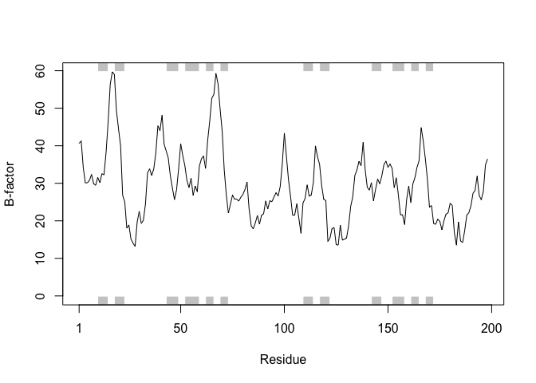

Class 11: Structural Bioinformatics 1
================

## The PDB Database for Biomolecular Structure Data

> Q1: Determine the percentage of structures solved by X-Ray and
> Electron Microscopy. Percentage for structures solved by X-Ray = 89%
> Percentage for structured solved by Electron Microscopy = 2.5%

> Q2: Determine how many HIV-1 protease structures are in the current
> PDB? 92.7% for proteins of HIV-1 protease structures

Download CSV File From

``` r
data<-read.csv("Data Export Summary.csv")
head(data)
```

    ##   Experimental.Method Proteins Nucleic.Acids Protein.NA.Complex Other
    ## 1               X-Ray   131278          2059               6759     8
    ## 2                 NMR    11235          1303                261     8
    ## 3 Electron Microscopy     2899            32                999     0
    ## 4               Other      280             4                  6    13
    ## 5        Multi Method      144             5                  2     1
    ##    Total
    ## 1 140104
    ## 2  12807
    ## 3   3930
    ## 4    303
    ## 5    152

Total of Different Experimental Method

``` r
(data$Total)
```

    ## [1] 140104  12807   3930    303    152

Total Number of Entries

``` r
sum(data$Total)
```

    ## [1] 157296

Finding the Proportion of Entries From Each Method

``` r
(data$Total / sum(data$Total)) * 100
```

    ## [1] 89.0702879  8.1419744  2.4984742  0.1926305  0.0966331

Finding the Proportion That Are Protein

``` r
sum(data$Proteins) / sum(data$Total) * 100
```

    ## [1] 92.71437

Using Significant Figures

``` r
round(sum(data$Proteins) / sum(data$Total) *100, 2)
```

    ## [1] 92.71

## HIV-Pr Structure Analysis

Here we will read the 1HSG PDB structure and select protein component
and write out a **new protein-only** PDB format file. We then do the
same for the ligand (i.e. knwn drug molecule) creating a **ligand-only**
PDB file.

Info: HIV-1 protease is an enzyme that is vital for the replication of
HIV. It cleaves newly formed polypeptide chains at appropriate locations
so that they form function proteins. Hence, drugs that target this
protein could be vital for suppressing viral replication. A handful of
drugs - called HIV-1 protease inhibitors (saquinavir, ritonavir,
indinavir, nelfinavir, etc.) are currently commercially available that
inhibit the function of this protein, by binding in the catalytic site
that typically binds the polypeptide.

Using VMD Program \> Q3: Water molecules normally have 3 atoms. Why do
we see just one atom per water molecule in this structure? Hydrogen atom
in the water molecule has only 1 Angstrom, so we cannot see the water
molecule, except the oxygen molecule.

> Q4: There is a conserved water molecule in the binding site. Can you
> identify this water molecule? What residue number does this water
> molecule have? The water molecule is at residue 127.

> Q5: As you have hopefully observed HIV protease is a homodimer
> (i.e. it is composed of twoidentical chains). With the aid of the
> graphic display and the sequence viewer extension can you identify
> secondary structure elements that are likely to only form in the dimer
> rather than the monomer? The 3rd residue of ILE on beta sheet.

## Section 3: Introduction to Bio3D in R

Getting Started With Bio3D

``` r
library(bio3d)
```

Reading PDB File Data into R

``` r
# Read pdb
pdb <- read.pdb("1hsg.pdb")
print(pdb)
```

    ## 
    ##  Call:  read.pdb(file = "1hsg.pdb")
    ## 
    ##    Total Models#: 1
    ##      Total Atoms#: 1686,  XYZs#: 5058  Chains#: 2  (values: A B)
    ## 
    ##      Protein Atoms#: 1514  (residues/Calpha atoms#: 198)
    ##      Nucleic acid Atoms#: 0  (residues/phosphate atoms#: 0)
    ## 
    ##      Non-protein/nucleic Atoms#: 172  (residues: 128)
    ##      Non-protein/nucleic resid values: [ HOH (127), MK1 (1) ]
    ## 
    ##    Protein sequence:
    ##       PQITLWQRPLVTIKIGGQLKEALLDTGADDTVLEEMSLPGRWKPKMIGGIGGFIKVRQYD
    ##       QILIEICGHKAIGTVLVGPTPVNIIGRNLLTQIGCTLNFPQITLWQRPLVTIKIGGQLKE
    ##       ALLDTGADDTVLEEMSLPGRWKPKMIGGIGGFIKVRQYDQILIEICGHKAIGTVLVGPTP
    ##       VNIIGRNLLTQIGCTLNF
    ## 
    ## + attr: atom, xyz, seqres, helix, sheet,
    ##         calpha, remark, call

``` r
#atom.select()
#write.pdb()
#trim.pdb()
#Select chain A
a.inds <- atom.select(pdb, chain="A")
```

> Q6:How many amino acid residues are there in this pdb object and what
> are the two nonprotein residues? There are 198 amino acids residues
> and the two nonprotein residues are HOH(water) and MK1(indinavir)

Atom Select With “ligand”

``` r
ligand <- atom.select(pdb, "ligand", value = TRUE)
write.pdb(ligand, file ="1hsg_ligand.pdb")
```

Atom Select With “protein”

``` r
protein <- atom.select(pdb, "protein", value = TRUE)
write.pdb(protein, file = "1hsg_protein.pdb")
```

Using Attribute

``` r
attributes(pdb)
```

    ## $names
    ## [1] "atom"   "xyz"    "seqres" "helix"  "sheet"  "calpha" "remark" "call"  
    ## 
    ## $class
    ## [1] "pdb" "sse"

To Access Individual Attributes…Use
    **$attribute**

``` r
head(pdb$atom)
```

    ##   type eleno elety  alt resid chain resno insert      x      y     z o
    ## 1 ATOM     1     N <NA>   PRO     A     1   <NA> 29.361 39.686 5.862 1
    ## 2 ATOM     2    CA <NA>   PRO     A     1   <NA> 30.307 38.663 5.319 1
    ## 3 ATOM     3     C <NA>   PRO     A     1   <NA> 29.760 38.071 4.022 1
    ## 4 ATOM     4     O <NA>   PRO     A     1   <NA> 28.600 38.302 3.676 1
    ## 5 ATOM     5    CB <NA>   PRO     A     1   <NA> 30.508 37.541 6.342 1
    ## 6 ATOM     6    CG <NA>   PRO     A     1   <NA> 29.296 37.591 7.162 1
    ##       b segid elesy charge
    ## 1 38.10  <NA>     N   <NA>
    ## 2 40.62  <NA>     C   <NA>
    ## 3 42.64  <NA>     C   <NA>
    ## 4 43.40  <NA>     O   <NA>
    ## 5 37.87  <NA>     C   <NA>
    ## 6 38.40  <NA>     C   <NA>

``` r
# Print a Subset of $atom data for the first two atoms
pdb$atom[1:2, c("eleno", "elety", "x", "y", "z")]
```

    ##   eleno elety      x      y     z
    ## 1     1     N 29.361 39.686 5.862
    ## 2     2    CA 30.307 38.663 5.319

``` r
# Note that individual $atom records can also be accessed like this
pdb$atom$elety[1:2]
```

    ## [1] "N"  "CA"

``` r
# Which allows us to do the following
plot.bio3d(pdb$atom$b[pdb$calpha], sse=pdb, typ="l", ylab= "B-factor")
```

<!-- -->

> Q7. What type of R object is pdb$atom?

``` r
str(pdb$atom)
```

    ## 'data.frame':    1686 obs. of  16 variables:
    ##  $ type  : chr  "ATOM" "ATOM" "ATOM" "ATOM" ...
    ##  $ eleno : int  1 2 3 4 5 6 7 8 9 10 ...
    ##  $ elety : chr  "N" "CA" "C" "O" ...
    ##  $ alt   : chr  NA NA NA NA ...
    ##  $ resid : chr  "PRO" "PRO" "PRO" "PRO" ...
    ##  $ chain : chr  "A" "A" "A" "A" ...
    ##  $ resno : int  1 1 1 1 1 1 1 2 2 2 ...
    ##  $ insert: chr  NA NA NA NA ...
    ##  $ x     : num  29.4 30.3 29.8 28.6 30.5 ...
    ##  $ y     : num  39.7 38.7 38.1 38.3 37.5 ...
    ##  $ z     : num  5.86 5.32 4.02 3.68 6.34 ...
    ##  $ o     : num  1 1 1 1 1 1 1 1 1 1 ...
    ##  $ b     : num  38.1 40.6 42.6 43.4 37.9 ...
    ##  $ segid : chr  NA NA NA NA ...
    ##  $ elesy : chr  "N" "C" "C" "O" ...
    ##  $ charge: chr  NA NA NA NA ...

``` r
# Print a summary of the coordinate data in $xyz
pdb$xyz
```

    ## 
    ##    Total Frames#: 1
    ##    Total XYZs#:   5058,  (Atoms#:  1686)
    ## 
    ##     [1]  29.361  39.686  5.862  <...>  30.112  17.912  -4.791  [5058] 
    ## 
    ## + attr: Matrix DIM = 1 x 5058

``` r
# Examine the row and column dimensions
dim(pdb$xyz)
```

    ## [1]    1 5058

``` r
# Print coordinates for the first two atom
pdb$xyz[1, atom2xyz(1:2)]
```

    ## [1] 29.361 39.686  5.862 30.307 38.663  5.319

## Section 4: Atom Selection

``` r
# Select all C-alpha atoms (return their indices)
ca.inds <- atom.select(pdb, "calpha")
```

``` r
# Print details of the first few selected atoms
head(pdb$atom[ca.inds$atom, ])
```

    ##    type eleno elety  alt resid chain resno insert      x      y     z o
    ## 2  ATOM     2    CA <NA>   PRO     A     1   <NA> 30.307 38.663 5.319 1
    ## 9  ATOM     9    CA <NA>   GLN     A     2   <NA> 30.158 36.492 2.199 1
    ## 18 ATOM    18    CA <NA>   ILE     A     3   <NA> 29.123 33.098 3.397 1
    ## 26 ATOM    26    CA <NA>   THR     A     4   <NA> 29.774 30.143 1.062 1
    ## 33 ATOM    33    CA <NA>   LEU     A     5   <NA> 27.644 27.003 1.144 1
    ## 41 ATOM    41    CA <NA>   TRP     A     6   <NA> 30.177 24.150 1.279 1
    ##        b segid elesy charge
    ## 2  40.62  <NA>     C   <NA>
    ## 9  41.30  <NA>     C   <NA>
    ## 18 34.13  <NA>     C   <NA>
    ## 26 30.14  <NA>     C   <NA>
    ## 33 30.12  <NA>     C   <NA>
    ## 41 30.82  <NA>     C   <NA>

``` r
# Select xyz coordinate
head(pdb$xyz[, ca.inds$xyz])
```

    ## [1] 30.307 38.663  5.319 30.158 36.492  2.199

## Section 5: 3D Structure Viewing in R

``` r
# Load the Package
library("bio3d.view")
```

``` r
# View the 3D structure
view(pdb, "overview", col = "sse")
```

    ## Computing connectivity from coordinates...
