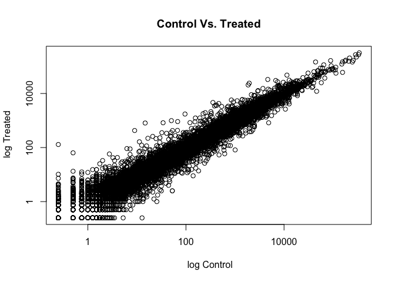
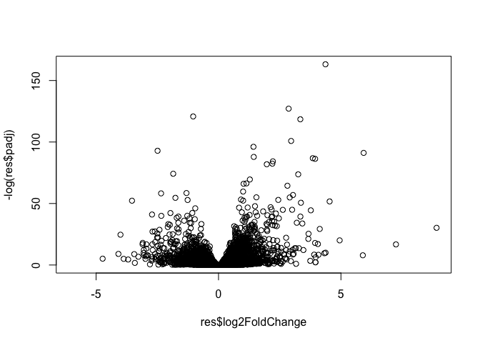
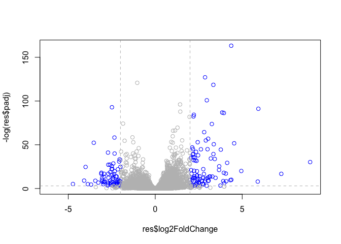

class14: Genome Informatics II
================
Duy Tong
11/12/2019

Section \#1: Instal packages…

``` r
install.packages("BiocManager")
BiocManager::install("DESeq2")
#Always install in console!
```

Side-Notes: Aligning Reads to Reference Genome

The computational analysis of an RNA-seq experiment begins from the
FASTQ files that contain the nucleotide sequence of each read and a
quality score at each position. These reads must first be aligned to a
reference genome or transcriptome. The output of this alignment step is
commonly stored in a file format called SAM/BAM. This is the workflow we
followed last day.

Once the reads have been aligned, there are a number of tools that can
be used to count the number of reads/fragments that can be assigned to
genomic features for each sample. These often take as input SAM/BAM
alignment files and a file specifying the genomic features, e.g. a GFF3
or GTF file specifying the gene models as obtained from ENSEMBLE or
UCSC.

In the workflow we’ll use here, the abundance of each transcript was
quantified using kallisto (software, paper) and transcript-level
abundance estimates were then summarized to the gene level to produce
length-scaled counts using the R package txImport (software, paper),
suitable for using in count-based analysis tools like DESeq. This is the
starting point - a “count matrix”, where each cell indicates the number
of reads mapping to a particular gene (in rows) for each sample (in
columns). This is where we left off last day when analyzing our 1000
genome data.

DESeq2 Required Inputs

First column of colData must match column names of countData

Section \#2: Import countData and colData

``` r
counts <- read.csv("airway_scaledcounts.csv", stringsAsFactors = FALSE)
metadata <-  read.csv("airway_metadata.csv", stringsAsFactors = FALSE)
```

Have a
    peak…

``` r
head(counts)
```

    ##           ensgene SRR1039508 SRR1039509 SRR1039512 SRR1039513 SRR1039516
    ## 1 ENSG00000000003        723        486        904        445       1170
    ## 2 ENSG00000000005          0          0          0          0          0
    ## 3 ENSG00000000419        467        523        616        371        582
    ## 4 ENSG00000000457        347        258        364        237        318
    ## 5 ENSG00000000460         96         81         73         66        118
    ## 6 ENSG00000000938          0          0          1          0          2
    ##   SRR1039517 SRR1039520 SRR1039521
    ## 1       1097        806        604
    ## 2          0          0          0
    ## 3        781        417        509
    ## 4        447        330        324
    ## 5         94        102         74
    ## 6          0          0          0

``` r
head(metadata)
```

    ##           id     dex celltype     geo_id
    ## 1 SRR1039508 control   N61311 GSM1275862
    ## 2 SRR1039509 treated   N61311 GSM1275863
    ## 3 SRR1039512 control  N052611 GSM1275866
    ## 4 SRR1039513 treated  N052611 GSM1275867
    ## 5 SRR1039516 control  N080611 GSM1275870
    ## 6 SRR1039517 treated  N080611 GSM1275871

This view is showing the SRR1039508… as the control or treated and ENSG:
are the genes. The counts data has a different views and the metadata
also has a different view.

``` r
#how many experiemnts do we have
nrow(counts)
```

    ## [1] 38694

``` r
ncol(counts)
```

    ## [1] 9

``` r
nrow(metadata)
```

    ## [1] 8

``` r
ncol(metadata)
```

    ## [1] 4

Section \#3: Toy Differntial Gene Expression

We want to know if there is a difference in expression values for
control (non-drug) vs. treated (i.e. drug added cell lines).

First step is to find which experienments were the control experiments
and then get the average values across all control expeirments (or
treated)

For the control group…

``` r
control <- metadata[metadata[,"dex"]=="control",]
control$id
```

    ## [1] "SRR1039508" "SRR1039512" "SRR1039516" "SRR1039520"

Now calculate the mean values across these control columns of
**countdata**…

``` r
# These are the rows for control groups
control.mean <- rowSums(counts[,control$id])/length(control$id)
names(control.mean) <- counts$ensgene
```

For the treatment group…

``` r
treated <-metadata[metadata[,"dex"]=="treated",]
treated
```

    ##           id     dex celltype     geo_id
    ## 2 SRR1039509 treated   N61311 GSM1275863
    ## 4 SRR1039513 treated  N052611 GSM1275867
    ## 6 SRR1039517 treated  N080611 GSM1275871
    ## 8 SRR1039521 treated  N061011 GSM1275875

Now calculate the mean values across these control columns of
**countdata**

``` r
treated.mean <- rowSums(counts[,treated$id])/length(treated$id)
names(control.mean) <- counts$ensgene
```

> Q1. How would you make the above code more robust? What would happen
> if you were to add more samples. Would the values obtained with the
> excat code above be correct?

> Q2. Follow the same procedure for the treated samples (i.e. calculate
> the mean per gene accross drug treated samples and assign to a labeled
> vector called treated.mean)

Combine our Meancount Data for Bookeping Purposes.

``` r
meancounts <- data.frame(control.mean, treated.mean)
```

Create Scatter Plot to Plot Control Vs.
Treated

``` r
plot(meancounts$control.mean, meancounts$treated.mean, log = "xy", xlab = " log Control", ylab = " log Treated", main = "Control Vs. Treated")
```

    ## Warning in xy.coords(x, y, xlabel, ylabel, log): 15032 x values <= 0
    ## omitted from logarithmic plot

    ## Warning in xy.coords(x, y, xlabel, ylabel, log): 15281 y values <= 0
    ## omitted from logarithmic plot

<!-- -->

Calculate
log2foldchange

``` r
meancounts$log2fc <- log2(meancounts[,"treated.mean"]/meancounts[,"control.mean"])
head(meancounts)
```

    ##                 control.mean treated.mean      log2fc
    ## ENSG00000000003       900.75       658.00 -0.45303916
    ## ENSG00000000005         0.00         0.00         NaN
    ## ENSG00000000419       520.50       546.00  0.06900279
    ## ENSG00000000457       339.75       316.50 -0.10226805
    ## ENSG00000000460        97.25        78.75 -0.30441833
    ## ENSG00000000938         0.75         0.00        -Inf

``` r
#Exclude all the 0 from data.set only focus on changes
# == 0 means that which ones are 0.
# arr.ind = shows where and which columns and rows where values are 0.
zero.vals <-which(meancounts[,1:2]==0, arr.ind=TRUE)

# unique syntax removes any row with 0 values that are duplicated.
to.rm <- unique(zero.vals[,1])
mycounts <- meancounts[-to.rm,]
head(mycounts)
```

    ##                 control.mean treated.mean      log2fc
    ## ENSG00000000003       900.75       658.00 -0.45303916
    ## ENSG00000000419       520.50       546.00  0.06900279
    ## ENSG00000000457       339.75       316.50 -0.10226805
    ## ENSG00000000460        97.25        78.75 -0.30441833
    ## ENSG00000000971      5219.00      6687.50  0.35769358
    ## ENSG00000001036      2327.00      1785.75 -0.38194109

A common threshold used for calling something differentially expressed
is a log2(FoldChange) of greater than 2 or less than -2. Let’s filter
the dataset both ways to see how many genes are up or down-regulated.

``` r
up.ind <- mycounts$log2fc > 2
down.ind <- mycounts$log2fc < (-2)
```

Calculate how many genes are upregulated…

``` r
sum(up.ind)
```

    ## [1] 250

Calculate how many genes are downregulated…

``` r
sum(down.ind)
```

    ## [1] 367

``` r
head( mycounts[up.ind,])
```

    ##                 control.mean treated.mean   log2fc
    ## ENSG00000004799       270.50      1429.25 2.401558
    ## ENSG00000006788         2.75        19.75 2.844349
    ## ENSG00000008438         0.50         2.75 2.459432
    ## ENSG00000011677         0.50         2.25 2.169925
    ## ENSG00000015413         0.50         3.00 2.584963
    ## ENSG00000015592         0.50         2.25 2.169925

## Skipped Section 4

## Section 5: DESeq2 Analysis

Let’s do this the right way. DESeq2 is an R package for analyzing
count-based NGS data like RNA-seq. It is available from Bioconductor.
Bioconductor is a project to provide tools for analyzing high-throughput
genomic data including RNA-seq, ChIP-seq and arrays.

``` r
library(DESeq2)
```

    ## Loading required package: S4Vectors

    ## Loading required package: stats4

    ## Loading required package: BiocGenerics

    ## Loading required package: parallel

    ## 
    ## Attaching package: 'BiocGenerics'

    ## The following objects are masked from 'package:parallel':
    ## 
    ##     clusterApply, clusterApplyLB, clusterCall, clusterEvalQ,
    ##     clusterExport, clusterMap, parApply, parCapply, parLapply,
    ##     parLapplyLB, parRapply, parSapply, parSapplyLB

    ## The following objects are masked from 'package:stats':
    ## 
    ##     IQR, mad, sd, var, xtabs

    ## The following objects are masked from 'package:base':
    ## 
    ##     anyDuplicated, append, as.data.frame, basename, cbind,
    ##     colnames, dirname, do.call, duplicated, eval, evalq, Filter,
    ##     Find, get, grep, grepl, intersect, is.unsorted, lapply, Map,
    ##     mapply, match, mget, order, paste, pmax, pmax.int, pmin,
    ##     pmin.int, Position, rank, rbind, Reduce, rownames, sapply,
    ##     setdiff, sort, table, tapply, union, unique, unsplit, which,
    ##     which.max, which.min

    ## 
    ## Attaching package: 'S4Vectors'

    ## The following object is masked from 'package:base':
    ## 
    ##     expand.grid

    ## Loading required package: IRanges

    ## Loading required package: GenomicRanges

    ## Loading required package: GenomeInfoDb

    ## Loading required package: SummarizedExperiment

    ## Loading required package: Biobase

    ## Welcome to Bioconductor
    ## 
    ##     Vignettes contain introductory material; view with
    ##     'browseVignettes()'. To cite Bioconductor, see
    ##     'citation("Biobase")', and for packages 'citation("pkgname")'.

    ## Loading required package: DelayedArray

    ## Loading required package: matrixStats

    ## 
    ## Attaching package: 'matrixStats'

    ## The following objects are masked from 'package:Biobase':
    ## 
    ##     anyMissing, rowMedians

    ## Loading required package: BiocParallel

    ## 
    ## Attaching package: 'DelayedArray'

    ## The following objects are masked from 'package:matrixStats':
    ## 
    ##     colMaxs, colMins, colRanges, rowMaxs, rowMins, rowRanges

    ## The following objects are masked from 'package:base':
    ## 
    ##     aperm, apply, rowsum

We will use the DESeqDataSetFromMatrix() function to build the required
DESeqDataSet object and call it dds, short for our DESeqDataSet. If you
get a warning about “some variables in design formula are characters,
converting to factors” don’t worry about it. Take a look at the dds
object once you create
it.

``` r
dds <- DESeqDataSetFromMatrix(countData = counts, colData = metadata, design = ~dex, tidy = TRUE)
```

    ## converting counts to integer mode

    ## Warning in DESeqDataSet(se, design = design, ignoreRank): some variables in
    ## design formula are characters, converting to factors

``` r
dds
```

    ## class: DESeqDataSet 
    ## dim: 38694 8 
    ## metadata(1): version
    ## assays(1): counts
    ## rownames(38694): ENSG00000000003 ENSG00000000005 ...
    ##   ENSG00000283120 ENSG00000283123
    ## rowData names(0):
    ## colnames(8): SRR1039508 SRR1039509 ... SRR1039520 SRR1039521
    ## colData names(4): id dex celltype geo_id

Run DESeq2

``` r
dds <-DESeq(dds)
```

    ## estimating size factors

    ## estimating dispersions

    ## gene-wise dispersion estimates

    ## mean-dispersion relationship

    ## final dispersion estimates

    ## fitting model and testing

Getting the Results

``` r
res <- results(dds)
res
```

    ## log2 fold change (MLE): dex treated vs control 
    ## Wald test p-value: dex treated vs control 
    ## DataFrame with 38694 rows and 6 columns
    ##                          baseMean     log2FoldChange             lfcSE
    ##                         <numeric>          <numeric>         <numeric>
    ## ENSG00000000003  747.194195359907 -0.350703020686579 0.168245681332529
    ## ENSG00000000005                 0                 NA                NA
    ## ENSG00000000419  520.134160051965  0.206107766417861 0.101059218008052
    ## ENSG00000000457  322.664843927049 0.0245269479387471 0.145145067649248
    ## ENSG00000000460   87.682625164828  -0.14714204922212 0.257007253994673
    ## ...                           ...                ...               ...
    ## ENSG00000283115                 0                 NA                NA
    ## ENSG00000283116                 0                 NA                NA
    ## ENSG00000283119                 0                 NA                NA
    ## ENSG00000283120 0.974916032393564  -0.66825846051647  1.69456285241871
    ## ENSG00000283123                 0                 NA                NA
    ##                               stat             pvalue              padj
    ##                          <numeric>          <numeric>         <numeric>
    ## ENSG00000000003   -2.0844696749953 0.0371174658432827 0.163034808641681
    ## ENSG00000000005                 NA                 NA                NA
    ## ENSG00000000419    2.0394751758463 0.0414026263001167 0.176031664879168
    ## ENSG00000000457  0.168982303952746  0.865810560623561 0.961694238404388
    ## ENSG00000000460  -0.57252099672319  0.566969065257939 0.815848587637724
    ## ...                            ...                ...               ...
    ## ENSG00000283115                 NA                 NA                NA
    ## ENSG00000283116                 NA                 NA                NA
    ## ENSG00000283119                 NA                 NA                NA
    ## ENSG00000283120 -0.394354484734893  0.693319342566817                NA
    ## ENSG00000283123                 NA                 NA                NA

Summarize
    Data

``` r
summary(dds)
```

    ## [1] "DESeqDataSet object of length 38694 with 22 metadata columns"

## Summary Plot: Volcano Plot

Volcano Plot: further away from 0 -\> bigger change. This figure will
combine both Fold Change and the pv-value into one overivew figure
indicating the porportion of genes with large scale signficant
differences in their expression.

Volcano Plot: Black and White

``` r
plot(res$log2FoldChange, -log(res$padj))
```

<!-- -->

Volcano Plot With Colors…

``` r
# Add Colors
mycols <- rep("gray", nrow(res))
# Make points with +2 -2 fold change blue
mycols[abs(res$log2FoldChange) > 2] <- "blue"
#make point below p-value cutoff gray
mycols[abs(res$padj) > 0.05] <- "gray"

plot(res$log2FoldChange, -log(res$padj), col = mycols)
#Adding abline
abline(v = c(-2,2), col="gray", lty =2)
abline(h = -log(0.05), col ="gray", lty =2)
```

<!-- -->

``` r
# Setup your point color vector
mycols <- rep("gray", nrow(res))
mycols [abs(res$log2FoldChange) >2] <-"red"

inds <-(res$padj < 0.01) & (abs(res$log2FoldChange) >2)
mycols[inds] <- "blue"
```

Save our results for next day…

``` r
write.csv(res, file="expression_results.csv")
```
