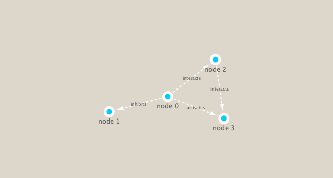

```{r setup, include=FALSE}
knitr::opts_chunk$set(echo = TRUE)
```

## R Markdown

## Metagenomics Co-Occurance Networks

We will use the **igraph** package from CRAN and the **RCy3** package from bioconductor gto build and visualize networks in this data.
```{r}
# Load the Packages
library("RCy3")
library(igraph)
```

```{r}
# Test The Connection to Cytoscape
cytoscapePing()
```

```{r}
g <- makeSimpleIgraph()
createNetworkFromIgraph(g,"myGraph")
```

```{r}
plot(g)
```

Tell Cytoscape to Export an Image
```{r}
fig <- exportImage(filename="demo", type="png", height=350)
```

Insert This Image Into This Rmd Report
```{r}
knitr::include_graphics("./demo.png")
```

Switch Styles
```{r}
setVisualStyle("Marquee")
```

Save and Include Image Here in This Report
```{r}
fig <- exportImage(filename="demo_marquee", type="png", height=350)


```

Other Visual Styles
```{r}
styles <- getVisualStyleNames()
styles
```

Plot
```{r}
plot(g)
```

# Read Our Metagenomics Data
```{r}
## scripts for processing located in "inst/data-raw/"
prok_vir_cor <- read.delim("virus_prok_cor_abundant.tsv", stringsAsFactors = FALSE)

# Have a peak at the first 6 rows
head(prok_vir_cor)
```

```{r}
g <- graph.data.frame(prok_vir_cor, directed = FALSE)
```

```{r}
class(g)
```

```{r}
g
```

```{r}
plot(g)
```

# Organize 
```{r}
plot(g, vertex.label = NA)
```

# Nodes / Vertex are Too Big -> Make Them Smaller
```{r}
plot(g, vertex.size = 3, vertex.label = NA)
```

# Optional: ggplot
```{r}
library(ggraph)
```

```{r}
ggraph(g, layout = 'auto') +
  geom_edge_link(alpha = 0.25) +
  geom_node_point(color="steelblue") +
  theme_graph()
```

To Move to Cytoscape
```{r}
createNetworkFromIgraph(g,"myIgraph")
```

```{r}
V(g)
```

```{r}
E(g)
```

# Network Community Dectection
```{r}
cb <- cluster_edge_betweenness(g)
```

```{r}
cb
```

```{r}
head( membership(cb) )
```

# Node Degree
```{r}
# Calculate and plot node degree of our network
d <- degree(g)
hist(d, breaks=30, col="lightblue", main ="Node Degree Distribution")
```

```{r}
plot( degree_distribution(g), type="h" )
```

# Centrality Analysis
```{r}
pr <- page_rank(g)
head(pr$vector)
```

```{r}
# Make a size vector btwn 2 and 20 for node plotting size

v.size <- BBmisc::normalize(pr$vector, range=c(2,20), method="range")
plot(g, vertex.size=v.size, vertex.label=NA)
```

```{r}
v.size <- BBmisc::normalize(d, range=c(2,20), method="range")
plot(g, vertex.size=v.size, vertex.label=NA)
```

```{r}
b <- betweenness(g)
v.size <- BBmisc::normalize(b, range=c(2,20), method="range")
plot(g, vertex.size=v.size, vertex.label=NA)
```

# Read Taxonomic
```{r}
phage_id_affiliation <- read.delim("./data/phage_ids_with_affiliation.tsv")
head(phage_id_affiliation)
```

```{r}
bac_id_affi <- read.delim("./data/prok_tax_from_silva.tsv", stringsAsFactors = FALSE)
head(bac_id_affi)
```

# Add Taxonomic Annotation

```{r}
## Extract out our vertex names
genenet.nodes <- as.data.frame(vertex.attributes(g), stringsAsFactors=FALSE)
head(genenet.nodes)
```

