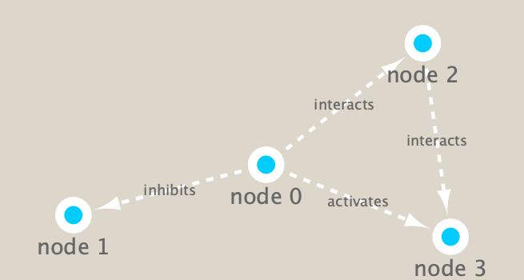

```{r setup, include=FALSE}
knitr::opts_chunk$set(echo = TRUE)
```

## R Markdown

## Metagenomics Co-Occurance Networks

Scientists collected samples to look at different kinds of microorganisms present in different parts of the oceans. Gathered information and formed species occurance table where the rows are different sites and columns are the observation of the different organisms at each site. Purpose of using Co-occurance Network is to examine organisms that occur together. Many of the microbial species in these types of studies have not yet been characterized in the lab. Thus, to know more about the organisms and their interactions, we can observe which ones occur at the same sites or under the same kinds of environmental conditions. One way to do that is by using co-occurrence networks where you examine which organisms occur together at which sites. The more frequently that organisms co-occur at the same site, the stronger the interaction predicted among these organisms.

We will use the **igraph** package from CRAN and the **RCy3** package from bioconductor gto build and visualize networks in this data.
```{r}
# Load the Packages
library("RCy3")
library(igraph)
library(RColorBrewer)
```

```{r}
# Test The Connection to Cytoscape
cytoscapePing()
```

```{r}
# Check the version
cytoscapeVersionInfo()
```

Test Things Further By Making Small Network **igraph**
```{r}
g <- makeSimpleIgraph()
createNetworkFromIgraph(g,"myGraph")
```

```{r}
plot(g)
```

Tell Cytoscape to Export an Network Image
```{r}
fig <- exportImage(filename="demo", type="png", height=350)
```

InsertImage Into Rmd Report
```{r}
knitr::include_graphics("./demo.png")
```

Switch Styles of Visualization
```{r}
setVisualStyle("Marquee")
```

Save and Include Image Here in This Report
```{r}
fig <- exportImage(filename="demo_marquee", type="png", height=350)


```

Other Visual Styles
```{r}
styles <- getVisualStyleNames()
styles
```

Plot igraph Objects in R Itself
```{r}
plot(g)
```

# Read Our Metagenomics Data
```{r}
## scripts for processing located in "inst/data-raw/"
prok_vir_cor <- read.delim("virus_prok_cor_abundant.tsv", stringsAsFactors = FALSE)

# Have a peak at the first 6 rows
head(prok_vir_cor)
```

Use igraph package to convert the co-occurance dataframe into a network to send to Cytoscape. (graph is undirected -> **directed = FALSE**)
```{r}
g <- graph.data.frame(prok_vir_cor, directed = FALSE)
```

```{r}
class(g)
```

```{r}
g
# First line of output "UNW- 854 1544) tells network graph has 845 vertices (nodes which represent bacteria and viruses) and 1544 degree (linking lines indicate their co-occurance). 
# First four characters **UNV-** tell us about the network setup. (U = undirected, N = named, W = weighted)
```

```{r}
plot(g)
# Graph is little too dense of node labels.
```

Organize  Graph
```{r}
plot(g, vertex.label = NA)
```

Nodes / Vertex  Too Big -> Make Smaller
```{r}
plot(g, vertex.size = 3, vertex.label = NA)
```

# Optional: ggplot
```{r}
library(ggraph)
```

```{r}
ggraph(g, layout = 'auto') +
  geom_edge_link(alpha = 0.25) +
  geom_node_point(color="steelblue") +
  theme_graph()
```

To Send Network to Cytoscape
```{r}
createNetworkFromIgraph(g,"myIgraph")
```

# Network Querys
```{r}
V(g)
```

```{r}
E(g)
```

# Network Community Dectection
```{r}
# Community Structure detection algorithms try to find dense sub-graphs within larger networking graph. 
#Clusters of well connected that are densely connected themselves but sparsely connected to other nodes outside the cluster.
cb <- cluster_edge_betweenness(g)
```

```{r}
cb
```

```{r}
# Create a Plot for cb
plot(cb, y=g, vertex.label=NA,  vertex.size=3)
```

```{r}
head( membership(cb) )
```

# Node Degree
The degree of a node or vertex is its most basic structural property, the number of its adjacent edges. 
```{r}
# Calculate and plot node degree of our network
d <- degree(g)
hist(d, breaks=30, col="lightblue", main ="Node Degree Distribution")
```

For the **degree_distribution()** function a numeric vector of the same length as the maximum degree plus one is returned. The first element is the relative frequency zero degree vertices, the second vertices with degree one, etc.

```{r}
plot( degree_distribution(g), type="h" )
```

# Centrality Analysis
Gives estimation on how important a node or edge is for the connectivity (or the information flow) of a network. Important in signaling networks and finding drug targets.
```{r}
pr <- page_rank(g)
head(pr$vector)
```

Plot Our Network With Nodes Size Scaled
```{r}
# Make a size vector btwn 2 and 20 for node plotting size

v.size <- BBmisc::normalize(pr$vector, range=c(2,20), method="range")
plot(g, vertex.size=v.size, vertex.label=NA)
```

```{r}
v.size <- BBmisc::normalize(d, range=c(2,20), method="range")
plot(g, vertex.size=v.size, vertex.label=NA)
```

```{r}
b <- betweenness(g)
v.size <- BBmisc::normalize(b, range=c(2,20), method="range")
plot(g, vertex.size=v.size, vertex.label=NA)
```

# Read Taxonomic Classification for Network Annotation
```{r}
phage_id_affiliation <- read.delim("phage_ids_with_affiliation.tsv")
head(phage_id_affiliation)
```

```{r}
bac_id_affi <- read.delim("prok_tax_from_silva.tsv", stringsAsFactors = FALSE)
head(bac_id_affi)
```

# Add Taxonomic Annotation Data to Network

```{r}
## Sending Networks to Cytoscape, Add Taxonomic Data
## Extract out our vertex names
genenet.nodes <- as.data.frame(vertex.attributes(g), stringsAsFactors=FALSE)
head(genenet.nodes)
```

```{r}
#How Many Phage (ph_) in Genenet Nodes?
length( grep("^ph_",genenet.nodes[,1]))
# A total of 845 nodes but 81 non-phage nodes.
```
 
 Merge With Annotation Data
```{r}
# We dont need all annotation data so lets make a reduced table 'z' for merging
z <- bac_id_affi[,c("Accession_ID", "Kingdom", "Phylum", "Class")]
n <- merge(genenet.nodes, z, by.x="name", by.y="Accession_ID", all.x=TRUE)
head(n)
```
 
```{r}
#Check on column names before deciding what to merge.
colnames(n)
```
 
```{r}
# Colnames of phage_id_affliiation)
colnames(phage_id_affiliation)
```
 
```{r}
# Again we only need a subset of `phage_id_affiliation` for our purposes
y <- phage_id_affiliation[, c("first_sheet.Phage_id_network", "phage_affiliation","Tax_order", "Tax_subfamily")]

# Add the little phage annotation that we have
x <- merge(x=n, y=y, by.x="name", by.y="first_sheet.Phage_id_network", all.x=TRUE)

## Remove duplicates from multiple matches
x <- x[!duplicated((x$name) ),]
head(x)

## Save Merged Annotation Results to Genenet.Nodes
genenet.nodes <- x
```
 
# Send Network to Cytoscape Using RCy3
 To begin, we will delete any windows and networks that were already open in Cytoscape -> to ensure we don't use up all our memory
```{r}
# Open a new connection and delete any existing windows/networks in Cy
deleteAllNetworks()
# See that all previous networks in Cytoscape have been removed from the open display.
```

Get First Column in Our Node **Data.Frame to id** This is what the RCy3 function createNetworkFromDataFrames() expects. Note that additional columns are loaded into Cytoscape as node attributes. Likewise the edge data.frame should contain columns of character strings named: source, target and interaction (with additional columns loaded as edge attributes).
```{r}
# Set the main ndoes colname to the required "id"
colnames(genenet.nodes)[1] <- "id"
```

Add to the network the data related to the connections between the organisms, the edge data, and then send the nodes and edges data.frames to Cytoscape using **createNetworkFromDataFrames()**.

```{r}
genenet.edges <- data.frame(igraph::as_edgelist(g))

# Set the main edges colname to the required "source" and "target" 
colnames(genenet.edges) <- c("source","target")

# Add the weight from igraph to a new column...
genenet.edges$Weight <- igraph::edge_attr(g)$weight

# Send as a new network to Cytoscape
createNetworkFromDataFrames(genenet.nodes,genenet.edges, title = "Tara_Oceans")
```
 
** Side Notes: an alternative to all this is to use set_edge_attr() and set_node_attr() on our original igraph object and then just end it to cytoscape with the createNetworkFromDataFrames() function.

## Publishing Network to NDEx
1. Click on File > Export > Network to NDXe