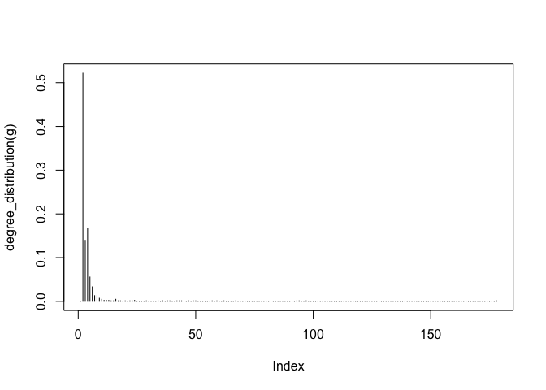

class17: Metagenomics Co-occurance Networks
================

## R Markdown

## Metagenomics Co-Occurance Networks

Scientists collected samples to look at different kinds of
microorganisms present in different parts of the oceans. Gathered
information and formed species occurance table where the rows are
different sites and columns are the observation of the different
organisms at each site. Purpose of using Co-occurance Network is to
examine organisms that occur together. Many of the microbial species in
these types of studies have not yet been characterized in the lab. Thus,
to know more about the organisms and their interactions, we can observe
which ones occur at the same sites or under the same kinds of
environmental conditions. One way to do that is by using co-occurrence
networks where you examine which organisms occur together at which
sites. The more frequently that organisms co-occur at the same site, the
stronger the interaction predicted among these organisms.

We will use the **igraph** package from CRAN and the **RCy3** package
from bioconductor gto build and visualize networks in this data.

``` r
# Load the Packages
library("RCy3")
library(igraph)
```

    ## 
    ## Attaching package: 'igraph'

    ## The following objects are masked from 'package:stats':
    ## 
    ##     decompose, spectrum

    ## The following object is masked from 'package:base':
    ## 
    ##     union

``` r
library(RColorBrewer)
```

``` r
# Test The Connection to Cytoscape
cytoscapePing()
```

    ## [1] "You are connected to Cytoscape!"

``` r
# Check the version
cytoscapeVersionInfo()
```

    ##       apiVersion cytoscapeVersion 
    ##             "v1"          "3.7.2"

Test Things Further By Making Small Network **igraph**

``` r
g <- makeSimpleIgraph()
createNetworkFromIgraph(g,"myGraph")
```

    ## Loading data...
    ## Applying default style...
    ## Applying preferred layout...

    ## networkSUID 
    ##         164

``` r
plot(g)
```

<!-- -->

Tell Cytoscape to Export an Network Image

``` r
fig <- exportImage(filename="demo", type="png", height=350)
```

    ## Warning: This file already exists. A Cytoscape popup 
    ##                 will be generated to confirm overwrite.

InsertImage Into Rmd Report

``` r
knitr::include_graphics("./demo.png")
```

<!-- -->

Switch Styles of Visualization

``` r
setVisualStyle("Marquee")
```

    ##                 message 
    ## "Visual Style applied."

Save and Include Image Here in This Report

``` r
fig <- exportImage(filename="demo_marquee", type="png", height=350)
```

    ## Warning: This file already exists. A Cytoscape popup 
    ##                 will be generated to confirm overwrite.

``` r
knitr::include_graphics("./demo_marquee.png")
```

<!-- -->

Other Visual Styles

``` r
styles <- getVisualStyleNames()
styles
```

    ##  [1] "Directed"             "Big Labels"           "Sample3"             
    ##  [4] "Ripple"               "Marquee"              "size_rank"           
    ##  [7] "BioPAX"               "Curved"               "Sample1"             
    ## [10] "default black"        "Minimal"              "Gradient1"           
    ## [13] "BioPAX_SIF"           "Sample2"              "default"             
    ## [16] "Nested Network Style" "Solid"                "Universe"

Plot igraph Objects in R Itself

``` r
plot(g)
```

<!-- -->

# Read Our Metagenomics Data

``` r
## scripts for processing located in "inst/data-raw/"
prok_vir_cor <- read.delim("virus_prok_cor_abundant.tsv", stringsAsFactors = FALSE)

# Have a peak at the first 6 rows
head(prok_vir_cor)
```

    ##       Var1          Var2    weight
    ## 1  ph_1061 AACY020068177 0.8555342
    ## 2  ph_1258 AACY020207233 0.8055750
    ## 3  ph_3164 AACY020207233 0.8122517
    ## 4  ph_1033 AACY020255495 0.8487498
    ## 5 ph_10996 AACY020255495 0.8734617
    ## 6 ph_11038 AACY020255495 0.8740782

Use igraph package to convert the co-occurance dataframe into a network
to send to Cytoscape. (graph is undirected -\> **directed = FALSE**)

``` r
g <- graph.data.frame(prok_vir_cor, directed = FALSE)
```

``` r
class(g)
```

    ## [1] "igraph"

``` r
g
```

    ## IGRAPH 76e81a4 UNW- 845 1544 -- 
    ## + attr: name (v/c), weight (e/n)
    ## + edges from 76e81a4 (vertex names):
    ##  [1] ph_1061 --AACY020068177 ph_1258 --AACY020207233
    ##  [3] ph_3164 --AACY020207233 ph_1033 --AACY020255495
    ##  [5] ph_10996--AACY020255495 ph_11038--AACY020255495
    ##  [7] ph_11040--AACY020255495 ph_11048--AACY020255495
    ##  [9] ph_11096--AACY020255495 ph_1113 --AACY020255495
    ## [11] ph_1208 --AACY020255495 ph_13207--AACY020255495
    ## [13] ph_1346 --AACY020255495 ph_14679--AACY020255495
    ## [15] ph_1572 --AACY020255495 ph_16045--AACY020255495
    ## + ... omitted several edges

``` r
# First line of output "UNW- 854 1544) tells network graph has 845 vertices (nodes which represent bacteria and viruses) and 1544 degree (linking lines indicate their co-occurance). 
# First four characters **UNV-** tell us about the network setup. (U = undirected, N = named, W = weighted)
```

``` r
plot(g)
```

<!-- -->

``` r
# Graph is little too dense of node labels.
```

Organize Graph

``` r
plot(g, vertex.label = NA)
```

<!-- -->

Nodes / Vertex Too Big -\> Make Smaller

``` r
plot(g, vertex.size = 3, vertex.label = NA)
```

<!-- -->

# Optional: ggplot

``` r
library(ggraph)
```

    ## Loading required package: ggplot2

``` r
ggraph(g, layout = 'auto') +
  geom_edge_link(alpha = 0.25) +
  geom_node_point(color="steelblue") +
  theme_graph()
```

    ## Using `stress` as default layout

<!-- -->

To Send Network to Cytoscape

``` r
createNetworkFromIgraph(g,"myIgraph")
```

    ## Loading data...
    ## Applying default style...
    ## Applying preferred layout...

    ## networkSUID 
    ##         192

# Network Querys

``` r
V(g)
```

    ## + 845/845 vertices, named, from 76e81a4:
    ##   [1] ph_1061       ph_1258       ph_3164       ph_1033       ph_10996     
    ##   [6] ph_11038      ph_11040      ph_11048      ph_11096      ph_1113      
    ##  [11] ph_1208       ph_13207      ph_1346       ph_14679      ph_1572      
    ##  [16] ph_16045      ph_1909       ph_1918       ph_19894      ph_2117      
    ##  [21] ph_2231       ph_2363       ph_276        ph_2775       ph_2798      
    ##  [26] ph_3217       ph_3336       ph_3493       ph_3541       ph_3892      
    ##  [31] ph_4194       ph_4602       ph_4678       ph_484        ph_4993      
    ##  [36] ph_4999       ph_5001       ph_5010       ph_5286       ph_5287      
    ##  [41] ph_5302       ph_5321       ph_5643       ph_6441       ph_654       
    ##  [46] ph_6954       ph_7389       ph_7920       ph_8039       ph_8695      
    ## + ... omitted several vertices

``` r
E(g)
```

    ## + 1544/1544 edges from 76e81a4 (vertex names):
    ##  [1] ph_1061 --AACY020068177 ph_1258 --AACY020207233
    ##  [3] ph_3164 --AACY020207233 ph_1033 --AACY020255495
    ##  [5] ph_10996--AACY020255495 ph_11038--AACY020255495
    ##  [7] ph_11040--AACY020255495 ph_11048--AACY020255495
    ##  [9] ph_11096--AACY020255495 ph_1113 --AACY020255495
    ## [11] ph_1208 --AACY020255495 ph_13207--AACY020255495
    ## [13] ph_1346 --AACY020255495 ph_14679--AACY020255495
    ## [15] ph_1572 --AACY020255495 ph_16045--AACY020255495
    ## [17] ph_1909 --AACY020255495 ph_1918 --AACY020255495
    ## [19] ph_19894--AACY020255495 ph_2117 --AACY020255495
    ## + ... omitted several edges

# Network Community Dectection

``` r
# Community Structure detection algorithms try to find dense sub-graphs within larger networking graph. 
#Clusters of well connected that are densely connected themselves but sparsely connected to other nodes outside the cluster.
cb <- cluster_edge_betweenness(g)
```

    ## Warning in cluster_edge_betweenness(g): At community.c:460 :Membership
    ## vector will be selected based on the lowest modularity score.

    ## Warning in cluster_edge_betweenness(g): At community.c:467 :Modularity
    ## calculation with weighted edge betweenness community detection might not
    ## make sense -- modularity treats edge weights as similarities while edge
    ## betwenness treats them as distances

``` r
cb
```

    ## IGRAPH clustering edge betweenness, groups: 18, mod: 0.82
    ## + groups:
    ##   $`1`
    ##   [1] "ph_1061"       "AACY020068177"
    ##   
    ##   $`2`
    ##    [1] "ph_1258"       "ph_5861"       "ph_7172"       "ph_11569"     
    ##    [5] "ph_1291"       "ph_1600"       "ph_2702"       "ph_5790"      
    ##    [9] "ph_5858"       "ph_7594"       "ph_7816"       "ph_784"       
    ##   [13] "ph_1359"       "ph_1534"       "ph_1874"       "ph_2465"      
    ##   [17] "ph_5453"       "ph_900"        "ph_908"        "ph_811"       
    ##   [21] "ph_1367"       "ph_1452"       "ph_1458"       "ph_1723"      
    ##   + ... omitted several groups/vertices

``` r
# Create a Plot for cb
plot(cb, y=g, vertex.label=NA,  vertex.size=3)
```

<!-- -->

``` r
head( membership(cb) )
```

    ##  ph_1061  ph_1258  ph_3164  ph_1033 ph_10996 ph_11038 
    ##        1        2        3        4        4        4

# Node Degree

The degree of a node or vertex is its most basic structural property,
the number of its adjacent edges.

``` r
# Calculate and plot node degree of our network
d <- degree(g)
hist(d, breaks=30, col="lightblue", main ="Node Degree Distribution")
```

<!-- -->

For the **degree\_distribution()** function a numeric vector of the same
length as the maximum degree plus one is returned. The first element is
the relative frequency zero degree vertices, the second vertices with
degree one, etc.

``` r
plot( degree_distribution(g), type="h" )
```

<!-- -->

# Centrality Analysis

Gives estimation on how important a node or edge is for the connectivity
(or the information flow) of a network. Important in signaling networks
and finding drug targets.

``` r
pr <- page_rank(g)
head(pr$vector)
```

    ##      ph_1061      ph_1258      ph_3164      ph_1033     ph_10996 
    ## 0.0011834320 0.0011599483 0.0019042088 0.0005788564 0.0005769663 
    ##     ph_11038 
    ## 0.0005745460

Plot Our Network With Nodes Size Scaled

``` r
# Make a size vector btwn 2 and 20 for node plotting size

v.size <- BBmisc::normalize(pr$vector, range=c(2,20), method="range")
plot(g, vertex.size=v.size, vertex.label=NA)
```

<!-- -->

``` r
v.size <- BBmisc::normalize(d, range=c(2,20), method="range")
plot(g, vertex.size=v.size, vertex.label=NA)
```

<!-- -->

``` r
b <- betweenness(g)
v.size <- BBmisc::normalize(b, range=c(2,20), method="range")
plot(g, vertex.size=v.size, vertex.label=NA)
```

<!-- -->

# Read Taxonomic Classification for Network Annotation

``` r
phage_id_affiliation <- read.delim("phage_ids_with_affiliation.tsv")
head(phage_id_affiliation)
```

    ##   first_sheet.Phage_id first_sheet.Phage_id_network phage_affiliation
    ## 1        109DCM_115804                       ph_775              <NA>
    ## 2        109DCM_115804                       ph_775              <NA>
    ## 3        109DCM_115804                       ph_775              <NA>
    ## 4        109DCM_115804                       ph_775              <NA>
    ## 5        109DCM_115804                       ph_775              <NA>
    ## 6        109DCM_115804                       ph_775              <NA>
    ##   Domain DNA_or_RNA Tax_order Tax_subfamily Tax_family Tax_genus
    ## 1   <NA>       <NA>      <NA>          <NA>       <NA>      <NA>
    ## 2   <NA>       <NA>      <NA>          <NA>       <NA>      <NA>
    ## 3   <NA>       <NA>      <NA>          <NA>       <NA>      <NA>
    ## 4   <NA>       <NA>      <NA>          <NA>       <NA>      <NA>
    ## 5   <NA>       <NA>      <NA>          <NA>       <NA>      <NA>
    ## 6   <NA>       <NA>      <NA>          <NA>       <NA>      <NA>
    ##   Tax_species
    ## 1        <NA>
    ## 2        <NA>
    ## 3        <NA>
    ## 4        <NA>
    ## 5        <NA>
    ## 6        <NA>

``` r
bac_id_affi <- read.delim("prok_tax_from_silva.tsv", stringsAsFactors = FALSE)
head(bac_id_affi)
```

    ##    Accession_ID  Kingdom         Phylum          Class             Order
    ## 1 AACY020068177 Bacteria    Chloroflexi   SAR202 clade marine metagenome
    ## 2 AACY020125842  Archaea  Euryarchaeota Thermoplasmata Thermoplasmatales
    ## 3 AACY020187844  Archaea  Euryarchaeota Thermoplasmata Thermoplasmatales
    ## 4 AACY020105546 Bacteria Actinobacteria Actinobacteria             PeM15
    ## 5 AACY020281370  Archaea  Euryarchaeota Thermoplasmata Thermoplasmatales
    ## 6 AACY020147130  Archaea  Euryarchaeota Thermoplasmata Thermoplasmatales
    ##              Family             Genus Species
    ## 1              <NA>              <NA>    <NA>
    ## 2   Marine Group II marine metagenome    <NA>
    ## 3   Marine Group II marine metagenome    <NA>
    ## 4 marine metagenome              <NA>    <NA>
    ## 5   Marine Group II marine metagenome    <NA>
    ## 6   Marine Group II marine metagenome    <NA>

# Add Taxonomic Annotation Data to Network

``` r
## Sending Networks to Cytoscape, Add Taxonomic Data
## Extract out our vertex names
genenet.nodes <- as.data.frame(vertex.attributes(g), stringsAsFactors=FALSE)
head(genenet.nodes)
```

    ##       name
    ## 1  ph_1061
    ## 2  ph_1258
    ## 3  ph_3164
    ## 4  ph_1033
    ## 5 ph_10996
    ## 6 ph_11038

``` r
#How Many Phage (ph_) in Genenet Nodes?
length( grep("^ph_",genenet.nodes[,1]))
```

    ## [1] 764

``` r
# A total of 845 nodes but 81 non-phage nodes.
```

Merge With Annotation
Data

``` r
# We dont need all annotation data so lets make a reduced table 'z' for merging
z <- bac_id_affi[,c("Accession_ID", "Kingdom", "Phylum", "Class")]
n <- merge(genenet.nodes, z, by.x="name", by.y="Accession_ID", all.x=TRUE)
head(n)
```

    ##            name  Kingdom          Phylum               Class
    ## 1 AACY020068177 Bacteria     Chloroflexi        SAR202 clade
    ## 2 AACY020207233 Bacteria Deferribacteres     Deferribacteres
    ## 3 AACY020255495 Bacteria  Proteobacteria Gammaproteobacteria
    ## 4 AACY020288370 Bacteria  Actinobacteria      Acidimicrobiia
    ## 5 AACY020396101 Bacteria  Actinobacteria      Acidimicrobiia
    ## 6 AACY020398456 Bacteria  Proteobacteria Gammaproteobacteria

``` r
#Check on column names before deciding what to merge.
colnames(n)
```

    ## [1] "name"    "Kingdom" "Phylum"  "Class"

``` r
# Colnames of phage_id_affliiation)
colnames(phage_id_affiliation)
```

    ##  [1] "first_sheet.Phage_id"         "first_sheet.Phage_id_network"
    ##  [3] "phage_affiliation"            "Domain"                      
    ##  [5] "DNA_or_RNA"                   "Tax_order"                   
    ##  [7] "Tax_subfamily"                "Tax_family"                  
    ##  [9] "Tax_genus"                    "Tax_species"

``` r
# Again we only need a subset of `phage_id_affiliation` for our purposes
y <- phage_id_affiliation[, c("first_sheet.Phage_id_network", "phage_affiliation","Tax_order", "Tax_subfamily")]

# Add the little phage annotation that we have
x <- merge(x=n, y=y, by.x="name", by.y="first_sheet.Phage_id_network", all.x=TRUE)

## Remove duplicates from multiple matches
x <- x[!duplicated((x$name) ),]
head(x)
```

    ##            name  Kingdom          Phylum               Class
    ## 1 AACY020068177 Bacteria     Chloroflexi        SAR202 clade
    ## 2 AACY020207233 Bacteria Deferribacteres     Deferribacteres
    ## 3 AACY020255495 Bacteria  Proteobacteria Gammaproteobacteria
    ## 4 AACY020288370 Bacteria  Actinobacteria      Acidimicrobiia
    ## 5 AACY020396101 Bacteria  Actinobacteria      Acidimicrobiia
    ## 6 AACY020398456 Bacteria  Proteobacteria Gammaproteobacteria
    ##   phage_affiliation Tax_order Tax_subfamily
    ## 1              <NA>      <NA>          <NA>
    ## 2              <NA>      <NA>          <NA>
    ## 3              <NA>      <NA>          <NA>
    ## 4              <NA>      <NA>          <NA>
    ## 5              <NA>      <NA>          <NA>
    ## 6              <NA>      <NA>          <NA>

``` r
## Save Merged Annotation Results to Genenet.Nodes
genenet.nodes <- x
```

# Send Network to Cytoscape Using RCy3

To begin, we will delete any windows and networks that were already open
in Cytoscape -\> to ensure we don’t use up all our memory

``` r
# Open a new connection and delete any existing windows/networks in Cy
deleteAllNetworks()
# See that all previous networks in Cytoscape have been removed from the open display.
```

Get First Column in Our Node **Data.Frame to id** This is what the RCy3
function createNetworkFromDataFrames() expects. Note that additional
columns are loaded into Cytoscape as node attributes. Likewise the edge
data.frame should contain columns of character strings named: source,
target and interaction (with additional columns loaded as edge
attributes).

``` r
# Set the main ndoes colname to the required "id"
colnames(genenet.nodes)[1] <- "id"
```

Add to the network the data related to the connections between the
organisms, the edge data, and then send the nodes and edges data.frames
to Cytoscape using **createNetworkFromDataFrames()**.

``` r
genenet.edges <- data.frame(igraph::as_edgelist(g))

# Set the main edges colname to the required "source" and "target" 
colnames(genenet.edges) <- c("source","target")

# Add the weight from igraph to a new column...
genenet.edges$Weight <- igraph::edge_attr(g)$weight

# Send as a new network to Cytoscape
createNetworkFromDataFrames(genenet.nodes,genenet.edges, title = "Tara_Oceans")
```

    ## Loading data...
    ## Applying default style...
    ## Applying preferred layout...

    ## networkSUID 
    ##        4998

\*\* Side Notes: an alternative to all this is to use set\_edge\_attr()
and set\_node\_attr() on our original igraph object and then just end it
to cytoscape with the createNetworkFromDataFrames() function.

## Publishing Network to NDEx

1.  Click on File \> Export \> Network to NDXe
